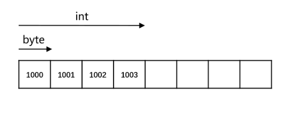
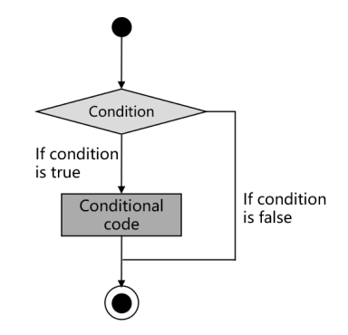
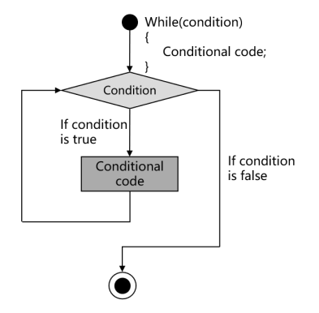

### ch01.C++初探目录
1. 从 Hello World 谈起
2. 系统 I/O
3. 猜数字与控制流
4. 结构体与自定义数据类型
### 一.从 Hello World 谈起
#### 1.1.函数
函数:一段能被反复调用的代码,可以接收输入,进行处理并(或)产生输出
- 返回类型:表示了函数返回结果的类型,可以为 void
- 函数名:用于函数调用
- 形参列表:表示函数接收的参数类型,可以为空,可以为 void ,可以无形参
- 函数体:具体的执行逻辑


**main 函数**:特殊的函数,作为整个程序的入口

- 返回类型为 int ,表示程序的返回值,通常使用 0 来表示正常返回
- 形参列表可以为空

```c
int main(int argc, char* argv[])
int main(int x, char* y[])//名字不固定
```

#### 1.2.(内建)类型
(内建)类型:为一段存储空间赋予实际的意义




- int = 4byte = 4*8bit


#### 1.3.语句
语句:表明了需要执行的操作
- 表达式 + 分号的语句
- 语句块 `{}`
- if/while 等语句

#### 1.4.注释

注释:会被编译器忽略的内容
- 用于编写说明或去除不使用的语句
- 两种注释形式: /**/ 与 //


### 二.系统 I/O

#### 2.1.iostream
iostream :标准库所提供的 IO 接口,用于与用户交互
- 输入流: cin ;输出流: cout / cerr / clog
- 输出流的区别: 1. 输出目标; 2. 是否立即刷新缓冲区
- 缓冲区与缓冲区刷新: std::flush; std::endl
- std::endl:耗时,'...\n'只换行,不刷新.

```c
#include<iostream>//首先从系统中找
#include"iostream"//首先从工程目录查找然后到系统中查找
```


#### 2.2.名字空间
名字空间:用于防止名称冲突
- std 名字空间
- 访问名字空间中元素的 3 种方式 : 域解析符 :: ; **using 语句;名字空间别名**
```c
namespace ns1 = NameSpace1;//从定义命名空间的名字
ns1::func();
```
　　命名空间使用可以放在函数外,也可放在函数内,命名空间(如using namespace std;)放在头文件中很危险,其他引用该头文件后也可见,容易造成命名空间污染.

- 名字空间与名称改编( name mangling )

　　外部链接的罗列：`nm ./main.cpp.o` 比如:`nm ./main.cpp.o | c++ filt -t`反de_mangling语句`de_mangling ***`

#### 3.C/C++ 系统 IO 比较

C/C++ 系统 IO 比较
- printf: 使用直观,但容易出错
- cout: 不容易出错,但书写冗长
- C++ 20 格式化库:新的解决方案--目前还没普及到应用

### 三.猜数字与控制流
#### 3.1.if 语句:用于分支选择
- 条件部分:用于判断是否执行
- 语句部分:要执行的操作




#### 3.2.== 与 = 操作
- = 操作:用于赋值,将数值保存在变量所对应的内存中
- == 操作:用于判断两个值是否相等
- 可以将常量放在 == 左边以防止误用
  放右边如果是判断只会有警告,放左边则会有报错
#### 3.3.while 语句:用于循环执行
- 条件部分:用于判断是否执行
- 语句部分:要执行的操作




### 四.结构体与自定义数据类型
##### 4.1.结构体:将相关的数据放置在一起
- 可以通过点操作符( . )访问内部元素
- 可以作为函数的输入参数或返回类型
- 可以引入成员函数,更好地表示函数与数据的相关性

```c
struct point{
    int x;
    int y;
};

point fun(point p){
    p.x = p.x - 1;
    return p;
}
```