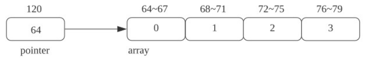

### ch03.数组,vector与字符串目录
1. 数组
2. vector
3. 字符串

### 一.数组

#### 1.1.数组 — 引入
- 将一到多个相同类型的对象串连到一起,所组成的类型
  - int a → int b[10]

    ```c
    #include<iostream>
    #include<type_traits>
    int main(){
      int a; //int
      int b[10];// b的类型为 int[10]
      std::cout<< std::is_same_v<decltype(b), int[10]><<std::endl;// 1

      std::cin >> x;
      int b[x];//非法,x为运行期输入,但b[]是在编译期所确定的
      //g++,clang++设置编译选项可以运行,但最好不要这样做,
      //可移植性很差,不是C++标准,只是某些编译器支持.
      //variable length array C++
    }
    ```
    ```c
    int a;//int
    int b[1];//int[1]
    //注意a,b为不同类型,尺寸一样,允许的操作不同
    ```
    **数组长度**需要是常量表达式:const expression
    ```c
    constexpr short x= 3;//constexpr:编译期常量表达式
    int b[x];//合法
    int b[3.14];//非法
    int b[-6];//非法
    int b[0];// 非法,不是C++ 标准,g++,clang支持,比如柔性数组:
    struct str{
      ...
      int b[0];
      //使用柔性数组构造可缩放的结构体
      //Array of length Zero
    };
    ```

  - 数组的初始化方式:
     - 缺省初始化
        ```c
        int b[3];//函数内,随机初始化赋值;全局域,初始化赋值为0
        ```
     - 聚合初始化( aggregate initialization )
        ```c
        int b[3] = {1,2,3};
        int b[2] = {1,2};//b[2] = 0
        int b[3] = {};//全0
        int b[] = {1,2,3};//b 为int[3]
        int b[];//非法
        ```
- 注意事项
  - 不能使用 auto 来声明数组类型
    ```c
    #include<typeinfo>
    auto b = {1,3,4};//b 不是int[3]
    std::cout<< std::is_same_v<decltype(b), int[3]><<std::endl;// 0
    // b为std::initalizer_list<int>初始化列表
    std::cout<< typeid(b).name() << std::endl;
    如果:
    ```


  - 数组不能复制
    ```c
    int b[] = {1,2,3};
    int a[3] = b;//非法
    ----
    int b[] = {1,2,3};
    int a[3];
    a = b;//非法
    ----
    int b[] = {1,2,3};
    auto a = b;// 不会报错但是a的类型不是int[3],a为一个指针int* (auto推导的退化问题)
    autu& a = b;//auto& 不会退化,此时a为int(&)[3]  ==>int[3]的引用
    ```
  - 元素个数必须是一个常量表达式(编译期可计算的值)
  - 字符串数组的特殊性
    ```c
    char str[] = "hello";//str类型为char[6];char[5] = '\0'
    char str[] = {'h', 'e', 'l', 'l', '0'};//str类型为char[5]
    ```
- 数组的复杂声明
  - 指针数组与数组的指针
    ```c
    /**指针数组**/
    int* a[3];//指针数组,a是一个数组,数组里有3个int*, a的类型为int*[3]
    std::cout<< is_same_v<decltype(a), int*[3]> <<std::endl;//1 
    int x1, x2, x3;
    int* a[3] = {&x1, &x2, &x3};

    /**数组指针**/
    int (*a)[3];//a是一个指针,指针指向int[3], a的类型为int(*)[3]
    std::cout<< is_same_v<decltype(a), int(*)[3]> <<std::endl;//1 
    int b[3];
    int (*a)[3] = &b;//对a解引用 *a 为 int[3] 既是b
    ```
  - 声明数组的引用
    ```c
    int b[3];
    int (&a)[3] = b;//由内到外,a为引用,a为数组的引用; 此时a就是b的别名
    std::cout<< is_same_v<decltype(a), int(&)[3]> <<std::endl;//1 
    ```
    ```c
    int x1,x2,x3;
    int& a[3] = {x1,x2,x3};//非法,不存在引用的数组
    ```
- 数组中的元素访问
  - 数组对象是一个左值

    ```c
    int a[3] = {1,2,3};
    //l-value, 能够放在等号左边的值; C++ 进行了扩展: locator value (有地址名称?)
    const int x;//x为l-value,但不能放在等号左边

    ----
    /*
    参考链接:https://zh.cppreference.com/w/cpp/language/decltype
    a) if the value category of expression is xvalue(广义右值), 
       then decltype yields T&&;
    b) if the value category of expression is lvalue(广义左值), 
       then decltype yields T&;
    c) if the value category of expression is prvalue(一般值), 
       then decltype yields T.
    请注意，如果对象的名称被括号括起来，则它被视为一个普通的左值表达式，
    因此 decltype(x) 和 decltype((x)) 通常是不同的类型。
    */
    const int x = 3;
    std::cout<< std::is_same_v<decltype(x), const int> <<std::ensl;//1
    //0 .(x)解析为表达式, 表达式作为l-value,类型应该为const int &
    std::cout<< std::is_same_v<decltype((x)), const int> <<std::ensl;
    std::cout<< std::is_same_v<decltype((x)), const int&> <<std::ensl;//1
    ```
  - 使用时通常会转换成相应的指针类型
    ```c
    int a[3] = {1,2,3};
    std::cout<< std::is_same_v<decltype((a)), const int(&)[3]> <<std::ensl;//1
    //左值可以出现在赋值语句的左侧，右值不能
    a = 1;//a为左值,但不能放在等号左边,它不能被修改
    auto b = a;
    //a为左值,此时放在等号右边,可能会发生隐式的转换,
    //此时b为 int* ,指向a的第一个元素,既是 b = &(a[0])
    std::cout<< std::is_same_v<decltype(b), int*> <<std::ensl;//1
    std::cout<< *b <<std::endl;//1
    std::cout<< b <<std::endl;// 地址A
    std::cout<< &(a[0]) <<std::endl;// 地址A
    ----
    int a[3] = {1,2,3};
    auto b = a;
    std::cout<< b[1] <<std::endl;
    // 2 通过[]访问元素不是数组的专属,指针也可以,
    //就看怎么解引:*(b+1),这里的1即为int型四个字节
    ```
  - x[y] <--> *((x) + (y))
    x为首地址,y为解引地址偏移
    ```c
    int a[3] = {1,2,3};
    std::cout<< *(a+1) <<std::endl;//2
    std::cout<< *(1+a) <<std::endl;//2
    std::cout<< 1[a] <<std::endl;//2  牛逼
    ```
  
#### 1.2.数组 — 从数组到指针
- 数组到指针的隐式转换
  - 使用数组对象时,通常情况下会产生数组到指针的隐式转换
    ```c
    int a[3] = {1,2,3};
    auto b = a; // decay 数据类型退化, 此时的b为 int*
    /*
    还是有一些情况不会产生数组到指针的退化:
    decltype(a);//int[3]
    sizeof(a);//3*int;如果有退化,应该是指针的大小:4字节
    大部分情况都会产生数组到指针的隐式转换
    */
    ```
  - 隐式转换会丢失一部分类型信息
    ```c
    int a[3] = {1,2,3};
    std::cout<< a[4] <<std::endl;//数组已经越界,但是此时a已经退化为指针,此句编译不会报错!!!
    auto b = a; // decay 数据类型退化, 此时的b为 int* ;丢失信息[3]
    ```
  - 可以通过声明引用来避免隐式转换

    数组与指针的区别:
    

    ```c
    int a[3] = {1,2,3};
    std::cout<< a[4] <<std::endl;//此句编译不会报错!!!
    auto b = a; // int* ;丢失信息[3]
    /**不希望产生这样的隐式转换**/
    autu& b = a;// b的类型为 int(&)[3] 引用-->数组的引用
    ```
  - 注意:不要使用 extern 指针来声明数组
    - Unknown Bounded Array 声明
      ```c
      //source.cpp 定义数组
      int array[4] = {1,2,3,4};

      //main.cpp 声明数组
      extern int array[4];

      int main(){
        std::cout<< array[1] << std::endl;//这样链接就是合法的
      }

      /*这样会存在一个问题: 如果在source.cpp中对数组大小进行了更改,
      其他地方的声明也需要做相应的更改,这是不利于维护的!*/
      ```

      ```c
      //改法一:
      //source.cpp 定义数组
      int array[4] = {1,2,3,4};
      //在source中打印array:0x55ec34614010 (这个是正确的)
      std::cout<< array <<std::endl;
      //main.cpp 声明数组
      extern int* array;//将数组退化为指针使用,不关注长度信息 // 段错误

      int main(){
        // 1 --> 00000001 (十六进制:四字节,8个十六进制数字可表示4字节)
        // 2 --> 00000002
        // 实际系统大小端保存
        // 1 --> 01 00 00 00
        // 2 --> 02 00 00 00
        // array --> 01 00 00 00 02 00 00 00 03 00 00 00 04 00 00 00
        // 将array中的数据解析成了内存地址,打印输出以逻辑输出(64位机):
            2 00 00 00 01
        //在main中打印array:0x200000001 (十六进制数:指针存放的地址)
        std::cout<< array <<std::endl;
      }
      //程序是错误的:运行期错误!!可以编译可以链接,一旦运行就是段错误!
      //编译时:两个文件单独编译都没问题;
      /*
      nm main.cpp.o
      nm main.cpp.o | c++filt -t
      */
      //链接时:array没有类型信息,可以成功进行链接
      //运行时:main中的array (int*类型)会将链接过来的array存储的数值解析为地址,出现错误
      ```

      ```c
      //正确的改法:
      //source.cpp 定义数组
      int array[4] = {1,2,3,4};
      //在source中打印array:0x55ec34614010 (这个是正确的)
      std::cout<< array <<std::endl;
      //main.cpp 声明数组
      extern int array[];//合法!!!同时易于维护,不关注数组大小

      int main(){
        std::cout<< array[1] << std::endl;//这样链接就是合法的
        //在main中打印array:0x55ec34614010 (这个是正确的)
        std::cout<< array <<std::endl;
        std::cout<<std::begin(array)<<std::endl;
        //err array为Unknown Bounded Array
        std::cout<<std::end(array)<<std::endl;
        //err array为Unknown Bounded Array
      }

      ---
      int x[];//非法,编译错误,数组大小为编译期常量
      int x[] = {1,2.3};//合法,聚合初始化
      extern int array[];//只是声明,合法==>Unknown Bounded Array 声明 
      // 还有一个术语称之为incomplete type ==> 不完整类型
      // 后续的类的相关知识也会涉及到不完整类型
      ```

 - 获得指向数组开头与结尾的指针 : std::(c)begin, std::(c)end
    ```c
    int a[3] = {1,2,3};
    //获得指向数组开头的指针:&(a[0]) , a, std::begin(a), std::cbegin(a)
    //获得指向数组结尾的指针:&(a[3]) , a + 3, std::end(a), std::cend(a)
    ```
    begin与cbegin的区别:c为const的意思
    std::begin(a): // int* 读写
    std::cbegin(a):
    std::end(a): // const int* 只读
    std::cend(a): // **指向数组最后一个元素的下一个元素**

    ```c
    int a[3] = {1,2,3};
    auto b = a;
    std::cout<<std::begin(b)<<std::endl;//err b不在是数组
    std::cout<<std::end(b)<<std::endl;//err b不在是数组
    auto& b = a;// 不会有退化
    ```

 - 指针算数:
    - 增加、减少
    - 比较
    - 求距离
    - 解引用
    - 指针索引
    ```c
    int a[3] = {1,2,3};
    auto ptr = a;// ptr 为 int*
    ptr = ptr + 1;//注意 1 的解析,指向想一个元素
    auto ptr2 = a + 3;
    //可以对 ptr 与 ptr2 进行大小比较,一般是比较相等
    //可以求距离
    ```
  #### 1.3.数组 — 其它操作
- 求元素的个数
  - sizeof 方法: 和类型相关联,不太推荐
  - std::size 方法:编译期执行,推荐
  - (c)end - (c)begin 方法: 运行期的方法,不推荐
  ```c
  int a[3] = {1,2,3};
  std::cout<< sizeof(a) <<std::endl;//12, a不会退化为指针
  std::cout<< sizeof(int) <<std::endl;// 4
  std::cout<< sizeof(a)/sizeof(int) <<std::endl;// 3
  std::cout<< std::size(a) <<std::endl;// 3,推荐
  std::cout<< std::cend(a) - cbegin(a) <<std::endl;// 12

  //以下两种情况都无法使用上述三种方法
  auto b = a;
  extern array[];
  ```

- 元素遍历
  - 基于元素个数
  - 基于 (c)begin/(c)end
    `  for(auto ptr = std::cbegin(a); ptr != std::cend(a); ptr ++)`
  - 基于 range-based for 循环
    ```c
    for(int x:a){
      std::cout<< x << std::endl;
    }
    ```

####  1.4.数组 — C 字符串
 - C 字符串本质上也是数组
 - C 语言提供了额外的函数来支持 C 字符串相关的操作 : strlen, strcmp...
    ```c
    char str[] = "Hello";// str类型为char[6], null-terminated string, 以'\0'为结尾的字符串
    auto ptr = str;// ptr 为 char*
    std::cout<< strlen(str) << std::endl;// 5, #include<cstring>
    std::cout<< strlen(ptr) << std::endl;// 5, #include<cstring>
    ----
    char str[] = {'H','e','l','l','o'};
    std::cout<< strlen(str) << std::endl;//输出有误,strlen是检测'\0'停止
    //更改
    char str[] = {'H','e','l','l','o','\0'};
    ```

#### 1.5.数组 — 多维数组
- 本质:数组的数组
  - int a[3][4];
    ```c
    int x1[3];
    int x2[3][4];//从里到外看,先看 x2[3], x2[3]有三个元素,每个元素是 int[4]
    int x3[3][4][5];//从里往外看,x3[2]-->int[4][5]
    // (int int int int) (int int int int) (int int int int)
    // 行优先
    x2[0];//类型为int[4]
    std::cout<< sizeof(int) << std::endl;//4
    std::cout<< sizeof(x2[0]) << std::endl;//12
    //注意x2[0]是一个左值,int(&)[4]  (左值,decltype返回的是类型引用)
    std::is_same_v<decltype(x2[0]), int(&)[4]> <<std::endl;
    ```

 - 多维数组的 聚合初始化:一层大括号 V.S. 多层大括号
    ```c
    int x2[3][4] = {1,2,3,4,5};
    //(int int int int) (int int int int) (int int int int)
    //  1   2   3   4     5   0   0   0     0   0   0   0
    int x2[3][4] = {{1,2,3,4},{5,6,7,8}};
    //(int int int int) (int int int int) (int int int int)
    //  1   2    3  4     5   6   7   8     0   0   0   0
    int x3[3][4] = {{1,2,3,4},{5,6,7}};
    //(int int int int) (int int int int) (int int int int)
    //  1   2    3  4     5   6   7   0     0   0   0   0
    int x3[3][4] = {{1,2,3},{4,5,6,7}};
    //(int int int int) (int int int int) (int int int int)
    //  1   2   3   0    4   5    6   7     0   0   0   0

    int x[][] = {1,2,3,4};//err无法推导
    int x[][2] = {1,2,3,4};//合法 int[2][2]
    int x[][3] = {1,2,3,4};//合法 int[2][3], 只能省略最前面的
    ```
 - 多维数组的索引与遍历
    - 使用多个中括号来索引
    - 使用多重循环来遍历
    ```c
    int x2[3][3] = {1,2,3,4};
    x[0][3];
    x2[1],x2[2];
    ----
    //for(auto p:x2){//如果这里不加&,则p就退化为指针, 内循环就无法对指针进行循环!!
    for(auto& p:x2){//这里一定要加引用
      for(auto q:p){
        std::cout<< q <<'\n';
      }
    }

    //三层同理
    intx3[3][4][5] = {1,2,3,4,5,6};
    for(auto& p:x3){
      for(auto& q:p){
        for(auto r:q){
          std::cout<< r << '\n';
        }
      }
    }

    //通过size遍历
    size_t index0 = 0;
    while(index0 < std::size(x2)){// <3, x2是一个数组,包含了三个元素
      size_t index1 = 0;
      while(index1 < std::size(x2[index0])){// <4
        std::cout<<x2[index0][index2]<<'\n';
        index1 ++;
      }
      index0 ++;
    }

    //x[0][0-4] x[1][0-4] x[2][0-4]  这种遍历顺序更优,地址的连续
    //x[0-2][0] x[0-2][1] x[0-2][2] x[0-2][3]
    ```

- 指针与多维数组
  - 多维数组可以隐式转换为指针,但只有最高维会进行转换,其它维度的信息会被保留
    ```c
    int x2[3][4] = {1,2,3,4};
    auto ptr = x2;//ptr类型为 int(*)[4],类型退化

    x2[1];// --> *(x2 + 1)// 这里 1 的解析则为 1*4int

    int x3[3][4][5];
    auto ptr = x3;//int(*)[4][5],类型退化
    auto ptr2 = ptr[0];//int(*)[5],类型退化
    ```
  - 使用类型别名来简化多维数组指针的声明
    ```c
    #include<iostream>
    using A2 = int[4][5];
    int main(){
      int x2[3][4][5];
      A2* ptr = x2;//int(*)[4][5]
      auto ptr1 = ptr[0];
    }
    ----
    #include<iostream>
    using A = int[4];
    int main(){
      int x2[3][4];
      //还可以这样定义:x2
      A x2[3];// x2有三个元素,每个元素为A,既每个元素为int[4]
      A* ptr = x2;//int(*)[4]
      auto ptr1 = ptr[0];
    }
    ```

  - 使用指针来遍历多维数组
    ```c
    #include<iostream>
    int main(){
      int x2[3][4];
      auto ptr = std::begin(x2);// ptr为int(*)[4] 
      while(ptr != std::end(x2)){
        auto ptr2 = std::begin(*ptr); //ptr2 为int*
        while(ptr2 != std::end(*ptr)){
          std::cout<< *ptr2 << '\n';
          ptr2 ++;
        }
        ptr = ptr + 1;
      }
    }
    ```


### 二.vector

- 是 C++ 标准库中定义的一个类模板
  ```c
  #include<iostream>
  #include<vector>

  int main(){
    std::vector<int> x;
    std::vector<float> y;
  }
  ```
- 与内建数组相比,更侧重于易用性
  - 可复制、可在运行期动态改变元素个数
    ```c
    #include<iostream>
    #include<vector>

    int main(){
      std::vector<int> x;
      std::vector<int> y;
      //数组不支持复制
      int a[3];
      int b[3] = a;//err
      x = y;//可以复制
    }
    ```
- 构造与初始化
  - 聚合初始化
    ```c
    std::vector<int> x = {1,2,3};
    std::vector<int> x(3); //三个int,随机初始化
    std::vector<int> x(3,1);//3个1
    其他的参考:
    https://duckduckgo.com/?sites=cppreference.com&q=std%3A%3Avector
    ```
  - 其它的初始化方式
- 其它方法
  - 获取元素个数、判断是否为空
    ```c
    std::vector<int> x(3,1);
    std::cout<< x.size()<<'\n';//size()方法
    std::cout<< x.empty()<<'\n';
    ```
  - 插入、删除元素
    ```c
    std::vector<int> x(3,1);
    x.push_back(2);
    x.pop_back();//删除最后一个
    ```
  - vector 的比较
    ```c
    std::vector<int> x1 = {1,2,3};
    std::vector<int> x2 = {1,3,2};

    std::cout<< (x1 == x2) <<'\n';//0  字典排序
    std::cout<< (x1 > x2) <<'\n';//0
    ```
- vector 中元素的索引与遍历:
  - [] V.S. at
    ```c
    int a[3] = {1,2,3};
    std::vector<int> x1 = {1,2,3};
    std::cout<< x1[2] <<'\n';//容易越界
    std::cout<< x1.at(2) <<'\n';//会检测越界行为
    ```
  - (c)begin / (c)end 函数 V.S. (c)begin / (c)end 方法
    ```c
    int a[3] = {1,2,3};
    std::vector<int> x1 = {1,2,3};
    auto b = std::begin(x1);//不是指针了, 返回的是迭代器
    auto e = std::end(x1);
    ```
- 迭代器
  - 模拟指针的行为
  - 包含多种类别,每种类别支持的操作不同
  - vector 对应随机访问迭代器
     - 解引用与下标访问
     - 移动
     - 两个迭代器相减求距离
     - 两个迭代器比较
- vector 相关的其它内容
  - 添加元素可能使迭代器失效
    ```c
    std::vector<int> x1 = {1,2,3};
    auto b = std::begin(x1);//不是指针了, 返回的是迭代器
    auto e = std::end(x1);
    x1.push_back(4);
    添加元素后,b, e 可能就失效了
    ```

  - 多维 vector
    ```c
    std::vector<std::vector<int>> x;
    x.push_back(std::vector<int>());
    x[0].push_back(1);
    cout<< x[0][0] <<endl;
    
    std::vector<std::vector<int>> x{{1,2,3},{4,5}};//聚合初始化


  - 从 . 到 -> 操作符
    ```c
    std::vector<int> x1 = {1,2,3};
    cout<< x.size()<<endl;

    std::vector<int>* ptr = &x;
    cout<< (*ptr).size()<<endl;
    cout << ptr->size() <<endl;// ptr 为指针
    ```

  - vector 内部定义的类型
     - size_type
     - iterator / const_iterator

### 三.string

 - 是 C++ 标准库中定义的一个类模板特化别名,用于内建字符串的代替品
 - 与内建字符串相比,更侧重于易用性
    - 可复制、可在运行期动态改变字符个数
 - 构造与初始化
 - 其它方法
    - 尺寸相关方法( size / empty )
    - 比较
    - 赋值
    - 拼接
    - 索引
    - 转换为 C 字符串

    ```c
    #include<iostream>
    #include<string>

    int main(){
      std::string x = "Hello World";
      std::string y = x;
      std::string y(x);
      std::string y("Hello");
      y = "New World!"
      y = y + x;
      y = y + "Hello";
      y = y + '!';

      auto ptr = y.c_str();//转换为 C 字符串  返回指针,指向null-terminated字符串
    }
    ```

