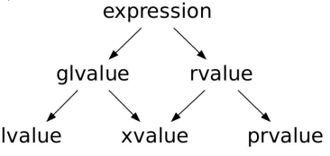
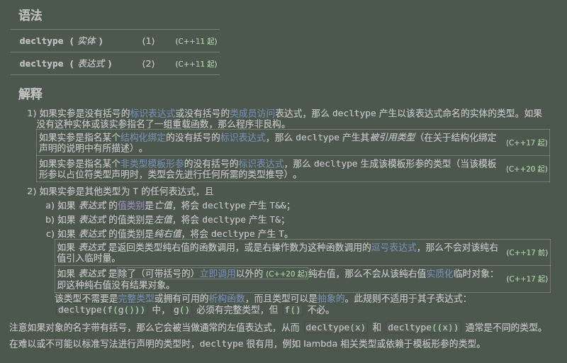

### ch04.表达式基础与详述目录
1. 表达式基础
2. 表达式详述
3. C++ 17 对表达式的求值顺序限定


### 一.表达式基础

#### 1.1.表达式基础 — 引入
- 表达式由一到多个操作数组成,可以求值并 ( 通常会 ) 返回求值结果
  - 最基本的表达式:变量、字面值
  - 通常来说,表达式会包含操作符(运算符)
  - 操作符的特性
    -  接收几个操作数:一元、二元、三元
    -  操作数的类型 —— 类型转换
    -  操作数是左值还是右值
    -  结果的类型
    -  结果是左值还是右值
    -  优先级与结合性 ([cpp-reference](https://zh.cppreference.com/w/cpp/language/operator_precedence)) ,可以通过小括号来改变运算顺序
    -  操作符的重载 —— 不改变接收操作数的个数、优先级与结合性
  - 操作数求值顺序的不确定性
####  1.2.表达式基础 — 左值与右值

- [cppreference.value](https://zh.cppreference.com/w/cpp/language/value_category)
- 传统的左值与右值划分
  - 来源于 C 语言:左值可能放在等号左边;右值只能放在等号右边
  - 在 C++ 中,左值也不一定能放在等号左边;右值也可能放在等号左边
    ```c
    #include<iostream>
    
    int main(){
      int x;
      x = 3;//3为纯右值
      3 = x;
      ----
    }
    ```
    ```c
    /*C++中,左值也不一定能放在等号左边*/
    const int x = 3;//首先, x为一个独一无二的标识, 是一个泛左值glvalue
    //其次,x是将亡值吗,x不是将亡值,因为后续代码中还可以使用x的值,不是一个即将消亡的东西
    //所以 x 为glvalue 但不是 xvalue 故 x 是一个lvalue 左值
    x = 4;//x为常量,不能放在等号左边进行修改, 既是左值不一定能放在左边 
    //==> 又称为 immutable lvalue 不可变左值
    
    /*C++中,右值也可能放在等号左边*/
    #include<vector>
    #include<iostream>
    struct Str{
    
    };
    int main(){
      int x = int();// int()代表一个纯右值
      ----
      Str x = Str();//用一个纯右值Str()去初始化x
      Str() = Str();//合法, Str()是临时变量,没有唯一的标识符可以对其进行定位,是一个纯右值
      Str() = x;//合法
    }
    ```

- 所有的划分都是**针对表达式**的,不是针对对象或数值
  - glvalue(generalized泛化,泛左值) :标识一个对象、位或函数 
  - prvalue(pure纯,纯右值) :用于初始化对象或作为操作数
  - xvalue(expiring将亡,将亡值) :表示其资源可以被重新使用
  
  
                                                      
    ```c
    #include<iostream>
    struct Str{
    };
    int main(){
      int{};//构造临时对象,通常也用于操作符操作数.为纯右值
      Str{};
    }
    ----
    #include<iostream>
    #include<vector>

    void fun(std::vector<int> && par){ //&&右值引用
      //传递给 par 的是将亡值,可以重复利用;将亡值也可以看做右值,使用右值引用进行接收
    }
    int main(){
      std::vector<int> x;// 此时 x 为左值
      fun(std::move(x)); //std::move(x)将 左值x 转换为将亡值

      //move后,就代表main()函数中后续的代码不会再对x值进行操作, 
      //因为 x 是即将死亡的值, 把x的信息交出去
    }
    ```

- 左值与右值的转换
  - 左值转换为右值( lvalue to rvalue conversion )
    ```c
    int x = 3;//x是一个左值
    int y = x;//对y的初始化需要纯右值,此时x转换为纯右值
    ----
    int x = 3;//左值
    int y;//左值
    y = x;//合法,把x作为操作符'='的操作数,此时x也是纯右值
    ----
    int x = 3;//左值
    int y = 3;//左值
    x + y;//操作符'+'接受右值作为输入,此时x,y为右值
    ```
  - 临时具体化( Temporary Materialization )
    prvalue-->xvalue
    ```c
    struct Str{
      int x;
    };
    
    int main(){
      Str();//纯右值,当做操作符的操作数进行使用,用来初始化对象,其并没有标识一块内存
      Str().x;//'.'为操作符,该操作符连接了前后两个表达式,
      //从'.'前面一个特定的内存中取一个部分;此时Str()变为了一块内存的标识符(glvalue),
      //但是后续又无法继续标识,所以此时Str()是一个将亡值
    }
    
    ----
    
    void fun(const int& par){
    
    }
    int main(){
      fun(3);//从引用角度讲,par是要绑定到具体的对象上的,
      //但此处3是一个纯右值,此时的3则是由纯右值转换为了将亡值
    }
    ```


- 再论 decltype
- [cppreference.decltype](https://zh.cppreference.com/w/cpp/language/decltype)
  


- [cppreference.move](https://zh.cppreference.com/w/cpp/utility/move)
    ```c
    表达式的值类型
    - prvalue → type  (类型)
    - lvalue → type&  (引用)
    - xvalue → type&& (右值引用)
    
    int x;
    decltype(x);//这是传入的实体,主要讨论掺入表达是的情况
    ----
    decltype(3) x;//3是纯右值int,decltype(3)返回int,所以x为int型
    ----
    int x;
    decltype((x)) y = x;//此时decltype((x))返回int& ,故y必须进行初始化
    ----
    int x;
    //std::move()构造亡值 #include<utility>
    decltype(std::move(x)) y = std::move(x);//int&& 右值引用 
    ```


#### 1.3.表达式基础 —— 类型转换
-  一些操作符要求其操作数具有特定的类型,或者具有相同的类型,此时可能产生类型转换
-  隐式类型转换
    - 自动发生
      ```c
      3 + 0.5;//0.5是double,会将3隐式转换为double
      //转换也是有一定限制的
      "abcef" + 0.5;//字符串无法进行隐式或显示的转换为double类型
      ```
    - 实际上是一个(有限长度的)转型序列,[隐式转换](https://zh.cppreference.com/w/cpp/language/implicit_conversion)
      ```c
        1) 零或一个来自下列集合者：左值到右值转换、数组到指针转换及函数到指针转换；(之前有讲到过)
        2) 零或一个数值提升或数值转换；
          (本节将重点讨论的地方)由小的类型转换到大的类型:char-->int
        3) 零或一个函数指针转换；(C++17 起)
        4) 零或一个限定转换。
      ```

- 显式类型转换
  - 显式引入的转换
  - [static_cast](https://zh.cppreference.com/w/cpp/language/static_cast),静态转换,在编译期实现
    ```c
    static_cast<double>(3) + 0.5;
    static_cast<double>"abcde" + 0.5;//同样非法
    ----
    std::cout<< (3/4) <<std::endl;//0
    std::cout<< 3/4.0 <<endl;//0.75
    int x = 3;
    int y = 4;
    cout<< x/static_cast<double>y <<endl;//0.75
    
    可以将基类的指针和引用转换为派生类的指针和引用,不是很安全,
    有点强制转换的意思,通常使用dynamic_cast进行实现
    int* ptr;
    void* v = ptr;
    
    int* ptr2 = v;//err  不纯在void* 到int* 的隐式转换
    int* ptr2 = static_cast<int*>v;//合法,进行显示转换
    ----
    
    void fun(void* par, int t){//c的处理方式,C++ 一般是使用函数重载
      if(t == 1){
        int* ptr = static_cast<int*> (par);
      }else if(t == 2){
        int* ptr = static_cast<double*> (par);
      }
      ...
    }
    
    int main(){
      int *ptr;
      double* ptr2;
      fun(ptr, 1);
      fun(ptr2, 2);
    }
    ```
  - const_cast
    ```c
    const int* ptr;
    static_cast<int*> ptr;//err,无法进行转换,无法去除常量性质
    const_cast<int*> ptr;//const_cast可以去除和引入常量性质
    ----
    int x = 3;
    const int& ref = x;//添加const性质
    int& ref2 = const_cast<int&>(ref);//去除const性质
    //此时可以通过ref2进行x的改变
    ref2 = 4;// x = 4, ref = 4,这种操作还是比较危险
    cout<<x<<endl;//4,
    ----
    const int x = 3;// x为常量
    const int& ref = x;//添加const性质
    int& ref2 = const_cast<int&>(ref);//去除const性质
    //此时可以通过ref2进行x的改变
    ref2 = 4;// ref = 4,这种操作还是比较危险
    cout<< x <<endl; //3,行为不确定性,有的编译器是3有的编译器是4
    因此在使用const_cast时,避免链接的是常量!!
    ```
  - dynamic_cast,动态转换,运行期实现,类小节讲解
  - reinterpret_cast,解释,重新解释
    ```c
    int x = 3;//内存开辟了一段空间进行保存,但是内存是无差别对待的
    //reinterpret_cast将这段内存强行看成另外的含义
    double y = reinterpret_cast<double>(x);//err 无法通过编译
    ---
    int x = 1;
    int* ptr = &x;
    double* ptr2 = reinterpret_cast<double*>(ptr);
    //编译合法,对内存空间进行从新解释,但是int内存到double内存不一样,输出的值并不是我们想要的值
  - [C 形式的类型转换](https://zh.cppreference.com/w/cpp/language/explicit_cast),C++中避免使用C类型的转换
    ```c
    ( new_type ) expression	(1)	
    new_type ( expression )	(2)	
    new_type ( arg1, arg2, ... )	(3)	
    new_type ( )	(4)	
    new_type { arg1, arg2, ...(optional) }	(5)	(since C++11)
    template-name ( arg1, arg2, ...(optional) )	(6)	(since C++17)
    template-name { arg1, arg2, ...(optional) }	
    ```

### 二.表达式详述
#### 2.1.表达式详述——算术操作符
- 共分为三个优先级
  - \+ , - (一元)

  - \* , / , %
  - \+ , - (二元)

-  均为左结合的
    ```c
    int x = 3;
    int y = 5;
    +x;//一元
    -x;//一元
    x + y;//二元
    x - y;//二元
    3 + 5 * 7;
    7 * + 3;//合法7 * (+3),一元操作符的优先级最高  
    /*左结合*/
    7 * 3 * 5;//(7*3)*5
    7 - 3 - 4;//(7-3)-4
    ```
-  通常来说,操作数与结果均为算数类型的右值;但加减法与一元 + 可接收指针
    ```c
    int x = 3;//x是左值
    int y = 4;//y是左值
    x + y;//结果是右值
    ---
    int a[3]={1,2,3};
    int *ptr = a;
    ptr = ptr + 1;
    ptr = ptr - 1;
    
    std::cend(a) - std::cbegin(a);
    ---
    int a[3] = {1,2,3};
    auto x = a;//int*
    auto& x = a;//int(&)[3]
    const auto& x = +a;//一元运算符'+', 使用'+'强制实现类型变换
    //等价于 int* const& x = +a; 
    ```
-  一元 + 操作符会产生 integral promotion (整数的提升)
-  整数相除会产生整数,**向 0 取整**
-  求余只能接收整数类型操作数,结果符号与第一个操作数相同
-  满足 (m / n) * n + m % n == m
    ```c
    short x = 3;
    auto y = +x;//此时y的类型为int
    /*除法'\':向零去整*/
    4/3;//1
    -4 / 3;//-1
    /*求余:只针对整数*/
    cout<< (4/3)*3 + (4%3) <<endl;//4
    cout<< (4/-3)*-3 + (4%-3) <<endl;//4
    cout<< (-4/3)*3 + (-4%3) <<endl;//-4
    3/0;//err
    ```


#### 2.2.表达式详述——逻辑与关系操作符
-  关系操作符接收算术或指针类型操作数;（== 、!= 、< 、<= 、> 、>=）
  逻辑操作符接收可转换为 bool 值的操作数'&&','||','!'
-  操作数与结果均为右值(结果类型为 bool )
-  除逻辑非外,其它操作符都是左结合的
-  逻辑与、逻辑或具有短路特性
    ```c
    a && b;//如果a为假,直接返回假,不会计算b
    ---
    int* ptr = nullptr;
    //*ptr == 3;对空指针解引用是未定义的行为,但下面这句合法
    if(ptr && (*ptr == 3)){//合法ptr,如果为空则不执行if,如果不为空,再判断解引用是否为3
    }
    ---
    a||b;//如果a为真,直接返回真,不计算b
    ```
-  逻辑'&&'与的优先级高于逻辑或'||'
    ```c
    /*最好加括号*/
    a && b || c;//先计算&&
    a || b && c;//先计算&&
    ```
-  通常来说,不能将多个关系操作符串连
    ```c
    int a = 3;
    int b = 4;
    int c= 5;
    cout<< (c > b > a) <<endl;//按数学逻辑看是正确的
    //但是程序结果为0,先计算c>b=true==1,1>a=false
    cout<< (c > b)&&(b > a)<<endl;//改为此句,1
    ---
    int a = 3;
    int b = 3;
    int c = 3;
    cout<< (a == b == c) <<endl;//0,a==b==true==1,1==c==false
    cout<< (a == b)&&(b == c)<<endl;//1
    ```

-  不要写出 val == true 这样的代码
    ```c
    int a = 3;
    if(a)//a!=0,执行if
    if(a == true)//最好不要这样写,a==true,程序会将true转换为1
    //上句会等价与 if(a==1)
    ---
    int a = 3;
    if(a == true){
        cout<<"debug - 1"<<endl;
    }
    if(a){
        cout<<"debug - 2"<<endl;
    }
    result:debug - 2
    ```
-  Spaceship operator(飞船操作符): <=>
    #include<compare>
     - [strong_ordering](https://zh.cppreference.com/w/cpp/utility/compare/strong_ordering)
        ```c
        a,b; //如果a,b很复杂,则很耗时间
      
        if(a > b){
      
        }else if(a < b){
      
        }else{
      
        }
        ---
        int a = 3;
        int b = 5;
        auto res = (a <=> b);//提升时间性能, C++20提出来的
        if(res > 0){
        //if(res > std::strong_ordering::greater){//等价  
      
        }else if(res < 0){
        //if(res > std::strong_ordering::less){//等价  
      
        }else{
        //if(res > std::strong_ordering::equal){//等价  
      
        }
        ```
     - [weak_ordering](https://zh.cppreference.com/w/cpp/utility/compare/weak_ordering)

     - [partial_ordering](https://zh.cppreference.com/w/cpp/utility/compare/partial_ordering)

        ```c
        auto res = (3.0 <=> 5.0);
        //等价于
        ats::partial_ordering res = (3.0 <=> 5.0);
        cout<< sqrt(-1)<<endl;// -nan, -nan无法进行比较
        ```

#### 2.3.表达式详述——位操作符
~按位取反,&按位与,|按位或,^按位异或
-  接收右值,进行位运算,返回右值
-  除取反外,其它运算符均为左结合的
-  注意计算过程中可能会涉及到 integral promotion
-  注意这里没有短路逻辑
-  移位操作在一定情况下等价于乘(除) 2 的幂,但速度更快:>>1, <<1
-  注意整数的符号与位操作符的相关影响
     - integral promotion 会根据整数的符号影响其结果
     - 右移保持符号,但左移不能保证

#### 2.4.表达式详述——赋值操作符
-  左操作数为可修改左值;右操作数为右值,可以转换为左操作数的类型
    ```c
    int x;
    x = true;//true 转为int的1
    ```
-  赋值操作符是右结合的
    ```c
    int x;
    int y;
    x = y = 3;//右结合,y = 3; x = y;//结果x = y = 3;
    x = 5 = 2;//右结合,5 = 2;非法
    (x = 5) = 2;//合法,结果为x = 2;
    ```
-  求值结果为左操作数
-  可以引入大括号(初始化列表)以防止收缩转换(narrowing conversion)
    ```c
    short x;
    x = 0x80000003;//0x80000003为int
    cout<< x <<endl;//waring,3结果会被截取
    //改
    x = {0x80000003};
    cout<< x <<endl;//err,加强安全性
    ---
    int y = 3;
    short x;
    x = {y};//err
    std::cout<< x <<std::endl;
    ---
    //const int y = 3;//const是运行期常量,还是会报错
    constexpr int y = 3;
    //编译期常量,当编译期看到这句话时知道值一定是3,不会溢出
    short x;
    x = {y};//不报错
    std::cout<< x <<std::endl;//err
    ```
-  小心区分 = 与 ==
    ```c
    if(x = 3)//永真
    if(x == 3)
    ```
-  复合赋值运算符
    ```c
    int x = 2;
    x = x + 2;
    x += 2;
    ---
    int x = 2;//0010
    int y = 3;//0011
    x^=y^=x^=y;
    /*本质是赋值操作符,右结合
    (1)最右边的x^=y ==> x = x^y;//0001
    (2)中间的 y^=x ==> y = y^x;//0010
    (3)最左边的x^=y ==> x = x^y;//0011
    */
    std::cout<< x <<std::endl;  //3
    std::cout<< y <<std::endl;  //2
    ```
#### 2.5.表达式详述——自增与自减运算符
-  ++; --
-  分前缀与后缀两种情况
-  操作数为左值;前缀时返回左值;后缀时返回右值
  x ++,实际上已经更新计算,返回的是临时值(自增之前的值),既是右值
    ```c
    int x = 3;
    ++++x;//合法,返回的是左值
    cout<< x <<endl;//5
    ----
    int x = 3;
    x++++;//等价于(x++)++,非法
    //非法,(x++)返回的是右值,无法放在左边再进行赋值
    ----
    int x = 3;
    int y = 5;
    5 + ++++x;//合法
    5+++++x;//非法,贪婪原则
    ```

-  建议使用前缀形式

#### 2.6.表达式详述——其它操作符
- 成员访问操作符: . 与 ->
  - -> 等价于 (*).
  - . 的左操作数是左值(或右值),返回左值(或右值 xvalue )
  - -> 的左操作数指针,返回左值
  ```c
  struct Str{
    int x;
  };
  int main(){
    Str a;
    a.x;
    //-> 等价于 (*).
    Str* ptr = &a;
    (*ptr).x;
    ptr -> x;
    ----
    //. 的左操作数是左值(或右值),返回左值(或右值 xvalue )
    Str a;
    a.x;//左值
    decltype(a.x) y;//decltype(实体) int
    decltype((a.x)) y = a.x;//decltype(实体) int&
  
    //.的左操作数是右值,返回将亡值
    decltype((Str().x)) y = std::move(a.x);//(Str().x)右值
  
    //-> 的左操作数指针,返回左值
    Str a;
    Str* ptr = &a;
    decltype((ptr->x)) y = a.x;//(ptr->x)为左值返回引用,int&
  }
  ```


- 条件操作符
  - 唯一的三元操作符
  - 接收一个可转换为 bool 的表达式与两个类型相同的表达式,只有一个表达式会被求值
  - 如果表达式均是左值,那么就返回左值,否则返回右值
  - 右结合表 
    ```c
    //三元操作符
    cout<< (true ? 3 : 5) <<endl;//3
    cout<< (false ? 1 : "Hello") <<endl;//err,返回的类型必须是相同的
    ---
    //如果表达式均是左值,那么就返回左值,否则返回右值
    int x = 2;
    false ? 1 : x;//1为纯右值,x为左值,返回的是右值
    int y = 3;
    false ? y : x;//均为左值,返回的是左值
    ---
    //右结合
    int score = 100;
    int res = (score > 0) ? 1 : (score == 0) ? 0 : -1;
    //右结合,返回右值1;
    ```
- 逗号操作符
  - 确保操作数会被从左向右求值
  - 求值结果为右操作数
  - 左结合
    ```c
    2,3;//从左至右求值
    cout<< (2,3,4,5) <<endl;//5
    ---
    int x;
    int y;
    (++x), (++y);
    fun(++x, ++y);//这不是逗号表达式,先计算++x,还是++y,不能确定
    ```

- [sizeof 操作符](https://zh.cppreference.com/w/cpp/language/sizeof)
  - 操作数可以是一个类型或一个表达式
    - sizeof(类型)	
    - sizeof 表达式	

  - 并不会实际求值,而是返回相应的尺寸
- 其它操作符
  - 域解析操作符 ::
  - 函数调用操作符 ()
  - 索引操作符 []
  - 抛出异常操作符 throw
  - ...
    ```c
    int x;
    
    namespace::ABC{
      int x;
    }
    int main(){
      int x;
      int y = ::x;//访问全局域里面的x
      int z = ABC::x;//ABC中的x
    }
    ```


### 三.C++ 17 对表达式的求值顺序限定
- 以下表达式在 C++17 中,可以确保 e1 会先于 e2 被求值
  - e1[e2]
  - e1.e2
  - e1.*e2
  - e1→*e2
  - e1<<e2
  - e1>>e2
  - e2 = e1 / e2 += e1 / e2 *= e1... (赋值及赋值相关的复合运算)
- new Type(e) 会确保 e 会在分配内存之后求值