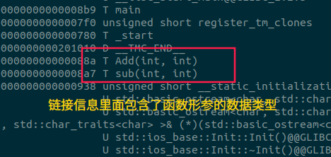
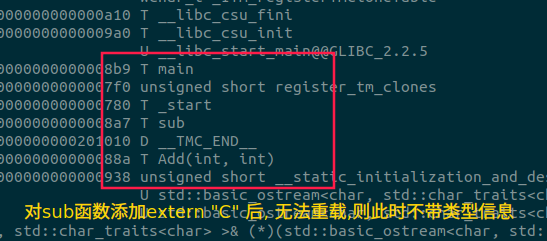
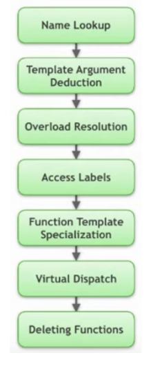

@[TOC]()

# 
##

### ch06.函数
1. 函数基础
2. 函数详解
3. 函数重载与重载解析
4. 函数相关的其它内容

### 一.函数基础
#### 1.1.函数:封装了一段代码,可以在一次执行过程中被反复调用。
  - 函数头
    - 函数名称 —— 标识符,用于后续的调用
    - 形式参数 —— 代表函数的输入参数
    - 返回类型 —— 函数执行完成后所返回的结果类型
  - 函数体
    - 为一个语句块( block ),包含了具体的计算逻辑
#### 1.2.函数声明与定义
  - 函数声明只包含函数头,不包含函数体,通常置于头文件中
  - 函数声明可出现多次,但函数定义通常只能出现一次(存在例外)

如果只有声明,没有定义,则编译期不会出错,链接期出错,找不到函数的定义
#### 1.3.函数调用
  - 需要提供函数名与实际参数
  - 实际参数拷贝初始化形式参数
  - 返回值会被拷贝给函数的调用者
  - 栈帧结构
    ```c
    #include<iostream>
    //函数声明,可以声明多次
    int Add(int x, int y);
    int Add(int x, int y);
    int Add(int x, int y);

    //函数定义,只能实现一次
    int Add(int x, int y){//x,y为形参
      //栈帧结构,函数的变量都是放在栈里面,调用结束释放
      int x1 = x + 1;
      return x + y;
    }

    int main(){
      //函数调用;2,3为实参
      //实际参数拷贝初始化形式参数
      //int x = 2;int y = 3;
      std::cout<< Add(2, 4) <<std::endl;
    }
    ```
#### 1.4.拷贝过程的(强制)省略
  - 返回值优化
  - C++17 强制省略拷贝临时对象
#### 1.5.函数的外部链接
  ```c
  #include<iostream>
  //函数定义,只能实现一次
  //C++中函数可以重载
  int Add(int x, int y){//x,y为形参
    int x1 = x + 1;
    return x + y;
  }

  extern "C"
  //转换为C语言的形式,C语言无法重载,编译后不带形参的类型信息
  //如果有函数声明,声明也需要添加extern "C"修饰
  int sub(int x, int y){
    return x - y;
  }

  int main(){
    int z = Add(2, 3);
    cout<< z <<endl;
    z = sub(2, 3);
    cout<< z <<endl;
  }
  ```
函数编译后,在链接过程中,会包含有函数的类型信息,只有类型信息,没有形参



C语言在调用时直接查找add,sub,此时就没办法调用C++编译的结果(因为C++编译得到的是add(int,int)),而要在C++中更改为C风格,则添加extern "C",此时C++编译后得到的函数就是sub.




### 二.函数详解
#### 2.1.函数详解——参数  
- 函数可以在函数头的小括号中包含零到多个形参
  - 包含零个形参时,可以使用 void 标记
  - 对于非模板函数来说,其每个形参都有确定的类型,但形参可以没有名称
    ```c
    #include<iostream>
    //形参可以没有名称,因为编译后是通过类型进行链接的,如前面截图所示
    void fun(int, int y){
      cout<< y <<'\n';//当然也只能访问y
    }
    int main(){
      fun(1, 2);//但是调用还是必须得输入两个实参
    }
    ```
  - 形参名称的变化并不会引入函数的不同版本
    ```c
    #include<iostream>
    //形参可以没有名称,因为编译后是通过类型进行链接的,如前面截图所示
    void fun(int, int y){
      cout<< y <<'\n';//当然也只能访问y
    }
    void fun(int x, int y){//算重复定义,原因同样是链接阶段,只看形参类型
      cout<< y <<'\n';
    }
    ```
  - 实参到形参的拷贝求值顺序不定, C++17 强制省略复制临时对象
    ```c
    /*实参到形参的拷贝求值顺序不定,*/
    #include<iostream>
    void fun(int x, int y){
      cout<< y <<'\n';
    }
    int main(){
      //调用过程,拷贝初始化
      //int x = 1; int y = 2;//谁先初始化,不确定
      fun(1, 2);
      int x = 0;
      //由于不知道谁先初始化,因此这种调用方式十分的危险
      fun(x++, x++);
    }
    ```
    ```c
    /*C++17 强制省略复制临时对象*/
    #include<iostream>
    struct Str{
      Str() = default;
      Str(const Str&){
        std::cout<< "Copy constructor is called!.\n";
      }
    };
    void fun(Str par){
    }
    int main(){
      Str val;
      fun(val);//Copy constructor is called!
      // 通过val 拷贝初始化形参
      // 调用的过程就是将val拷贝给par,所以调用了拷贝初始化,
      // 打印:Copy constructor is called!
    }
    ----
    int main(){
      //如果不使用拷贝构造,而是使用传递临时变量
      fun(Str{});//则没有输出:C++17 强制省略复制临时对象
    }
    ```
- 函数传值、传址、传引用
    ```c
    #include<iostream>
    void fun(int par){
      ++ par;
    }
    void fun1(int* par){
      ++ (*par);
    }
    void fun2(int& par){
      ++ par
    }
    int main(){
      int arg = 3;
      fun(arg); //传值.拷贝初始化,int par = arg;par与arg无关
      std::cout<< arg <<std::endl;//3

      fun1(&arg);//传址.拷贝初始化,int* par = &arg;par解地址是arg
      std::cout<< arg <<std::endl;//4

      fun1(arg);//传引用.拷贝初始化,int& par = arg;par绑定到arg
      std::cout<< arg <<std::endl;//4
    }
    ```
- 函数传参过程中的类型退化
    ```c
    #include<iostream>
    void fun(int* par){
    }
    /*
    void fun(int par[])
    void fun(int par[3])
    这两中写法,在编译后形参均是int*,同时存在算重复定义
    测试: https://cppinsights.io/
    void fun(int (&par)[3])//3为确定的,无类型退化的数组引用
    使用引用,没有类型退化,但是在函数的传参过程中,不存在值传递,因此
    传递数组引用作为形参的意义不是很大!!
    */
    void fun1(int (*par)[4]){//数组指针
    }
    /*
    void fun1(int par[3][4])//合法
    void fun1(int par[100][4])//合法
    void fun1(int par[3][5])//非法,后面这个数不能改!!
    void fun(int (&par)[3][4])//合法,无类型退化的数组引用
    */
    int main(){
      int a[3];
      auto b = a;//b为int*
      auto& b = a;//b为int(&)[3]:数组引用
      fun(a);//a由 int[3]退化为int*
      //形参建议写为int* par 或者int par[]
      ----
      //多维数组情况
      int a1[3][4];
      auto ptr = a1;//a1由int[3][4]退化为int(*)[4]:数组指针
      auto& b1 = a;//b1为int(&)[3][4]
      fun1(a1);
    }
    ```
**学到这里,可以知道,我们可以通过`auto b = 实参`,到[insights](https://cppinsights.io/)中查看函数形参的类型!!**
- 变长参数
  - [initializer_list](https://zh.cppreference.com/w/cpp/utility/initializer_list)
  - 可变长度模板参数:后面讨论
  - 使用省略号表示形式参数:在C++中不是一种很好的方式
  ```c
  #include<iostream>
  #include<initializer_list>
  //initializer_list含有两个指针,一个指向头,一个指向尾的后一位
  void fun(std::initializer_list<int> par){
  }

  //这样写非常危险,initializer_list调用完就销毁了
  initializer_list<int> fun1(){
    return {1,2,3,4,5};
  }
  int main(){
    fun({1,2,3,4,5});//传入五个参数
    auto res = funq();//很危险,值可能不是我们想要的
  }
  ```
- 函数可以定义缺省实参
  - 如果某个形参具有缺省实参,那么它右侧的形参都必须具有缺省实参
  - 在一个翻译单元中,每个形参的缺省实参只能定义一次
  - 具有缺省实参的函数调用时,传入的实参会按照从左到右的顺序匹配形参
  - 缺省实参为对象时,实参的缺省值会随对象值的变化而变化
  ```c
  #include<iostream>
  /*最不重要的参数放在形参后面
    void fun(int x, int y = 0)//合法
    void fun(int x = 0, int y = 0)//合法
    void fun(int x = 0, int y)//非法
  */
  void fun(int x = 0){
  }
  int main(){
    fun(1);
    fun();//这样调用就使用缺省的实参0
  }
  ```
  ```c
  #include<iostream>
  /*缺省实参为对象时,实参的缺省值会随对象值的变化而变化*/
  int x = 3;
  void fun(int y = x){
    std::cout<< y <<std::endl;
  }
  int main(){
    fun();//fun(x);
  }
  ----
  //最安全的写法
  //headr.h
  void fun(y = 3);
  //source.cpp
  void fun(y){
    std::cout<< y <<std::endl;
  }
  ```
- [main 函数的两个版本](https://zh.cppreference.com/w/cpp/language/main_function)
  - 无形参版本
  - 带两个形参的版本
  ```c
  int main()
  int main(int ac, char** av)
  int main(int argc, int *argv[]){
    //argc:实参的个数
    //argv是argc+1个指针,指向的是char[]
    //argv[0]指向表示用于调用程序的名称的字符串，或空字符串。
    if(argc != 3){
      std::cout<< "Usage: "<< argv[0] << "param1 param2\n";
    }
    for(int i = 0; i < argc; ++i){
      std::cout<< argv[0] <<std::endl;
    }
  }
  ```
#### 2.2.函数详解——函数体
- 函数体形成域:
  - 其中包含了自动对象(内部声明的对象以及形参对象)
  - 也可包含局部静态对象
  ```c
  #include<iostream>
  void fun(){
    int x = 0;
    ++ x;
    std::cout<< x << std::endl;
  }
  int main()
    fun();//1
    fun();//1
  }
  ----
  void fun(){
    static int x = 0;//局部静态对象
    //多线程时,局部静态对象只会初始化一次
    ++ x;
    std::cout<< x << std::endl;
  }
  int main()
    fun();//1
    fun();//2
  }
  ```
- 函数体执行完成时的返回
  - 隐式返回
    ```c
    void fun(){
      std::cout<< "Hello!\n";
      //隐式返回
    }
    int main(){
      fun();
      //main的返回值为int,但可以忽略,隐式返回return 0;
    }
    ```
  - 显式返回关键字: return
    - return; 语句
    - return 表达式 ;
    ```c
    void fun(){
      std::cout<< "Hello!\n";
      return;//显式返回
      std::cout<< "World!\n";
    }
    int fun(){
      return 1;
      return true;
    }
    int main(){
      fun();
      return 0;//显式返回
    }
    ```
    - return 初始化列表 ;
    ```c
    #include<iostream>
    #include<vector>
    std::vector<int> fun(){
      std::cout<< "Hello!\n";
      return {1,2,3,4,5};//显式返回
      std::cout<< "World!\n";
    }
    int main(){
      fun();
      return 0;//显式返回
    }
    ```

  - 小心返回自动对象的引用或指针
    ```c
    //危险操作,对象被销毁了,一般是以引用传参进行
    int& fun(){
      int x = 3;
      return x;
    }
    int main(){
      int& res = fun();
    }
    //指针同理
    ```
  - 返回值优化( RVO ) —— C++17 对返回临时对象的强制优化
    ```c
    struct Str{
      Str() = default;
      Str(const Str&){
        std::cout<< "Copy constructor is called!\n";
      }
    };
    Str fun(){
      Str x;//具名对象
      return x;//因为会被销毁,所以会生成一个临时对象进行返回
    }
    int main(){
       Str res = fun();//没有任何输出,既没有调用拷贝构造函数
       //理论上需要调用两次拷贝构造函数,被C++17优化了!//为什么是两次
       //fun函数返回时,构建一个临时对象进行拷贝初始化
       //(临时对象的初始化调用一次:x-->临时对象)
       //(返回赋值调用一次:临时对象-->res)
       //优化后:对同一块内存进行操作
    }
    ```
#### 2.3.函数详解——返回类型
- 返回类型表示了函数计算结果的类型,可以为 void
  ```c
  auto fun(int a, int b) -> void{
    std::cout<< a << std::endl;
  }
  int main(){

  }
  ```
- 返回类型的几种书写方式
  - 经典方法:位于函数头的前部
  - C++11 引入的方式:位于函数头的后部
  - C++14 引入的方式:返回类型的自动推导
    - 使用 constexpr if 构造 “ 具有不同返回类型 ” 的函数
      ```c
      auto fun(int a, int b){//根据return语句进行推导类型
        std::cout<< a << std::endl;
        return x;
        return (x);//auto退化推导为 int
      }
      const auto& fun(int a, int b){//无退化: const int&
        std::cout<< a << std::endl;
        return x;
        return (x);//auto退化推导为 int
      }
      //根据return语句进行推导类型,不会产生退化
      decltype(auto) fun(int a, int b){//int&
        std::cout<< a << std::endl;
        int x;
        return (x);//返回的是表达式:int&
      }
      int main(){
          decltype(3) x = 4;
      }
      ```
      ```c
      /*使用 constexpr if 构造 “ 具有不同返回类型 ” 的函数*/
      constexpr bool value = false;
      auto fun(){
        //if(value)//err,返回值1;1.0不一样
        //if constexpr编译期确定的,所以编译完后返回值只有一种类型,合法!!
        if constexpr(value)
          return 1;
        else
          retun 1.0;
      }
    ```
- 返回类型与结构化绑定( C++ 17 )
  ```c
  #include<iostream>
  struct Str{
    int x;
    int y;
  };
  Str fun(){
    return Str{};
  }
  int main(){
    Str res = fun();
    res.x;
    res.y;
    //C++17后可以这样简化
    // res1 = res.x; res2 = res.y;
    auto [res1, res2] = fun();
    /*通过insights可以看出这句等价于
    Str __fun12 = fun();
    int & res1 = __fun12.x;
    int & res2 = __fun12.y;
    */
  }
  ```
  ```c
  #include<iostream>
  struct Str{
    int x;
    int y;
  };
  Str& fun(){//返回引用,为了安全,返回静态变量
    static Str inst;
    return inst;
  }
  int main(){
    auto& [res1, res2] = fun();//非法,
    //引用必须绑定到一个对象上,而此处只有临时对象
    //如上,更改fun()函数后合法,此句等价于
    /*
    Str & __fun11 = fun();
    int & res1 = __fun11.x;
    int & res2 = __fun11.y;
    */
  }
  ```
  ```c
  #include<iostream>
  #include<string>
  struct Str{
    int x;
    std::string y;
  };
  Str& fun(){//返回引用,为了安全,返回静态变量
    static Str inst;
    return inst;
  }
  int main(){
    auto& [res1, res2] = fun();//不同类型也可以接
    /*
    Str & __fun12 = fun();
    int & res1 = __fun12.x;
    std::basic_string<char> & res2 = __fun12.y;
    */
  }
  ```

- \[[nodiscard]] 属性( C++ 17 )
  ```c
  #include<iostream>
  int fun(int a, int b){
    return a + b;
  }
  int main(){
    fun(2, 3);//这样用没意义,但不会报错
  }
  ----
  #include<iostream>
  [[nodiscard]] int fun(int a, int b){
    return a + b;
  }
  int main(){
    fun(2, 3);//此时会有warning
  }
  ```


### 三.函数重载与重载解析



- 函数重载:使用相同的函数名定义多个函数,每个函数具有不同的参数列表
  - 不能基于不同的返回类型进行重载
    也可以从代码编译期函数的标识理解,如上一章中的'Add(int,int)'

- 编译器如何选择正确的版本完成函数调用 ?
  - 参考资源: Calling Functions: A Tutorial
- 名称查找
  - 限定查找( qualified lookup )与非限定查找( unqualified lookup )
  - 非限定查找会进行域的逐级查找 —— 名称隐藏( hiding )
  - 查找通常只会在已声明的名称集合中进行
  - 实参依赖查找( Argument Dependent Lookup: ADL )
    - 只对自定义类型生效
  ```c
  //限定查找
  #include<iostream>
  void fun(){
  }
  namespace NS{
    void fun(){
    }
  };
  
  int main(){
    ::fun();
    NS::fun();
  }
  //非限定查找
  #include<iostream>
  void fun(){
  }
  namespace NS{
    void fun(){
    }
    void g(){
      fun();//非限定查找,先查找同域,再查找全局域
    }
  };
  
  int main(){
    NS::g();
  }
  //查找通常只会在已声明的名称集合中进行
  #include<iostream>
  void fun(int x){
    cout<< "int.\n";
  }
  void g(){
    fun(1.0);
  }
  void fun(double x){
    cout<< "double.\n";
  }

  int main(){
    g();//在g();的定义之前只声明了fun(int),所以查找的是fun(int)
  }

  //实参依赖查找( Argument Dependent Lookup: ADL )
  //只对自定义类型生效
  #include<iostream>
  namespace NS{
    struct Str{
    }; 
    void fun(Str x){
    }
  }

  int main(){
    NS::Str value;
    fun(value);//合法.没有加NS,通过实参value的类型找到NS域,从而找到fun
  }
  -----
  //实参依赖查找( Argument Dependent Lookup: ADL )
  //只对自定义类型生效
  #include<iostream>
  template<Typename T>
  void g(T val){
    fun(val);
  }
  namespace NS{
    struct Str{
    };
    void fun(int x){
    }
  }

  int main(){
    NS::Str x;
    //似乎违反了"查找通常只会在已声明的名称集合中进行"
    g(x);//合法.顺序执行到这儿的时候,在对g()实例化,此时已经知道T的实际类型
  }
  ```
- 重载解析:在名称查找的基础上进一步选择合适的调用函数
  - 过滤不能被调用的版本 (non-viable candidates)
    - 参数个数不对
    - 无法将实参转换为形参
    - 实参不满足形参的限制条件
    ```c
    #include<iostream>
    void fun(int){
    }
    void fun(std::string){
    }
    int main(){
       fun(3);//合法
    }
    ```
  - 在剩余版本中查找与调用表达式最匹配的版本,匹配级别越低越好(有特殊规则)
    - 级别 1 :完美匹配 或 平凡转换(比如加一个 const )
    - 级别 2 : promotion 或 promotion(类型提升) 加平凡转换
    - 级别 3 :标准转换 或 标准转换加平凡转换
    - 级别 4* :自定义转换 或 自定义转换加平凡转换 或 自定义转换加标准转换
    - 级别 5* :形参为省略号的版本
    - 函数包含多个形参时,所选函数的所有形参的匹配级别都要优于或等于其它函数
    ```c
    #include<iostream>
    void fun(int){
    }
    //void fun(const int)//算重定义
    void fun(std::string){
    }
    int main(){
      fun(3);//级别1
    }
    ```
    ```c
    /*特殊规则*/
    #include<iostream>
    void fun(const int&){//不算重定义
      std::cout<< "const int&.\n";
    }
    void fun(int&){
      std::cout<< "int&.\n";
    }
    int main(){
      int x;
      //合法const int& 能做的事情更少,编译器会有限选择int&.
      fun(x);
      //合法,结果:const int&.fun(int&)形参为左值引用,3为右值
      fun(3);
    }
    ```
    ```c
    /*函数包含多个形参时,所选函数的所有形参的匹配级别都要优于或等于其它函数*/
    #include<iostream>
    void fun(int, float){//不算重定义
      std::cout<< "int, float.\n";
    }
    void fun(int, double){
      std::cout<< "int, double.\n";
    }
    int main(){
      fun(1, 1.0);
      fun(1, 1);//err.多个形均要匹配
    }
    ```
### 四.函数相关的其它内容
- 递归函数:在函数体中调用其自身的函数
  - 通常用于描述复杂的迭代过程(示例)

- 内联函数 / constexpr 函数 (C++11 起 ) / consteval 函数 (C++20 起 )
  ```c
  //内联函数,短小的经常使用的语句,避免调用栈帧浪费资源
  //inline只是对编译器的建议,并不一定会被内联,递归无法内联
  #include<iostream>
  inline void fun(){
    std::cout<< "Hello, World!" <<std::endl;
  }
  int main(){
  }

  ----
  //也可以定义编译期函数
  constexpr int fun(int x){//必须在编译期能计算,运行期计算的不行
    return x + 1;
  }
  constexpr int x = fun(3);//编译期常量,进行编译期优化

  int main(){
    std::cout<< x <<std::endl;
  }
  ----
  //consteval 函数:既能在编译期调用也能在运行期调用
  constevel int fun(int x){//必须在编译期能计算,运行期计算的不行
    return x + 1;
  }

  constexpr int x = fun(3);//编译期常量,进行编译期优化
  int main(){
    constexpr int val = 3;
    constexpr int res = fun(val);
  }
  ```
- 函数指针
  - 函数类型与函数指针类型
    ```c
    //函数也是一个对象
    #include<iostream>
    //函数的类型用处比较少,可以用来声明
    using F = int(int);
    F f;//合法,声明了一个函数,int f(int)

    //数组
    using k = int[3];
    int[3] a;//非法
    k a = {};//聚合初始化,合法
    //函数
    using F = int(int);
    int(int) f;//非法
    F f = {};//非法   
    //现代C++ 扩展了,std::function,可以将函数类型作为模板的参数

    int fun(int val){//fun的类型为 int(int)
      return val + 1;
    }
    int main(){
      int a[3];//int[3]
    }
    ```
    ```c
    //函数指针类型

    //数组
    using k = int[3];
    k* a;//a是一个指针,指向int[3],==数组指针-->int(*a)[3]
    //区别 int* a[3];指针数组

    //函数
    using F = int(int);
    F* f;//函数指针   

    ----
    #include<iostream>

    int add(int val){
      return val + 1;
    }
    int sub(int val){
      return val - 1;
    }
    using F = int(int);
    int x(F* child, int val){
      auto tmp = (*child)(val);
      return tmp * tmp;
    }
    int main(){
      F* fun = &add;//指针指向add函数
      fun = &sub;//fun是指针变量,可以修改
      std::cout<< x(fun, 3) <<std::endl;// 2*2 = 4
    }
    ```
    ```c
    //函数指针类型

    //数组
    using k = int[3];
    k* a;//a是一个指针,指向int[3],==数组指针-->int(*a)[3]
    //区别 int* a[3];指针数组

    //函数
    using F = int(int);
    F* f;//函数指针   
    ----
    #include<iostream>

    int add(int val){
      return val + 1;
    }
    int sub(int val){
      return val - 1;
    }
    using F = int(int);
    int x(F* child, int val){
      auto tmp = (*child)(val);
      return tmp * tmp;
    }
    //数组做形参
    void FunWithArr(int a[3]);//形参中的数组退化为指针

    //函数做形参
    void FunWithFun(F val);//形参中的函数退化为函数指针F*
    //等价于
    void FunWithFun(F* val){
      std::cout<<val(3)<<std::endl;
    }

    //数组做形参
    void demo(int a[3]){

    }
    int main(){

      //数组
      int arr[3];
      demo(arr);
      auto ptr = arr;//arr退化为指针
      demo(ptr);

      //函数
      F* fun = &add;//指针指向add函数
      FunWithFun(fun);//4
      FunWithFun(add);
    }
    ```
    ```c
    //数组
    int[3] demo(){//非法
      }

    using k = int[3];
    k* demo(){//合法
    }

    //函数
    using F = int(int);
    F demo(){//非法
    }

    F* demo(){//合法
    }

    //使用:高阶函数
    F* demo(bool val){
      if(val){
        return add;//前面定义的add函数
      }else{
        return sub;
      }
    }
    ```
  - 函数指针与重载
    ```c
    #include<iostream>
    //函数重载
    void fun(int){

    }
    /*
    void fun(int, int){
    }
    */
    int main(){
      auto x = fun;//auto推导的结果就是函数指针
      /*insights解析
      using FuncPtr_11 = void (*)(int);
      FuncPtr_11 x = fun;
      */
    }

    ------
    //还是可以从函数的编译期名称那里来理解
    void fun(int){
    }
    void fun(int, int){
    }
    int main(){
      auto x = fun;//err
    }
    -----
    void fun(int){
    }
    void fun(int, int){
    }
    using k = void(int);
    using k1 = void(int, int);

    int main(){
      k* x = fun;//合法,int(*)(int),链接第一个fun
      k1* x = fun;//合法,int(*)(int, int),链接第二个fun
    }
    ```
  - 将函数指针作为函数参数
    函数返回值可以是函数指针不能是函数类型

  - 将函数指针作为函数返回值
  - 小心: [Most vexing parse](https://en.wikipedia.org/wiki/Most_vexing_parse)
