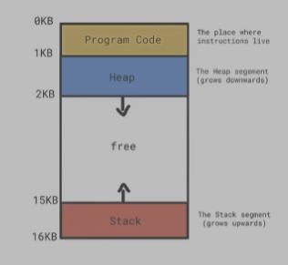

# ch08.动态内存管理目录
1. 动态内存基础
2. 智能指针
3. 动态内存的相关问题

# 一.动态内存基础



- 栈内存 V.S. 堆内存
  - 栈内存的特点:更好的局部性,对象自动销毁
  - 堆内存的特点:运行期动态扩展,需要显式释放 //这章的重点(显示释放使内存周期更长)
- 在 C++ 中通常使用 new 与 delete 来构造、销毁对象
- 对象的构造分成两步:分配内存与在所分配的内存上构造对象;对象的销毁与之类似
  ```c
  #include<iostream>

  int main(){
    int x;//占用的是栈内存
    x = 2;
    std::cout<< x <<std::endl;

  ---------
    int* y = new int(2);//合法,用new 开辟int 大小的内存,然后将地址保存到指针中
    std::cout<< *y <<std::endl;//需要对内存地址进行解引用

    delete y;//销毁y
  }
  ```
  ```c
  #include<iostream>
  int* fun(){
    int* res = new int(2);//堆内存,1.分配内存;2.将2赋值到内存中.类中两步更明显
    return res;
  }

  int* fun2(){
    int res = 2;//栈内存
    return &res;
  }
  int main(){
    int* y = fun();//合法
    std::cout<< *y <<std::endl;
    delete y;//销毁y

    int* y = fun2();//这个操作就很危险,res为栈里面的数据,会被销毁
  }
  ```
- new 的几种常见形式
  - 构造单一对象 / 对象数组
    ```c
    #include<iostream>
    
    int main(){
      //构造单一对象
      int* y = new int(2);
      std::cout<< *y <<std::endl;
      delete y;//销毁y
      ----------------
      int* y = new int;//合法,只分配了内存,赋值为缺省初始化(随机值)

      ----------------
      //构造对象数组
      //合法.开辟内存,可以存放5个int数,同时使用缺省初始化(随机值),返回首地址
      int* y = new int[5];
      //访问: y[1],y[2]...

      int* y = new int[5]{1,2,3,4,5};//使用列表进行初始化五个值
      delete[] y;//对y进行销毁
    }
    ```
  - nothrow new:分配内存失败
    ```c
    #include<iostream>
    #include<new>//添加头文件
    int main(){
      //构造对象数组
      int* y = new(std::nothrow) int[5]{};//如果内存不够,分配内纯失败
      /*如果不添加 (std::nothrow), 分配失败后会进入异常代码,不会执行后续的代码
      int* y = new int[5]{};//如果内存不够,分配内纯失败
      */
      if(y == nullptr){
        //分配不成功
      }
      std::cout<< y[2] <<std::endl;
      delete y[];
    }
    ```
  - placement new: 从前面的两步1,分配内存;2,构造对象上理解.如果此时已经有一段内存了,不需要分配内存,只需要在内存上构造对象. 
  典型的例子就是vector的增长:如果vector原先包含两个元素,现在又来了一个元素,此时重新分配一块新的内存,然后将原先的两个元素拷到新内存中,然后再添加第三的一个元素,再释放原来的内存(vector一般是新分配内存为原来的两倍,避免频繁操作)
    ```c
    #include<iostream>
    #include<new>//添加头文件
    int main(){
      char ch[sizeof(int)];//开辟连续四个字节的内存,栈内存,注意生命周期
      //ch是一个char型的数组,此时ch会被隐式转为char* 指针,添加new后被再次隐式转为void* 指针
      int* y = new (ch) int(4);//合法:placement new,在已经有的内存上(void*)构造对象
      std::cout<< y <<std::endl;//此时输出的是一个地址值
      std::cout<< *y <<std::endl;//此时输出的是4
    }
    ```
  - new auto
    ```c
    #include<iostream>
    #include<new>//添加头文件
    int main(){
      int* y = new auto(3);//根据3的类型自动推导开辟内存的大小,此时new auto(3) 等价于 new int(3)
    }
    ```
- new 与对象对齐
  ```c
  #include<iostream>
  #include<new>
  //构造一个结构体
  struct alignas(256) Str{};//设置对齐

  int main(){
    Str* ptr = new Str();//此时开辟的内存一定是256字节的整数倍
    std::cout<< ptr <<std::endl;//输出为地址
  }
  ```
- delete 的常见用法
  - 销毁单一对象 / 对象数组
    ```c
    #include<iostream>
    #include<new>
    int main(){
      int* ptr = new int;
      delete ptr;//销毁单一对象

      int* ptr = int[5];
      delete[] ptr;//销毁数组对象
    }
    ```
  - placement delete:同new的两步操作,delete也分两步销毁,placement delete则只进行一步操作:对所构造的对象进行销毁,而不对内存进行释放.
  典型的应用也是vector的元素删除.placement delete 不是关键字,是一个概念.后续在类中会进行讲解.

- 使用 new 与 delete 的注意事项
  - 根据分配的是单一对象还是数组,采用相应的方式销毁
  - delete nullptr
    ```c
    #include<iostream>
    #include<new>
    int main(){
      int* x = 0;//此时0为nullptr既是x为nullptr;
      delete x;//则此时delete什么也不做

      ------------
      int* x = nullptr;
      if(...){//满足一定条件时,对x进行内存分配
        x = new int(3);
      }
      //...//进行其他操作
      delete x;//对内存进行释放
    }
    ```
  - 不能 delete 一个非 new 返回的内存
    ```c
    #include<iostream>
    #include<new>
    int main(){
      int x;//x是栈内存
      delete &x;//非法:delete是操作堆内存
      ----
      malloc()开辟的内存也必须得使用free()进行释放
      ----
      int* ptr = new int[5];
      int* ptr2 = (ptr + 1);//数组第二个元素地址
      delete ptr2;//非法.ptr2不是new返回的内存
    }
    ```
  - 同一块内存不能 delete 多次
    ```c
    #include<iostream>
    #include<new>
    int main(){
      int* ptr = new int(3);
      std::cout<< ptr <<std::endl;//输出为地址值
      delete ptr;//ptr是一个对象,是放在栈中的,只是ptr的值是堆的地址
      //delete操作只是将ptr的值对应的地址进行销毁,不会对ptr本身进行操作
      std::cout<< ptr <<std::endl;//输出为地址值

      delete ptr;//非法,同一块内存已经被释放过了

      //更改:在首次释放后就对指针进行指空
      ptr = nullptr;
      delete ptr;//合法,虽然是第二次delete,但对nullptr不会进行任何操作
    }
    ```
- [调整系统自身的 new / delete 行为](https://zh.cppreference.com/w/cpp/memory/new/operator_new)
  - 不要轻易使用
  ```c
  #include<iostream>
  #include<new>
  int main(){
    int* ptr = new int[5];//通常不对全局的new进行调整
    delete ptr;
  }
  ```
# 二.智能指针
##  2.1.智能指针引言
- 使用 new 与 delete 的问题:内存所有权不清晰,容易产生不销毁,多销毁的情况
  ```c
  #include<iostream>
  #include<new>
  int* fun(){
    int* res = new int(3);
    return res;
  }
  int main(){
    int* y = fun();//逻辑上没问题
    //但是谁来销毁呢,是main具有内存的所有权还是fun对内存有所有权
    //谁具有所有权谁负责对其进行销毁
  }
  ------
  int* fun(){
    static int res(3);
    return &res;
  }
  int main(){
    int* y = fun();//此时可以看做所有权归fun所有,程序结束时static自动销毁
  }
  ```
- C++ 的解决方案:智能指针(智能指针为抽象数据类型:可以提供析构函数,在对象被销毁的时候会调用析构函数,此时可以把调用delete释放内存的操作放在析构函数中,好处就在于不需要用户去显式调用delete,只要对象被销毁调用析构函数自动释放内存)
  - auto_ptr ( C++17 删除)
  - shared_ptr / uniuqe_ptr / weak_ptr

## 2.2.[shared_ptr — 基于引用计数的共享内存解决方案](https://zh.cppreference.com/w/cpp/memory/shared_ptr)
- 基本用法
  ```c
  #include<iostream>
  #include<memory>//智能指针头文件
  #int main(){
    /*构造了一个智能指针,这个指针可以指向int型的对象,
    与之前的int*有异曲同工之妙
    int* x = new int(3);
    int* x(new int(3));//合法
    */
    //<typename>这种类似于一个模板,此时就可以不用delete,
    //智能指针会自动在使用完后销毁,不会造成内存泄露
    std::shared_ptr<int> x(new int(3));//此时的引用计数值为1

    /*
    基于引用计数的共享内存解决方案
    *x进行解引用,普通指针可以进行的操作,智能指针同样有
    同时shared_ptr还包含一个引用计数
    判断这个shared_ptr对象是否和其他shared_ptr对象共享内存
    如果有,有几个对象共享了这个内存,可以对其进行计数
    */

    std::shared_ptr y = x;//写完这句话时,引用计数为2,x,y指向相同的地址

    /*
    main函数结束时,y首先被析构,其次x被析构:析构的顺序与构造的顺序是相反的
    (系统调用智能指针的析构函数,析构y的同时会将引用计数减1,直至引用计数为0,
    最后调用delete对内存进行释放,这是C++本身的机制)
    */
  }
  ```
  ```c
  /*原代码*/
  #include<iostream>
  #include<memory>
  #include<new>
  int* fun(){
    int* res = new int(3);
    return res;
  }
  int main(){
    int* y = fun();
    //谁来delete
  }

  /*智能指针*/
  std::shared_ptr<int> fun(){
    std::shared_ptr<int> res(new int(3));
    return res;
  }
  int main(){
    std::shared_ptr<int> y = fun();
  }
  ```
- [reset](https://zh.cppreference.com/w/cpp/memory/shared_ptr/reset) / [get](https://zh.cppreference.com/w/cpp/memory/shared_ptr/get) 方法
  ```c
  #include<iostream>
  #include<memory>
  #include<new>

  std::shared_ptr<int> fun(){
    std::shared_ptr<int> res(new int(3));
    return res;
  }

  void fun2(int* x){
    std::cout<< *x <<std::endl;
  }

  int main(){
    std::shared_ptr<int> y = fun();
    std::cout<< *x <<std::endl;//合法
    std::cout<< *(x.get()) <<std::endl;//get()返回的是int* 指针

    /*
    对fun2()的调用
    无法使用fun2(x);
    可以使用fun2(x.get());
    get()方法用于兼容普通指针的代码
    */
    //reset判断原先的对象是否关联了一个对象
    //如果是关联了一个对象,则对其进行delete,然后重新将
    //新的对象关联到内存上
    // ---> apollo  就是使用的这种方式进行新的定义
    x.reset(new int(4));
    //x.reset((int*)nullptr);//等价于x.reset();
    fun2(x.get());
  }
  ```
- 指定内存回收逻辑
  ```c
  #include<iostream>
  #include<memory>
  #include<new>
  void fun(int* ptr){
    std::cout<< "call deleter fun!\n";
    delete ptr;
  }
  int main(){
    //传入参数后,在引用计数为0时,不调用智能指针默认的析构函数,
    //而是调用用户自定义的析构函数
    std::shared_ptr<int> x(new int(3), fun);//fun函数指针

  }
  -----------
  /*main到底应不应该删除x 无法控制*/
  int* fun(){
    static int res = 3;
    return &res;
  }
  int main(){
    int* x = fun();
  }
  /*使用智能指针指定内存回收逻辑*/
  void dummy(int*){
  }
  std::shared_ptr<int> fun(){
    static int res = 3;
    return std::shared_ptr<int>(&res, dummy);
    //return &res;
  }
  int main(){
    std::shared_ptr<int> x = fun();//引用计数为1
    //使用完后,系统调用deleter,但此时不是缺省,
    //而是用户自定义的dummy,dummy什么也不做,因此不会对静态变量内存进行销毁
  }
  ```
- std::make_shared:建议使用make_shared, 它会将开辟的内存和用于计数的内存开辟得尽可能的近,这对程序是有好处的,详细解释63-41min.
  ```c
  #include<iostream>
  #include<memory>
  #include<new>
  int main(){
    std::shared_ptr<int> x = new int(3);
    //make_shared<T>函数模板,make_shared<int> 返回int型的智能指针
    std::shared_ptr<int> x = std::make_shared<int>(3);
    //等价于
    auto x = std::make_shared<int>(3);
  }
    ```
- 支持数组( C++17 支持 shared_ptr<T[]> ; C++20 支持 [make_shared](https://zh.cppreference.com/w/cpp/memory/shared_ptr/make_shared) 分配数组)
  ```c
  #include<iostream>
  #include<new>
  #include<memory>
  int main(){
    std::shared_ptr<int> x(new int(3));
    std::shared_ptr<int> x(new int[5]);//可以运行,但是有潜在风险
    //因为在析构的时候,智能指针是调用的delete (x.get());
    //不匹配,只释放了单一对象

    //C++17以后
    std::shared_ptr<int[]> x(new int[5]);//合法,delete[] (x.get())
    //等价于
    auto x = std::make_shared<int[5]>();//C++ 20
    //等价于
    auto x = std::make_shared<int[]>(5);//C++ 20
  }
    ```
- 注意: shared_ptr 管理的对象不要调用 delete 销毁
  ```c
  #include<iostream>
  #include<new>
  #include<memory>
  int main(){
    std::shared_ptr<int> x(new int(3));
    delete x.get();//出错,画蛇添足
    std::shared_ptr<int> y(x.get());//也会出错,无法将两者的引用计数关联起来
  }
  ```

## 2.3.[unique_ptr — 独占内存的解决方案](https://zh.cppreference.com/w/cpp/memory/unique_ptr)
- 基本用法

- unique_ptr 不支持复制,但可以移动
  ```c
  #include<iostream>
  #include<new>
  #include<memory>
  int main(){
    //同样也是自动释放内存
    std::unique_ptr<int> x(new int(3));//独占内存,内存权限只归x所有
    /*unique_ptr 不支持复制,但可以移动*/
    std::unique_ptr<int> y = x;//错误,无法共享内存
    std::unique_ptr<int> y = std::move(x);//正确,将左值转换为将亡值,y来接收将亡值继续使用
  }
  ----------
  std::unique_ptr<int> fun(){
    std::unique_ptr<int> res(new int(3));
    return res;
  }

  int main(){
    std::unique_ptr<int> x = fun();//合法,函数返回的是纯右值
    //同样也有make_unique
    auto x = std::make_unique<int>(3);
  }
  ```
- 为 unique_ptr 指定内存回收逻辑
  ```c
  #include<iostream>
  #include<new>
  #include<memory>
  void fun(int* ptr){
    std::cout<< "Fun is called!\n";
    delete ptr;
  }
  int main(){
    std::shared_ptr<int> x(new int(3), fun);//合法
    //非法,因为unique<T,std::default_delete>有两个模板参数
    std::unique_ptr<int> x(new int(3), fun);
    //正确的调用方式
    std::unique_ptr<int, decltype(&fun)> x(new int(3), fun);
  }
  ```

## 2.4.weak_ptr — 防止循环引用而引入的智能指针
循环引用:
```c
#include<iostream>
#include<new>
#include<memory>
struct Str{
  std::shared_ptr<Str> nei;//关联到邻居对象
  //测试不会被释放
  ~Str(){
    std::cout<< "~Str is called!\n";
  }
};
int main(){
  //循环引用,x,y new出来的内存不会被释放
  std::shared_ptr<Str> x(new Str);
  std::shared_ptr<Str> y(new Str);
  x->nei = y;
  y->nei = x;
}
```

- 基于 shared_ptr 构造:  防止循环引用:
  ```c
  #include<iostream>
  #include<new>
  #include<memory>
  struct Str{
    std::weak_ptr<Str> nei;//关联到邻居对象
    //测试会不会被释放
    ~Str(){
      std::cout<< "~Str is called!\n";
    }
  };
  int main(){
    //循环引用,此时x,y new出来的内存在程序执行完后会被释放
    std::shared_ptr<Str> x(new Str);
    std::shared_ptr<Str> y(new Str);
    x->nei = y;
    y->nei = x;
  }
  ```
- [lock 方法](https://zh.cppreference.com/w/cpp/memory/weak_ptr/lock)

lock()返回的是一个shared_ptr
```c
#include<iostream>
#include<new>
#include<memory>
struct Str{
  std::weak_ptr<Str> nei;//关联到邻居对象
  //测试会不会被释放
  ~Str(){
    std::cout<< "~Str is called!\n";
  }
};
int main(){
  std::shared_ptr<Str> x(new Str);
  {
    std::shared_ptr<Str> y(new Str);//语句执行完后,y会被销毁掉
    x->nei = y;//x->nei指向一个销毁的对象,逻辑错误
  }
  if(auto ptr = x->nei.lock();ptr){//ptr此时为空
    //..
    std::cout<< "true brach\n";
  }else{
    std::cout<< "false brach\n";
  }
}
/*
weak_ptr一般不单独使用,配合lock方法进行使用
*/
```

# 三.动态内存的相关问题
- sizeof 不会返回动态分配的内存大小
string,vector以及自己分配的动态内存,不能使用sizeof去返回其大小
原因:sizeof是在编译期完成运算的,而动态内存分配是在运行期完成的.
  ```c
  #include<iostream>
  #include<memory>
  #include<new>
  #include<vector>

  int main(){
    int* ptr = new int(3);
    //sizeof(ptr);//指针大小固定,四个字节
    int* ptr = new int[5];
    //sizeof(ptr);//指针大小固定,四个字节

    std::vector<int> x;
    x.push_back(10);
    x.push_back(10);
    x.push_back(10);
    x.push_back(10);
    x.push_back(10);
    std::cout<< sizeof(std::vector<int>) << std::endl;//固定大小输出24
  }
  ```
- 使用分配器( [allocator](https://zh.cppreference.com/w/cpp/memory/allocator) )来分配内存(只完成第一步分配内存,而不进行第二步的对象构造)--对应的deallocate回收内存
  ```c
  #include<iostream>
  #include<memory>
  #include<new>
  #include<vector>

  int main(){
    allocator<int> x;
    ----
    std::allocator<int> al;
    int* ptr = al.allocator(3);//三个int大小的内存给ptr
    al.deallocate(ptr,3)//释放内存
  }
  ```
- 使用 [malloc](https://zh.cppreference.com/w/c/memory/malloc) / [free](https://zh.cppreference.com/w/c/memory/free) 来管理内存:C++不建议使用
C语言.
  ```c
  #include <stdio.h>   
  #include <stdlib.h> 
  
  int main(void) 
  {
      int *p1 = malloc(4*sizeof(int));  // 足以分配 4 个 int 的数组
      int *p2 = malloc(sizeof(int[4])); // 等价，直接命名数组类型
      int *p3 = malloc(4*sizeof *p3);   // 等价，免去重复类型名
  
      if(p1) {
          for(int n=0; n<4; ++n) // 置入数组
              p1[n] = n*n;
          for(int n=0; n<4; ++n) // 打印出来
              printf("p1[%d] == %d\n", n, p1[n]);
      }
  
      free(p1);
      free(p2);
      free(p3);
  }

  输出：
  p1[0] == 0
  p1[1] == 1
  p1[2] == 4
  p1[3] == 9
  ```
- 使用 [aligned_alloc](https://zh.cppreference.com/w/c/memory/aligned_alloc) 来分配对齐内存:C++中不建议使用
  ```c
  #include <stdio.h>
  #include <stdlib.h>
  
  int main(void)
  {
      int *p1 = malloc(10*sizeof *p1);
      printf("default-aligned addr:   %p\n", (void*)p1);
      free(p1);
  
      int *p2 = aligned_alloc(1024, 1024*sizeof *p2);
      printf("1024-byte aligned addr: %p\n", (void*)p2);
      free(p2);
  }
  可能的输出：
  default-aligned addr:   0x1e40c20
  1024-byte aligned addr: 0x1e41000
  ```
- 动态内存与异常安全
  ```c
  #include<iostream>
  #include<memory>
  #include<vector>
  int main(){
    int* ptr = new int(3);
    //..一些列操作,如果包含一些异常处理
    delete ptr;//不是异常安全的代码
    ----
    std::shared_ptr<int> x(new int(3));//属于异常安全的
    //..一些列操作,如果包含一些异常处理
  }
  ```
- C++ 对于垃圾回收的支持
  ```c
  #include<iostream>
  #include<memory>
  #include<vector>
  int main(){
    int* ptr = new int(3);//不对内存进行delete
    //系统会自动判断,然后释放;但也不太安全
  }
  ```
