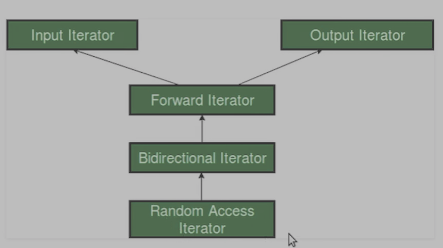
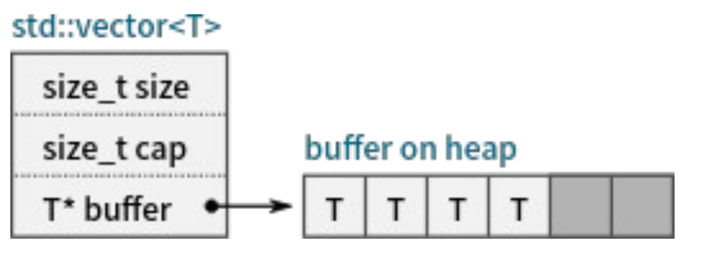
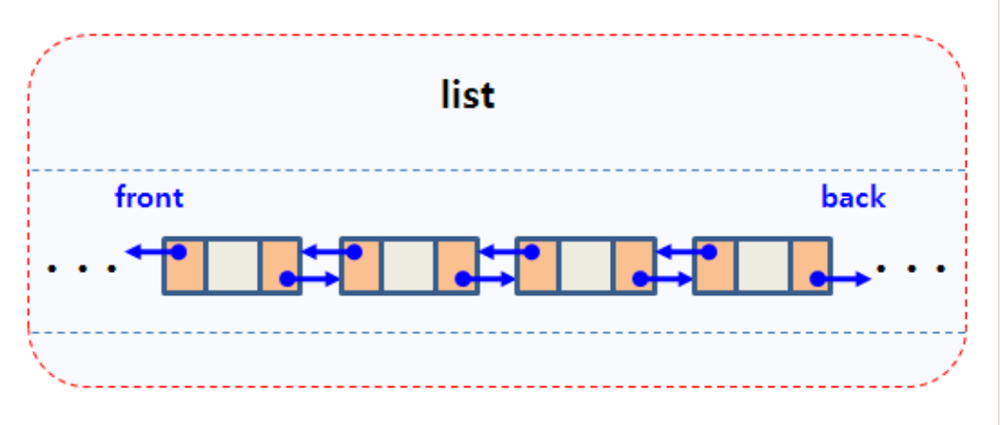
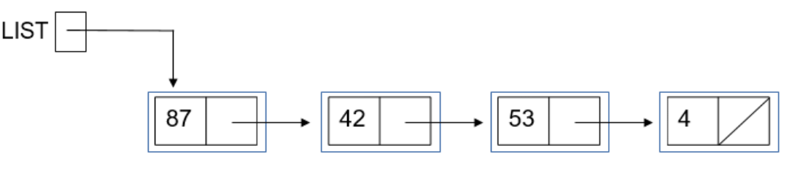
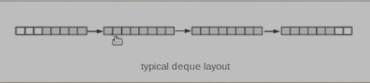
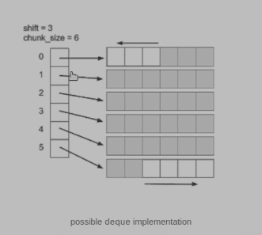
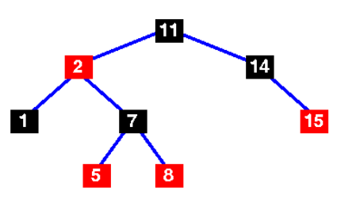
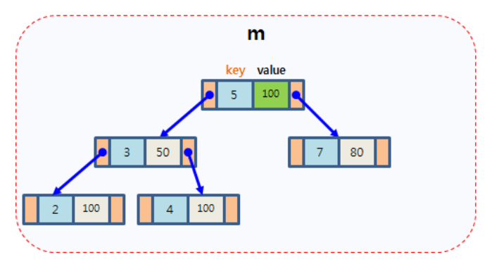
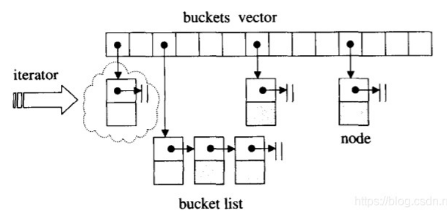

# ch09.序列与关联容器目录
1. 容器概述
2. 序列容器
3. 关联容器
4. 适配器与生成器


# 一.容器概述
## 1.1.容器
容器:一种特殊的类型,其对象可以放置其它类型的对象(元素)
- 需要支持的操作:对象的添加、删除、索引、遍历
- 有多种算法可以实现容器,每种方法各有利弊
## 1.2.容器分类
- 序列容器:其中的对象有序排列,使用整数值进行索引
- 关联容器:其中的对象顺序并不重要,使用键进行索引
- 适配器:调整原有容器的行为,使得其对外展现出新的类型、接口或返回新的元素
- 生成器:构造元素序列
## 1.3.迭代器
迭代器:用于指定容器中的一段区间,以执行遍历、删除等操作
- 获取迭代器: (c)begin/(c)end ; (c)rbegin/(c)rend -->C为const的含义
- 迭代器分类:分成 5 类( category ),不同的类别支持的操作集合不同
  


# 二.序列容器
- C++ **标准库**中提供了多种序列容器模板
  - array :元素个数固定的序列容器
  - vector :元素连续存储的序列容器[内存连续的存储]
  - forward_list / list :基于链表 / 双向链表的容器[指针存储]
  - deque : vector 与 list 的折衷[段与段之间是指针链接,段内是连续存储]
  - basic_string :提供了对字符串专门的支持
- 需要使用元素类型来实例化容器模板,从而构造可以保存具体类型的容器。
- 不同的容器所提供的接口大致相同,但根据容器性质的差异,其内部实现与复杂度不同。
- 对于复杂度过高的操作,提供相对较难使用的接口或者不提供相应的接口序列容器
## 2.1.[array 容器模板](https://zh.cppreference.com/w/cpp/container/array)
- array 容器模板:**具有固定长度的容器**,其内部维护了一个内建数组,与内建数组相比提供了复制操作
  ```c
  #include<iostream>
  #include<array>//头文件
  int main(){
    int a[3] = {1,2,3};
    int b[3] = a;//非法:内建数组不能复制
    ----
    std::array<int, 3> a;
    std::array<int, 3> b = a;//合法,array允许复制
  }
  ```
- 提供的接口
  - 构造
    ```c
    #include<iostream>
    #include<array>//头文件
    int main(){
      std::array<int, 3> a;//乱值
      std::array<int, 3> a = {};//0,0,0
      std::array<int, 3> a = {1};//1,0,0
      std::array<int, 3> a = {1,2,3};//1,2,3
    }
    ```
  - 成员类型: value_type 等
    ```c
    #include<iostream>
    #include<array>
    #include<type_traits>
    int main(){
      std::array<int, 3> a;
      std::array<int, 3>::value_type //返回的是int型值
      //验证
      // 1
      std::cout<< std::is_same_v<std::array<int,3>::value_type, int> <<std::endl;
    }
    ```
  - 元素访问: [] , at , front , back , data(容器中,一般内存是连续保存的就会提供一个data方法)
    ```c
    #include<iostream>
    #include<array>
    #include<type_traits>

    void fun(int* ptr){
    }

    int main(){
      std::array<int, 3> a = {1,2,3}
      std::cout<< a[1] <<std::endl;//[]访问
      std::cout<< a[100] <<std::endl;//[]访问,越界时可能报错可能打印出乱值
      std::cout<< a.at(1) <<std::endl;//at()访问
      std::cout<< a.at(100) <<std::endl;//at()访问,会检查越界,越界后代码直接崩溃
      std::cout<< a.front() <<std::endl;//1 front()返回第一个元素
      std::cout<< a.back() <<std::endl;//3 back()返回最后一个元素
      a.data();//返回a的首地址
      int* b = a.data();//有点类似opencv矩阵数据的操作
      fun(a.data());
    }
    ```
  - 容量相关(平凡实现): empty , size , max_size
    ```c
    #include<iostream>
    #include<array>
    #include<type_traits>

    int main(){
      std::array<int, 3> a = {1,2,3}
      std::cout<< a.empty() <<std::endl;//0,非空
      std::cout<< a.size() <<std::endl;//3, 固定元素个数的
      std::cout<< a.max_size() <<std::endl;//3, 固定元素个数的
    }
    ```
  - 填充与交换: fill , swap(数组的swap成本很大)
    ```c
    #include<iostream>
    #include<array>
    #include<type_traits>

    int main(){
      std::array<int, 3> a ;
      a,fill(100);//100, 100, 100
    }
    ```
    ```c
    #include <array>
    #include <iostream>
    
    template<class Os, class V> 
    Os& operator<<(Os& os, const V& v) {
        os << "{";
        for (auto i : v) os << ' ' << i;
        return os << " } ";
    }
    
    int main()
    {
        std::array<int, 3> a1{1, 2, 3}, a2{4, 5, 6};
    
        auto it1 = a1.begin();
        auto it2 = a2.begin();
        int& ref1 = a1[1];
        int& ref2 = a2[1];
    
        std::cout << a1 << a2 << *it1 << ' ' << *it2 << ' ' 
                  << ref1 << ' ' << ref2 << '\n';
        a1.swap(a2);
        std::cout << a1 << a2 << *it1 << ' ' << *it2 << ' ' 
                  << ref1 << ' ' << ref2 << '\n';
    
        // 注意交换后迭代器与引用https://thispointer.com/using-unordered_set-with-custom-hasher-and-comparision-function/保持与原 array 关联，
        // 例如 `it1` 仍指向元素 a1[0] ， `ref1` 仍指代 a1[1] 。
    }
    输出：

    { 1 2 3 } { 4 5 6 } 1 4 2 5
    { 4 5 6 } { 1 2 3 } 4 1 5 2
    ```
  - 比较操作: <=>  三元符比较
    ```c
    #include<iostream>
    #include<array>
    #include<type_traits>

    int main(){
      std::array<int, 3> a ;
      std::array<int, 4> b ;
      a < b;//非法,a,b的类型不一样无法比较-->大小不一样
      -----
      std::array<int, 3> a ;
      std::array<int, 3> b ;
      a < b;//合法
    }
    ```
  - 迭代器序列容器
## 2.2.[vector 容器模板](https://zh.cppreference.com/w/cpp/container/vector)
- vector 容器模板:元素数目可变




图中 buffer是一个T*型的指针

- 提供的接口
  - 与 array 很类似,但有其特殊性
    ```c
    #include<iostream>
    #include<vector>
    #include<type_traits>
    int main(){
      std::vector<int> a{1};
      std::cout<< a.empty() <<std::endl;//0,非空
      std::cout<< a.size() <<std::endl;/1, 固定元素个数的
      std::cout<< a.max_size() <<std::endl;//23051516013, 一个大数
      -----
      std::vector<int> a{1};
      std::vector<int> b{1,2,3};
      std::cout<< (a < b>) << std::endl;//1, 可以比较
    }
    ```
  - 容量相关接口: capacity / reserve / shrink_to_fit(顾名思义,使得vector大小适合数据大小,一般用在不需要对其大小进行改变的时候)
    ```c
    #include<iostream>
    #include<vector>
    #include<type_traits>
    int main(){
      std::vector<int> a;
      for(int i = 0; i < 1024; ++i){
        a.push_back(1);//可能会存在频繁扩容的操作,降低性能
      }
      //改进
      std::vector<int> a;
      a.reserve(1024);//不会频繁的扩容操作,性能提高
      for(int i = 0; i < 1024; ++i){
        a.push_back(1);
      }
    }
    ```
  - 附加元素接口: push_back / emplace_back
    ```c
    #include<iostream>
    #include<vector>
    #include<type_traits>
    #include<string>
    int main(){
      std::vector<string> a;
      //内部分两步,首先构造字符串"Hello",然后调用push_back传入vector
      a.push_back("Hello");
      //内部只有一步,直接在vector内存中构造string "Hello",
      //少了一次拷贝移动的过程,更优
      a.emplace_back("Hello");
    }
    ```
  - 元素插入接口: [insert](https://zh.cppreference.com/w/cpp/container/vector/insert)(插入元素 ) / [emplace](https://zh.cppreference.com/w/cpp/container/vector/emplace)(原位构造元素 )
  - 元素删除接口: [pop_back](https://zh.cppreference.com/w/cpp/container/vector/pop_back)(移除末元素) / [erase](https://zh.cppreference.com/w/cpp/container/vector/erase)(擦除元素) / [clear](https://zh.cppreference.com/w/cpp/container/vector/clear)(清除内容)
- 注意
  - vector 不提供 push_front / pop_front ,可以使用 insert / erase 模拟,但效率不高
  - swap 效率较高
  - 写操作可能会导致迭代器失效序列容器
## 2.3. [list 容器模板](https://zh.cppreference.com/w/cpp/container/list)
- list 容器模板:双向链表




  ```c
  #include<iostream>
  #include<list>
  #include<type_traits>
  int main(){
    std::list<int> a{1,2,3};//本质是链表的三个节点
    for(auto ptr = a.begin(); ptr != a.end(); ++ptr){
      std::cout<< *ptr << std::endl;
    }
  }
  ```
- 与 vector 相比, list
  - 插入、删除成本较低,但随机访问成本较高
  - 提供了 [pop_front](https://zh.cppreference.com/w/cpp/container/list/pop_front)(移除容器首元素) / [splice](https://zh.cppreference.com/w/cpp/container/array/get) (从另一个list中移动元素)等接口
  - 写操作通常不会改变迭代器的有效性
## 2.4.[forward_list 容器模板](https://zh.cppreference.com/w/cpp/container/forward_list)
forward_list 容器模板:单向链表




- 目标:一个成本较低的线性表实现
- 其迭代器只支持递增操作,因此无 rbegin/rend
- 不支持 size
- 不支持 pop_back / push_back
- XXX_after 操作序列容器
  - insert_after在某个元素后插入新元素 
  - emplace_after在元素后原位构造元素 
  - erase_after擦除元素后的元素

## 2.5.[deque容器模板](https://zh.cppreference.com/w/cpp/container/deque)







deque容器模板: vector 与 list 的折衷
- push_back / push_front 速度较快
- 在序列中间插入、删除速度较慢
#### 2.6.[basic_string 容器模板](https://zh.cppreference.com/w/cpp/string/basic_string)
basic_string 容器模板:实现了字符串相关的接口
- 使用 char 实例化出 std::string
- 提供了如 find , substr 等字符串特有的接口
- 提供了数值与字符串转换的接口;[to_string](https://zh.cppreference.com/w/cpp/string/basic_string/to_string);[stoi](https://zh.cppreference.com/w/cpp/string/basic_string/stol)等等
- [针对短字符串的优化( short string optimization: SSO )](https://www.cnblogs.com/cthon/p/9181979.html)

# 三.关联容器


  ```c
  #include<iostream>
  #include<list>
  #include<type_traits>
  #include<set>
  #include<map>
  int main(){
    std::list<int> a{1,2,3};//本质是链表的三个节点
    for(auto ptr = a.begin(); ptr != a.end(); ++ptr){
      std::cout<< *ptr << std::endl;
    }
    ----
    std::map<char,int> m{{'a' ,3},{'b', 4}};//键-值
    std::cout<<m['a']<<std::endl;//通过键作为index进行索引值3
    std::map<int,int> m1{{2,3}};
    std::cout<<m1[2]<<std::endl;//输出3

  }
  ```

- 使用键进行索引
  - set / map / multiset / multimap
  - unordered_set / unordered_map / unordered_multiset / unordered_multimap
- set / map / multiset / multimap 底层使用红黑树实现
- unordered_xxx 底层使用 hash 表实现关联容器

## 3.1.[set](https://zh.cppreference.com/w/cpp/container/set)
set

```c
#include<iostream>
#include<set>
int main(){
  //同样是键值对;键为int,值为true/false,达代表是否在里面
  std::set<int> s{100, 3, 56, 7};
  std::set<int> s{3, 100, 7, 56};
  //数学上理解.set为集合,元素的顺序不重要,元素不能重复
}
```



树特点:
- 左小右大
- 左右子树最多相差一层(便于查找)

```c
#include<iostream>
#include<set>
int main(){
  std::set<int> s{100, 3, 56, 7};
  for(auto ptr = s.begin(); ptr != s.end(); ptr++){
    //树的中序遍历
    std::cout<< *ptr <<std::endl;//3,7,56,100打印顺序是按小到大
  }
}
```

[set特点](https://zh.cppreference.com/w/cpp/container/set):

- 通常来说,元素需要支持使用 < 比较大小
- 或者采用自定义的比较函数来引入大小关系

  ```c
  #include<iostream>
  #include<set>
  struct Str{
    int x;
  };
  bool MyComp(const Str& val1, const Str& val2){
    return val1.x < val2.x;
  }
  int main(){
    std::set<int> s{100, 3, 56, 7};
    for(auto ptr = s.begin(); ptr != s.end(); ptr++){
      //树的中序遍历
      std::cout<< *ptr <<std::endl;//3,7,56,100打印顺序是按小到大
    }
    std::set<int, greater> s{100, 3, 56, 7};//按从大到小排序存
    //插入2,Compare(2,3),然后插入红黑树
    //int 支持, 3<100 但是
    std::set<Str> s1{Str{}};//非法,Str无法比较大小
    //合法,自定义大小比较方式.非法,Str无法比较大小,注意后面需要传入函数指针
    std::set<Str,decltype<&MyComp>> s1{Str{}, MyComp};
    std::set<Str,decltype<&MyComp>> s1{Str{3},Str{5} MyComp};
    }
  }
  ```
- 插入元素: insert / emplace / emplace_hint
- 删除元素: erase
- 访问元素: find / contains
- 修改元素: extract
  ```c
  #include<iostream>
  #include<set>
  struct Str{
    int x;
  };
  bool MyComp(const Str& val1, const Str& val2){
    return val1.x < val2.x;
  }
  int main(){
    std::set<Str,decltype<&MyComp>> s{Str{3},Str{5} MyComp};
    s.insert(Str{100});//插入
    s.emplace(100);//避免一些拷贝和移动
    s.emplace_hint();//系统可以预先估计大概插如的位置,插入加速,也可能有坏处,参考cppreference
    s.erase(100);//删除元素
    s.erase(s.begin());//传入迭代器进行操作
    ----
    std::set<int> s2{1,3,5};
    auto ptr = s.find(1);
    //auto ptr = s.find(100);//ptr = s.end();
    if(ptr != s.end){
      std::cout<< *ptr <<std::endl;
    }

    std::cout<< s.contains(50) <<std::endl;//输出0,false
    std::cout<< s.contains(1) <<std::endl;//输出1,true

    //迭代器对象只能读不能写
    std::cout<< *s.begin() <<std::endl;//输出1
    *s.begin() = 100;//非法,只读;如果能写,可能会破坏红黑树的结构
    //修改元素正确方式

  }
  ```
注意: set 迭代器所指向的对象是 const 的,不能通过其修改元素关联容器


## 3.2.[map](https://zh.cppreference.com/w/cpp/container/map)
map




```c
#include<iostream>
#include<map>
std::pair<const int,bool> fun(){

}
int main(){
  std::map<int, bool> m{{3,true},{4,false}.{1,true}}};
  for(auto ptr = m.begin(); ptr != m.end(); ptr++){
    auto pair = *ptr;//ptr-->std::pair<const int,bool>
    std::cout<< ptr.firse<< " "<<ptr.second<<" "<<std::endl;//1 1 3 1 4 0 按key排序
  }
  for(auto p:m){
    std::cout<< ptr.firse<< " "<<ptr.second<<" "<<std::endl;//1 1 3 1 4 0 按key排序
  }
  auto res = fun();
  //函数绑定的方式进行赋值
  auto [res1, res2] = fun();//分别赋值给res1,res2;

}
```

- 树中的每个结点是一个 std::pair
- 键 (pair.first) 需要支持使用 < 比较大小
- 或者采用自定义的比较函数来引入大小关系

  ```c
  #include<iostream>
  #include<map>
  struct Str{

  }
  int main(){
    //合法.int可以比较大小
    std::map<int, Str> m{{3,Str{}},{4,Str{}}.{1,Str{}}};
    //非法,Str无法比较大小
    std::map<Str, int> m{{Str{},3},{Str{},4}.{1,Str{}}};
    //自定义的比较函数来引入大小关系,参考set小结的处理
    //map的插入删除
    std::map<int,bool> m{{2,true},{1,false},{4,true}};
    m.insert(std::pair<int,bool>{5,true});//插入的是pair类型
    m.erase(2);//输入键值
    //访问元素: find / contains / [] / at
    auto ptr = m.find(4);
    std::cout<<ptr->first<<" "<<ptr->second<<std::endl;//4 0
    //contains返回bool值
    std::cout<<m[4]<<std::endl;//1, 通过键索引值, 不会检测越界
    //如果访问的键不存在,则会新添加该键,值若为类则使用默认构造函数,其情况初始化为0
    std::cout<<m[100]<<std::endl;//0
    std::cout<<m.at(4)<<std::endl;//1, 会检测越界,相同的情况以前有讲到
  }
  ```
- 访问元素: find / contains / [] / at
- 注意
  - map 迭代器所指向的对象是 std::pair ,其键是 const 类型
  - [[]访问不存在的键值时,会新插入该键并初始化](https://zh.cppreference.com/w/cpp/container/map/operator_at)
  - [] 操作不能用于常量对象关联容器

    ```c
    #include<iostream>
    #include<map>
    void fun(const std::map<int,int>& m){
      m[3];//之前有提到,如果m不存在则会新插入,而此处是const不能改变
      //因此是冲突的,故此时不能使用[]进行访问
      //可以使用如下方式进行访问
      auto ptr = m.find(3);
      if(ptr!=m.end){
        std::cout<<ptr->second<<std::endl;
      }
    }
    int main(){
      std::map<int,int>m;
      fun(m);
    }
    ```
## 3.3.multiset / multimap
```c
#include<iostream>
#include<map>
#include<set>
int main(){
  std::multiset<int> s{1,3,1};//允许元素重复
  for(auto i:s)
    std::cout<< i << std::endl;//1 1 3
}
```
- 与 set / map 类似,但允许重复键
- 元素访问
  - find 返回首个查找到的元素
  - count 返回元素个数
  - lower_bound / upper_bound / equal_range 返回查找到的区间关联容器
  ```c
  #include<iostream>
  #include<map>
  #include<set>
  int main(){
    std::multiset<int> s{1,3,1};//允许元素重复
    auto ptr = s.find(1);//第一个1
    ++ptr;//第二个1
    std::cout<<s.count(1)<<std::endl;//2
    for(auto i:s)
      std::cout<< i << std::endl;//1 1 3
    for(quto ptr = s.begin();ptr!=s.end();ptr++){
      std::cout<<*ptr<<std::endl;//1 1 3
    }
    //lower_bound / upper_bound / equal_range
    auto b = s.lower_bound(1);
    auto c = s.upper_bound(1);
    for(quto ptr = b;ptr!=c;ptr++){
      std::cout<<*ptr<<std::endl;//1 1
    }
    auto b = s.lower_bound(3);
    auto c = s.upper_bound(3);
    for(quto ptr = b;ptr!=c;ptr++){
      std::cout<<*ptr<<std::endl;//3
    }
    auto s = s.equal_range(3);
    for(quto ptr = p.first;ptr!=p.second;ptr++){
      std::cout<<*ptr<<std::endl;//3
    }
    auto [d,e] = s.equal_range(3);//绑定
    for(quto ptr = d;ptr!=e;ptr++){
      std::cout<<*ptr<<std::endl;//3
    }
  }
  ```

## 3.4.unordered_XXX
[unordered_set](https://zh.cppreference.com/w/cpp/container/unordered_set) / unordered_map / unordered_multiset / unordered_multimap




- 与 set / map 相比查找性能更好
- 但插入操作一些情况下会慢
- 其键需要支持两个操作
  - 转换为 hash 值
  - 判等
- 除 == , != 外,不支持容器级的关系运算,但 ==, != 速度较慢
- [自定义 hash 与判等函数](https://zh.cppreference.com/w/cpp/container/unordered_set/operator_cmp)
- [unordered_set-with-custom-hasher-and-comparision-function](https://thispointer.com/using-unordered_set-with-custom-hasher-and-comparision-function/)
  ```c
  #include<iostream>
  #include<unordered_set>
  #include<set>
  struct Str{
    int x; 
  };
  size_t MyHash(const Str& val){
    return val.x;
  }
  bool MyEqual(const Str& val1, const Str& val2){
    return val1.x == val2.x; 
  }

  int main(){
    std::unordered_set<int> s{3,1,5,4,1};
    for(auto p:s){
      //4 5 1 3 无序的输出,同样元素不嗯给你重复
      std::cout<<p<<std::endl;
    }
    //除 == , != 外,不支持容器级的关系运算,但 ==, != 速度较慢
    std::set<int> s1{1,1,5,4,1};//1,3,4,5
    std::set<int> s2{3,1,5};//1,3,5
    //set可以比较,s1<s2
    //unordered_set不能比较,但可以判断==和!=
    std::unordered_set<int> s3{3,1,5,4,1};
    std::unordered_set<int> s4{3,1,5};
    std::cout<<(s3==s4)<<std::endl;//0
    //- 自定义 hash 与判等函数
    std::unoedered_set<Str,decltype(&MyHash),decltype(&MyEqual)> s5(1,MyHash,MyEuqal);
    s5.insert(Str{3});
    //voideo.68.后半部分还讲了使用类来定义Hash,未做笔记
  }
  ```
# 四.适配器与生成器

xxx_view:个人理解,提前预览并判断数据类型的行为

## 4.1.类型适配器
- [basic_string_view ( C++17 )](https://zh.cppreference.com/w/cpp/string/basic_string_view)
  - 可以基于 std::string , C 字符串,迭代器构造
  - 提供成本较低的操作接口
  - 不可进行写操作
  ```c
  //string_view一般作为函数的输入,不作为函数的输出,只读不写
  #include<iostream>
  #include<string>
  #include<string_view>
  void fun1(char* ptr){//c字符串
  }
  void fun2(const std::string& ptr){//c++字符串
  }

  //新选择
  void fun3(std::string_view str){//兼容两种类型
    //string_view提供了很多的方法

    //16,16个字节,不拥有原始字符串的所有权,只定义了开头和结尾的指针
    std::cout<<sizeof(std::string_view)<<std::endl;
    if(!str.empty()){
      std::cout<<str[0]<<std::endl;//
    }
    //只读不写
    str[0] = '6';//非法
  }
  int main(){
    std::string s = "12345";
    fun1(s.c_str());//需要c_str()转换为c风格的字符串
    char* s = "12345";
    fun2(s);//内存构造比较慢,由c字符串构造C++字符串比较慢
    ---------
    fun3("12345");//"12345"为char*, c风格字符串
    fun3(std::string("12345")); 
    //传入迭代器
    fun3(std::string_view(s.begin(),s.begin()+3));//打印出123
  }
  ```
- [span ( C++20 )](https://zh.cppreference.com/w/cpp/container/span)
  - 可基于 C 数组、 array 等构造
  - 可读写
  ```c
  //string_view一般作为函数的输入,不作为函数的输出,只读不写
  #include<iostream>
  #include<span>
  #include<vector>

  void fun(std::span<int> in){
    for(auto p:in){
      std::cout<<p<<std::endl;
    }
    //可读写
    in[2] = 5;
  }

  int main(){
    std::vector<int> v{1,2,3};
    fun(v);//1 2 3
    int a[3] = {1,2,3};
    fun(a);//1 2 3
  }
  }
  ```
## 4.2.接口适配器
- [stack](https://zh.cppreference.com/w/cpp/container/stack) / [queue](https://zh.cppreference.com/w/cpp/container/queue) / priority_queue
- 对底层序列容器进行封装,对外展现栈、队列与优先级队列的接口
- priority_queue 在使用时其内部包含的元素需要支持比较操作适配器与生成器

```c
//string_view一般作为函数的输入,不作为函数的输出,只读不写
#include<iostream>
#include<span>
#include<vector>
#include<stack>
void fun(std::span<int> in){
  for(auto p:in){
    std::cout<<p<<std::endl;
  }
  //可读写
  in[2] = 5;
}

int main(){
  std::stack<int> p;//top,push等操作就够了
  std::stack<int,std::vector<int>> p;//top,push等操作就够了
  p.push(3);
  p.push(2);
  p.pop();
  p.pop();
}
```

## 4.3.数值适配器 (c++20) 
[Ranges library](https://zh.cppreference.com/w/cpp/ranges)
数值适配器 (c++20) : std::ranges::XXX_view, std::ranges::views::XXX, std::views::XXX
- 可以将一个输入区间中的值变换后输出
- 数值适配器可以组合,引入复杂的数值适配逻辑
```c
//string_view一般作为函数的输入,不作为函数的输出,只读不写
#include<iostream>
#include<vector>
#include<ranges>
bool IsEven(int i){//判断是否为偶数
  return i%2 == 0;
}
int Square(int i){
  return i*i;
}
int main(){
  std::vector<int> v{1,2,3,4,5};
  for(auto p:v){
    std::cout<<p<<std:endl;//1 2 3 4 5
  }
  std::cout<< std::endl;
  -----
  std::vector<int> v1{1,2,3,4,5};
  for(auto p:std::ranges::filter_view(v1,isEven)){
  // for(auto p:std::ranges::filter(v1,isEven)){//效果一样
    std::cout<<p<<std::endl;//2 4 打印出偶数
  }
  for(auto p:std::ranges::filter_view(v1,Square)){
    std::cout<<p<<std::endl;//1 4 9 16 25 打印出平方
  }
  -----
  //std::view的第二个用法
  //提供命名空间别名 std::views ，作为 std::ranges::views 的缩写。
  auto x = std::view::filter(isEven);//只有偶数才保留
  for(auto p: x(v1)){
  // for(auto p: v1 | x){//效果相同
    std::cout<<p<<std::endl;//2 4 打印出偶数
  }
  -----
  //std::view::filter的第二个用法
  auto x = std::view::filter(isEven);//只有偶数才保留
  auto y = std::view::tranform(Square);//计数平方
  for(auto p: v1 | x | y){
  // for(auto p: y(x(v1))){//以前的写法
    std::cout<<p<<std::endl;//4 16 打印出偶数的平方
  }
  -----
  //std::view::filter的第二个用法
  auto x = std::view::filter(isEven) | std::view::tranform(Square);
  //v1 | x缓式求值,拿一个计算一个,区别C++底层构造新内存拷贝一次性计算
  for(auto p: v1 | x){//v1 | x缓释求值,拿一个计算一个,
    std::cout<<p<<std::endl;//4 16 打印出偶数的平方
  }
}
```

## 4.4.生成器 (c++20)
- [std::ranges::itoa_view, std::ranges::views::itoa, std::views::itoa](https://zh.cppreference.com/w/cpp/ranges/iota_view)
- 可以在运行期生成无限长或有限长的数值序列
```c
#include <ranges>
#include <iostream>
 
int main()
{
    for (int i : std::iota_view{1, 10})
        std::cout << i << ' ';
    std::cout << '\n';
 
    for (int i : std::views::iota(1, 10))
        std::cout << i << ' ';
    std::cout << '\n';
    //std::views::take(9),截取前9个元素
    for (int i : std::views::iota(1) | std::views::take(9))
    // for (int i : std::views::iota(1))//从1开始无限生成1 2 3 4....
        std::cout << i << ' ';
    std::cout << '\n';
}
输出：
1 2 3 4 5 6 7 8 9
1 2 3 4 5 6 7 8 9
1 2 3 4 5 6 7 8 9
```
