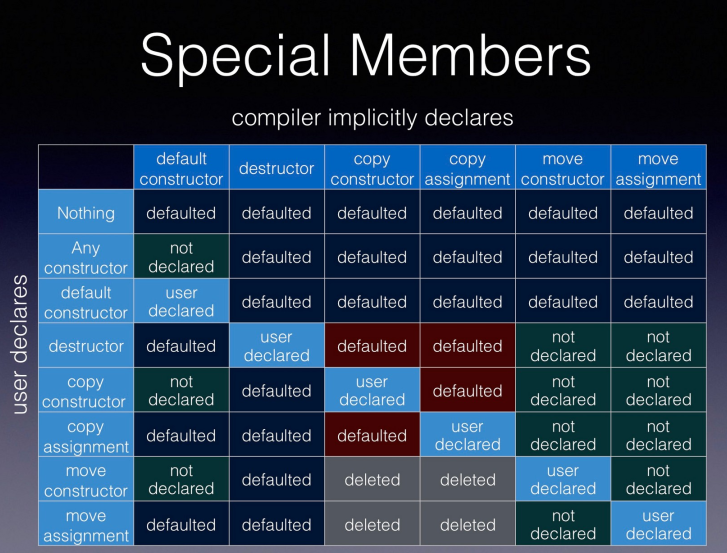

# ch11.类
1. 结构体与对象聚合
2. 成员函数(方法)
3. 访问限定符与友元
4. 构造、析构与复制成员函数
5. 字面值类,成员指针与 bind 交互


# 一.结构体与对象聚合


## 1.1.结构体
结构体:对基本数据结构进行扩展,将多个对象放置在一起视为一个整体

- 结构体的声明与定义(注意定义后面要跟分号来表示结束)

```c
#include<iostream>
#include<vector>
struct Str;//声明

struct Str{
  int x;
  int y;
};//定义

typedef struct Str{
  int x;
  int y;
}Mstr;//注意分号

int main(){
  Str mstr;
  mstr.x = 3;
  std::cout<<mstr.x<<std::endl;//3
}
```
- 仅有声明的结构体是不完全类型( incomplete type )

```c
#include<iostream>
#include<vector>
//不完全类型( incomplete type ),编译器不知道内存布局是怎样的
struct Str;

int main(){
  Str mstr;//非法
  Str* mstr;//合法,定义为指针,可以确定指针为四个字节
}
```
- 结构体(以及类)的一处定义原则:翻译单元级别


```c
#include<iostream>
#include<vector>
struct Str{
  int x;
  int y;
};//定义
struct Str{ //报错,重复定义
  int x;
  int y;
};//定义

int main(){
  Str mstr;
}
```
一处定义原则:翻译单元级别的
```c
//---source.cpp---
struct Str{
  int x;
  int y;
};//定义

void fun(){
  Str mstr;
}


//---main.cpp---
#include<iostream>
#include<vector>
struct Str{ //报错,重复定义
  int x;
  int y;
};//定义
void fun();
int main(){
  Str mstr;
  fun();
}
```

整个系统包含两个范翻译单元:main.cpp\source.cpp,都有Str结构体定义,真个系统有两个Str定义,但是一个翻译单元只有一个,是合理的,原因:source.cpp可能是其他函数调用,编译器是允许的.


## 1.2.数据成员(数据域)的声明与初始化

- 数据成员会在构造类对象时定义
```c
#include<iostream>
#include<vector>
//声明:告诉编译器已经有这么个东西,以后看到x将它解析为int
//定义:运行到这一句的时候要开辟内存
struct Str{
  int x;//声明
  int y;//声明
};
//整个'struct...;'为定义,定义里面是包含的数据成员的声明,
//成员的定义是隐式的

extern int x;//变量声明
int x;//变量定义

int main(){
  //结构体对象的定义,定义结构体对象的同时,
  //隐式定义内部的数据成员
  //数据成员会在构造类对象时定义
  Str mstr;
}
```

- ( C++11 )数据成员可以使用 decltype 来声明其类型,但不能使用 auto

- 数据成员声明时可以引入 const 、引用等限定
- ( C++11 )类内成员初始化
```c
#include<iostream>
#include<vector>

struct Str{
  decltype(3) x;//合法:decltype(3) x;==>int x;
  int y;//声明
  auto z;//非法
  auto z = 3;//非法
  decltype(3) w = 3;
  const int k = 3;//合法:类内成员初始化==>同样是声明
};

int main(){
  Str mstr;
}
```

- 聚合初始化:从初始化列表到指派初始化器
```c
#include<iostream>
#include<vector>

struct Str{
  int x;
  int y;
};

int main(){
  //mstr.x = 3; ,str.y = 4;
  Str mstr{3, 4};
  //mstr.x = 3; ,str.y = 0;
  Str mstr{3};
  //mstr.x = 0; ,str.y = 0;
  Str mstr{};
  //mstr.x = 3; ,str.y = 4;推荐指派初始化
  //指派初始化,不会因为代码改动变量的顺序而得到不想要的结果
  Str mstr{.x=3, .y=4};
}
}
```


## 1.3.mutable 限定符

```c
#include<iostream>
#include<vector>

struct Str{
  int x = 0;
  int y = 1;
  mutable z = 3;//mutable 可以绕过const限定
};

int main(){
  const int x = 3;
  x = 4;//非法
  ----
  Str mstr;
  mstr.x = 3;//合法
  ----
  const Str mstr;
  mstr.x = 3;//非法,const无法修改
  mstr.z = 5;//合法,z为mutable修饰,可以修改
}
}
```

## 1.4.静态数据成员---多个对象之间共享的数据成员

```c
#include<iostream>
#include<vector>

struct Str{
  static int x = 0;
  int y = 1;
};

int main(){
  Str mstr;
  Str nstr;
  mstr.x = 10;
  std::cout<<nstr.x<<std::endl;//10,,x为static成员
}
}
```

- 定义方式的衍化
  - C++98 :类外定义, const 静态成员的类内初始化
    ```c
    #include<iostream>
    #include<vector>

    struct Str{
      static int x = 0;//声明
      int y = 1;
    };

    //声明可以多次声明,定义:一个翻译单元只能定义一次

    int Str::x;//类外定义,Str::域

    int main(){
      Str mstr;
      Str nstr;
      mstr.x = 10;
      std::cout<<nstr.x<<std::endl;//10,,x为static成员
    }
    ----
    //const 静态成员的类内初始化
    struct Str{
      //array_size, 作为数组的大小,必须为编译期常量
      const static int array_size = 100;//定义,初始化
      int buffer[array_size];
    };
    int main(){
      //合法. 如果不能定义,则array_size就不是编译期常量
      Str mstr;
    }
    ```
  - C++17 :内联静态成员的初始化
    ```c
    #include<iostream>
    #include<vector>
    struct Str{
      //array_size, 作为数组的大小,必须为编译期常量
      inline const static int array_size = 100;//定义,初始化
      inline static int array_size = 100;//定义,初始化,同样合法
      int buffer[array_size];
    };
    int main(){
      //合法. 如果不能定义,则array_size就不是编译期常量
      Str mstr;
      mstr.array_size = 20;//甚至可以修改
    }
    ```

- 可以使用 auto 推导类型

    ```c
    #include<iostream>
    #include<vector>
    struct Str{
      //auto 可以推导,非一般成员,静态数据成员可以使用auto进行推导
      inline static auto array_size = 100;//定义,初始化
      int buffer[array_size];
    };
    int main(){
      Str mstr;
      mstr.array_size = 20;//甚至可以修改
    }
    ```

- 静态数据成员的访问


  - “.” 与 “ ->” 操作符
  - “::” 操作符

    ```c
    #include<iostream>
    #include<vector>
    struct Str{
      //auto 可以推导,非一般成员,静态数据成员可以使用auto进行推导
      inline static auto array_size = 100;//定义,初始化
      int buffer[array_size];
    };
    int main(){
      Str mstr;
      mstr.array_size = 20;
      
      Str* ptr = &mstr;
      ptr->array_size = 30;

      Str::array_size;//同样可以访问
    }
    ```
- 在类的内部声明相同类型的静态数据成员

    ```c
    #include<iostream>
    #include<vector>
    struct Str{
      Str x;//非法,定义的时候不容易确定大小
      //声明
      static Str x;//合法,被所有对象所共享,内存可以确定
      inline Str x;//非法
    };

    //Str Str::x;//定义后才能访问
    //inline Str Str::x;//定义后才能访问

    int main(){
      //此时定义mstr1\mstr2时,并没有为static Str x;进行隐式定义
      Str mstr1;
      Str mstr2;
      //编译不会出错,链接出错
      std::cout<< &(mstr1.x) <<std::endl;//无法访问,未定义
    }
    ```


# 二. 成员函数(方法)

## 2.1.成员函数定义

可以在结构体中定义函数,作为其成员的一部分:对内操作数据成员,对外提供调用接口
```c
#include<iostream>
#include<vector>
struct Str{
  int x = 3;
};
void fun(Str obj){//同样是C语言思维
  std::cout<<obj.x<<std::endl;
}

int main(){
  Str mstr;
  fun(mstr);
}

----
//可以在结构体中定义函数,作为其成员的一部分
//这个结构体,本质就是类
struct Str{
  int x = 3;
  void fun(){
    std::cout<<x<<std::endl;
  }
};

int main(){
  Str mstr;
  mstr.fun();//3
}
```


- 在结构体中将数据与相关的成员函数组合在一起将形成类,是 C++ 在 C 基础上引入的概念
```c
class Str{
public:
  int x = 3;
  void fun(){
    std::cout<<x<<std::endl;
  }
};

int main(){
  Str mstr;
  mstr.fun();//3
}
```

- 关键字 class

- 类可视为一种抽象数据类型,通过相应的接口(成员函数)进行交互

- 类本身形成域,称为类域


## 2.2.成员函数的声明与定义
- 类内定义(隐式内联)
```c
struct Str{
  int x = 3;
  //类内定义(隐式内联) 相当于加了关键字inline
  void fun(){
    std::cout<<x<<std::endl;
  }
};

int main(){
  Str mstr;
  mstr.fun();//3
}
```

- 类内声明 + 类外定义

```c
struct Str{
  int x = 3;
  void fun();//类内声明
};

//类外定义:此时就不是内敛函数
void Str::fun(){
  std::cout<<x<<std::endl;
}

//类外定义:内敛函数
inline  void Str::fun(){
  std::cout<<x<<std::endl;
}

int main(){
  Str mstr;
  mstr.fun();//3
}
```

- 类与编译期的两遍处理
```c
struct Str{
  //类内定义(隐式内联) 相当于加了关键字inline
  void fun(){
    std::cout<<x<<std::endl;
  }
  //编译器翻译单元一般是顺序翻译,而此时fun()对x的访问没有出错
  //类与编译期的两遍处理:同样可以运行
  int x = 3;
};

int main(){
  Str mstr;
  mstr.fun();//3
}
```

- 成员函数与尾随返回类型( trail returning type )

```c
//---source.cpp---
#include<source.h>
MyRes Str::fun(){//报错:编译器不认识MyRes,MyRes属于Str::
//方法一:加域名
Str::MyRes Str::fun(){//合法,MyRes属于Str::
  std::cout<< x <<std::endl;
}

//方法二:成员函数与尾随返回类型( trail returning type )
auto Str::fun() -> MyRes
{
  std::cout<< x <<std::endl;
}

//---source.h---
struct Str{
  using MyRes = int;
  MyRes fun();
  int x = 3;
};
//---main.cpp---
#include<source.h>
int main(){
  Str mstr;
  mstr.fun();//3
}
```

## 2.3.成员函数与 this 指针
- 使用 this 指针引用当前对象

```c
//---source.cpp---

//---source.h---
struct Str{
  void fun(){
    std::cout<< x <<std::endl;
  }
  int x = 3;
};
//---main.cpp---
#include<source.h>
int main(){
  //this指针引用当前对象
  Str mstr1;
  mstr1.x = 4;
  mstr1.fun();//4

  Str mstr2;
  mstr2.x = 5;
  mstr2.fun();//5
}
```

```c
//this指针引用当前对象
//---source.h---
struct Str{
  void fun(){//隐藏参数: Str* this
    std::cout<< this <<std::endl;
    //以下两种输出的行为是一致的
    std::cout<< x <<std::endl;
    std::cout<< this->x <<std::endl;
  }
  int x = 3;
};
//---main.cpp---
#include<source.h>
int main(){
  //this指针引用当前对象
  Str mstr1;
  mstr1.x = 4;
  std::cout<< &(mstr1) <<std::endl;//address1
  //fun(&mstr1) 隐藏的参数
  mstr1.fun();//address1 ,由this指针打印

  Str mstr2;
  mstr2.x = 5;
  std::cout<< &(mstr2) <<std::endl;//address2
  mstr2.fun();//address2 ,由this指针打印
}
```


this指针的用法举例:

```c
//this指针引用当前对象
//---source.h---
struct Str{
  void fun(int x){//注意这里的x是函数域内的x,形参
    std::cout<< x <<std::endl;//此时这个x就是fun()函数形参的这个x
    std::cout<< this->x <<std::endl;//这个x就是类属性的this->x
    std::cout<< Str::x <<std::endl;//加域:this->x
  }
  int x = 3;
};
//---main.cpp---
#include<source.h>
int main(){
  Str mstr1;
  mstr1.x = 4;
  mstr1.fun(2);//2, 4, 4
}
```


- 基于 const 的成员函数重载

```c
//this指针引用当前对象
//---source.h---
struct Str{
  //加const修饰,表示这个函数内部不对Str成员变量进行修改
  //此时,this的类型就为 const Str* const
  void fun() const 
  {
    //this 的类型为 Str* const  
    //this这个指针不能修改,指向的对向可以更改
    //this->x = 5;

    //加const修饰fun后
    this->x = 5;//就报错,不能修改this->x
  }

  int x = 3;
};
//---main.cpp---
#include<source.h>
int main(){
  Str mstr1;
  mstr1.x = 4;
  mstr1.fun(2);//2, 4, 4
}
```

```c
// const 的成员函数重载
//---source.h---
struct Str{
  // Str* const this
  void fun(int x) 
  {
  }

  //直接加个const也算重载,实际上也是满足重载的定义的,
  //此时隐藏的形参不同
  //const Str* const this
  void fun(int x) const 
  {
  }
  int x = 3;
};
//---main.cpp---
#include<source.h>
int main(){
  Str mstr;
}
```

## 2.4.成员函数的名称查找与隐藏关系
- 函数内部(包括形参名称)隐藏函数外部

```c
//---source.h---
struct Str{
  // Str* const this
  void fun(int x) const
  {
    //函数内部会隐藏this->x
  }

  void fun();

  int x = 3;
};

inline vois Str::fun(){
  x;//类内的x
}


//---main.cpp---
#include<source.h>
int main(){
  Str mstr;
}
```
- 类内部名称隐藏类外部
- 使用 this 或域操作符引入依赖型名称查找


## 2.5.静态成员函数


- 在静态成员函数中返回静态数据成员

```c
//---source.h---
struct Str{
  //此时就不会传入参数:Str * const this
  static void fun(int x) 
  {
    std::cout<<x<<std::endl;
  }

  int x = 3;
};
//---main.cpp---
#include<source.h>
int main(){
  Str mstr1;
  Str mstr2;
  Str.fun();//直接调用
  mstr1.fun()//也可以调用
  Str::fun();//也可以调用
}
```


```c
//---source.h---
struct Str{
  //此时就不会传入参数:Str * const this
  static int size() 
  {
    return 100;
  }

  int x[100] ;
};
//---main.cpp---
#include<source.h>
int main(){
  Str::size();
}
```

```c
//---source.h---
struct Str{
  //此时就不会传入参数:Str * const this
  //在静态成员函数中返回静态数据成员
  static int size() 
  {
    return x;//Not work.这里x不能返回
  }

  int x;
  -----
  //此时这段代码就可以work了
  //静态成员函数返回的类型需要是静态数据
  static int x;
};
//---main.cpp---
#include<source.h>
int main(){
  Str::size();//Not work
}
```


```c
//---source.h---
struct Str{
  static int size() 
  {
    //局部静态变量,周期在size内
    static int x;//不是Str的静态成员了
    return x;
  }
};
//---main.cpp---
#include<source.h>
int main(){
  Str::size();
}
```


```c
//---source.h---
#include<vector>
struct Str{
  static auto size() 
  {
    return x;
  }
  //合法, 但该句程序运行开始就建立,占用更多的内存与时间
  inline static std::vector<int> x;
  ------修改-----
  static auto& size() //引用,避免拷贝
  {
    //此时x就不会一开始就被建立,而是在函数第一次调用时才建立,即用即建
    static std::vector<int> x;
    return x;
  }
};
//---main.cpp---
#include<source.h>
int main(){
  Str::size();
}
```

```c
//---source.h---
#include<vector>
struct Str{
  static auto& instance() //典型的单例模式
  {
    static Str x;//合法,局部静态对象,不影响大小
    return x;
  }
};
//---main.cpp---
#include<source.h>
int main(){
  Str::instance();
}
```


## 2.6.[成员函数基于引用限定符的重载( C++11 )](https://kukuruku.co/post/ref-qualified-member-functions/)

```c
//---source.h---
#include<vector>
struct Str{
  static auto& instance() const//const限定
  {
    return x;
  }
  int x;
};
//---main.cpp---
#include<source.h>
int main(){
  Str mstr;
  mstr.x = 5;//非法,不能更改
}
```

```c
//不同的限定符,调用时相当于函数重载,隐藏参数,this指针类型不同
class some_type
{
  void foo() & ; // 1
  void foo() && ; // 2
  void foo() const & ; // 3
  void foo() const && ; // 4
};
```


# 三. 访问限定符与友元

## 3.1.类成员的访问权限

使用 public / private / protected 限定类成员的访问权限

```c
//---source.h---
#include<vector>
struct Str{
  void fun(){
    std::cout<<x<<std::endl;
  }
private:
  int x;
  int y;
protected:
  int z;
};
//---main.cpp---
#include<source.h>
int main(){
  Str mstr;
  std::cout<<mstr.x<<std::endl;//访问错误,外部不能private访问
  std::cout<<mstr.z<<std::endl;//访问错误,外部不能protected访问
  mstr.fun();//合法,间接访问的
}
```

- 访问权限的引入使得可以对抽象数据类型进行封装, 防止外部用户对一些内部属性进行访问
- 类与结构体缺省访问权限的区别
  - 类默认为private
  - 结构体默认为public


## 3.2.关键字 friend


使用友元打破访问权限限制 —— 关键字 friend


```c
#include<iostream>
#include<vector>
class Str{
  inline static int x;
};
#include<source.h>
int main(){
  Str mstr;
  std::cout<<mstr.x<<std::endl;//类默认为private不能访问
}
```
更改权限,友元可以访问私有成员
```c
#include<iostream>
#include<vector>
int main()//声明 main函数
class Str{
  friend int main();
  inline static int x;
};

int main(){
  Str mstr;
  std::cout<<mstr.x<<std::endl;//main是Str的friend可以访问
}
```
友元干的事情就是打破封装
```c
#include<iostream>
#include<vector>

class Str2;//声明

class Str{
  friend Str2;//声明友元,朋友可以访问私有成员
  inline static int x;
};
class Str2{
  //注意不是在这里声明
  //friend Str;
  //想象你要你拿别人的东西,不能自己说他是我朋友我可以去拿,
  //得别人承认我是他朋友才可以
  void fun(){
    std::cout<<Str::x<<std::endl;//可以访问
  }
}
int main(){
  Str2 mstr;
  std::cout<<mstr2.fun()<<std::endl;
}
```

- 声明某个类或某个函数是当前类的友元 —— 慎用!

本来就是要封装,打破后就没有封装,容易出现一些不可控的结果

- 在类内首次声明友元类或友元函数
  - 注意使用限定名称引入友元并非友元类(友元函数)的声明

```c
//必须先声明再在类内声明友元,还是比较麻烦的
#include<iostream>
#include<vector>

void Str2;//声明

class Str{
  inline static int x;
  int y;
  friend Str2;
};

class Str2{
};

int main(){
}
```
解决:
```c
//必须先声明再在类内声明友元,还是比较麻烦的
#include<iostream>
#include<vector>

void Str2;//声明

class Str{
  inline static int x;
  int y;
  friend void fun();//类似于直接将fun()看做是成员函数
  //此时就不行,::相当于fun是全局域,不能看做是成员函数
  friend void ::fun();//如果在前面有一个全局函数fun的声明则也可以
  friend class Str2;//合理的
};

void fun(){
  Str val;
  std::cout<<val.y<<std::endl;
}

class Str2{
  void fun2(){
    Str val;
    std::cout<<val.y<<std::endl;
}
};

int main(){
}
```


- 友元函数的类外定义与类内定义


- 隐藏友元( hidden friend ):常规名称查找无法找到(参考文献)
  - 好处:减轻编译器负担,防止误用
  - 改变隐藏友元的缺省行为:在类外声明或定义函数


```c
//必须先声明再在类内声明友元,还是比较麻烦的
#include<iostream>
#include<vector>

void Str2;//声明

class Str{
  inline static int x;
  int y;
  //友元函数的类内定义
  //fun是类的友元,因此fun的作用是全局域,不是类域
  friend void fun(){
    Str val;
    std::cout<<val.y<<std::endl;
  }
};

void fun2();
class Str2{
  inline static int x;
  int y;
  //友元函数的类外定义
  friend void fun2();
};


void fun2(){
  Str val;
  std::cout<<val.y<<std::endl;
}

int main(){
  //fun()作用域虽然是全局域,但是不能直接这样调用
  fun();//有定义,没有声明:隐藏友元
}
```


- 改变隐藏友元的缺省行为:在类外声明或定义函数


```c
#include<iostream>
#include<vector>

void fun();//类外声明
class Str{
  inline static int x;
  int y;
  //友元函数的类内定义
  //fun是类的友元,因此fun的作用是全局域,不是类域
  friend void fun(){
    Str val;
    std::cout<<val.y<<std::endl;
  }
};

----或者直接将定义放在类外----
void fun();
class Str{
  inline static int x;
  int y;
  //友元函数的类内定义
  //fun是类的友元,因此fun的作用是全局域,不是类域
  friend void fun(){
    Str val;
    std::cout<<val.y<<std::endl;
  }
};
void fun(){
    Str val;
    std::cout<<val.y<<std::endl;
}

int main(){
  fun();//有定义,有声明,可以这样直接访问
}
```

```c
#include<iostream>
#include<vector>

void fun();//类外声明
class Str{
  inline static int x;
  int y;
  //友元函数的类内定义
  //fun是类的友元,因此fun的作用是全局域,不是类域
  friend void fun(const Str& val){
    std::cout<<val.y<<std::endl;
  }
};

int main(){
  Str val;
  fun(val);//可以这样直接访问
}
```


# 四.构造、析构与复制成员函数


## 4.1.构造函数:构造对象时调用的函数
- 名称与类名相同,无返回值,可以包含多个版本(重载)
- ( C++11 )代理构造函数

```c
#include<iostream>
#include<vector>

class Str{
public:
  Str()//隐式的返回类型,就是类本身
  {
    std::cout<< "constructer is called!"<<std::endl;
  }

  Str(int input){//构造函数重载
    x = input;
    std<<x<<std::endl;
  }
-------------
  //代理构造函数
  Str Str(int input = 3){
    x = input;//具有默认参数
  }

  Str() : Str(3){

  }

  void fun(){
    std::cout<<x<<std::endl;
  }
private:
  int x;
};

int main(){
  Str m;//constructer is called!
  Str n(3);//3
}
```
```c
#include<iostream>
#include<vector>
class Str{
public:

  //代理构造函数
  Str() : Str(3){
    std::cout<<"here_1<<std::endl;
  }

  Str(int input){
    std::cout<<"here_2"<<std::endl;
    x = input;
  }
  void fun(){
    std::cout<<x<<std::endl;
  }
private:
  int x;
};

int main(){
  Str m(30);
  m.fun()//30
  //here_2 \ here_1 :先执行代理构造函数,再执行原始构造函数
  Str n();
  n.fun();//3 :代理构造函数
}
```

## 4.2.初始化列表:区分数据成员的初始化与赋值

- 通常情况下可以提升系统性能

```c
#include<iostream>
#include<vector>
#include<string>
class Str{
public:
  Str(const std::string& val ){
    x = val;//把x赋值为val,不是初始化
    ---
    //这里是初始化,但是只是在函数中构造了一个临时对象
    std::string x = "val"
  }
  void fun(){
    std::cout<<x<<std::endl;
  }
private:
  std::string x;
};

int main(){
  Str m("abc");
  m.fun()//"abc"
}
```
```c
#include<iostream>
#include<vector>
#include<string>
class Str{
public:
  Str(const std::string& val ){
    std::cout<<"Pre-assignment: "<< x <<std::endl;
    x = val;//把x赋值为val,不是初始化,这种方式其实不是很高效
    std::cout<<"Post-assignment: "<< x <<std::endl;
  }
private:
  std::string x;
};

int main(){
  Str m("abc");
  //Pre-assignment://此时x已经被构造出来了(缺省构造),只是没有赋值
  //Post-assignment: abc//然后再赋值
  //等价于
  // std::string x;
  // x = "abc";
  //这中操作性能不是很好,x先被缺省构造为空,然后再重新赋值
  //高效能操作:
  //std::string x = "abc"
}
```
==更改:==
```c
#include<iostream>
#include<vector>
#include<string>
class Str{
public:
  Str(const std::string& val ) : x(val), y(0)//初始化列表
  {
    std::cout<<"Pre-assignment: "<< x <<std::endl;
    std::cout<<"Post-assignment: "<< x <<std::endl;
  }
private:
  std::string x;
  int y;
};

int main(){
  Str m("abc");
  //Pre-assignment: abc
  //Post-assignment: abc
}
```


* <font color="red">一些情况下必须使用初始化列表(如类中包含引用成员)</font>


```c
#include<iostream>
#include<vector>
#include<string>
class Str{
public:
  //引用必须使用初始化列表进行初始化
  Str(const std::string& val, 
    int& p_i/*这里也必须是引用,不然ref是绑定到形参上的*/ ) 
    : x(val), ref(p_i)
  {
    std::cout<<"Pre-assignment: "<< x <<std::endl;
    std::cout<<"Post-assignment: "<< x <<std::endl;
    ref = 3;//这是赋值,也不是初始化,只能使用初始化列表进行初始化
  }
private:
  std::string x;
  int& ref;
};

int main(){
  int val;
  Str m("abc", val);//合法
  stc::cout<<val<<std::endl;//3
}
```

- 注意元素的初始化顺序与其声明顺序相关,与初始化列表中的顺序无关


输出和期待相同:

```c
#include<iostream>
#include<vector>
#include<string>
class Str{
public:
  Str(const std::string val) 
    : x(val), y(x.size())
  {
    std::cout<<x << ' '<< y<<std::endl;
  }
private:
  std::string x;
  sizt_t y;
};

int main(){
  // abc 3
  Str m("abc");
}
```

==但是更换初始化列表顺序后:==

```c
#include<iostream>
#include<vector>
#include<string>
class Str{
public:
  Str(const std::string val) 
    //会有一个 warning,但不是报错
    //合法.元素的初始化顺序与初始化列表顺序无关
    : y(x.size()), x(val)
  {
    std::cout<<x << ' '<< y<<std::endl;
  }
private:
// 元素的初始化顺序与其声明顺序相关
  std::string x;
  sizt_t y;
};

int main(){
  // abc 3
  Str m("abc");
}
```
如果是正常的初始化流程就会报错
```c
string x;
size_t y;
//非法,元素的初始化顺序与声明顺序相关
y = x-size();
x = "abc";
```

<font color="red">这种情况下,编译器调用哪个构造函数:</font>


```c
#include<iostream>
#include<vector>
#include<string>
class Str{
public:
  //代表元素的初始化顺序与声明顺序有关
  Str() 
    :x(""), y(0)//初始化顺序x--y
  {
    std::cout<<x << ' '<< y<<std::endl;
  }
  //代表元素的初始化顺序与声明顺序无关
  Str(const std::string val) 
    : y(x.size()), x(val)//初始化顺序y--x
  {
    std::cout<<x << ' '<< y<<std::endl;
  }
private:
  std::string x;
  sizt_t y;
};

int main(){
  // abc 3 //编译器的选择,会选择第二种
  Str m("abc");//有形参输入
}

```


C++ 规定 :
- 构造顺序:A--B
- 销毁顺序:B--A

符合用户使用习惯.回到当前讨论的问题,类里面的构造顺序就是按声明顺序
```c
private:
  std::string x;
  sizt_t y;
```
这个顺序,而不是看构造函数,如果看构造函数,还需要记录是调用的哪个构造函数,会造成资源的损耗.==由于这个构造顺序,这里就要特别小心下面的情况:==

```c
#include<iostream>
#include<vector>
#include<string>
class Str{
public:
  Str(size_t input) 
    :y(input), x(y+1)
  {
    std::cout<<x << ' '<< y<<std::endl;
  }

private:
  size_t x;
  sizt_t y;
};

int main(){
  //输出 4199057 4
  Str m(4);
}
```

<font color="red">由于默认构造顺序是x--y,因此在列表初始化x时,y还没初始化,因此是随机值,到y时是正常初始化,这和普通的人类感知不同,需要小心

平时的习惯应养成,初始化顺序与声明顺序相同!
</font>


* 使用初始化列表覆盖类内成员初始化的行为


```c
#include<iostream>
#include<vector>
#include<string>
class Str{
public:
  Str(size_t input) 
    :x(50), y(60)
  {
    std::cout<<x << ' '<< y<<std::endl;
  }

private:
  size_t x = 3;//类内成员初始化
  sizt_t y = 4;
};

int main(){
  //50 60 列表初始化优先级比类内初始化优先级高
  Str m();
}
```


## 4.3.缺省构造函数:不需要提供实际参数就可以调用的构造函数


```c
#include<iostream>
#include<vector>
#include<string>
class Str{
public:
  Str(int input = 3) //缺省构造函数
    : x(60)
  {
    std::cout<<x << ' '<< y<<std::endl;
  }

private:
  size_t x = 3;//类内成员初始化
  sizt_t y = 4;
};

int main(){
  //50 60 列表初始化优先级比类内初始化优先级高
  Str m();
}
```


- 如果类中没有提供任何构造函数,那么在条件允许的情况下,编译器会合成一个缺省构造函数:与C语言兼容

(1)用户自己定义了构造函数时,编译器不会合成缺省构造函数
```c
#include<iostream>
#include<vector>
#include<string>
//C++ 中struct除了访问权限以外 和类一样
struct Str{

  Str(int){
    //定义了构造函数,编译器就不会合成缺省构造函数
  }
  size_t x;
  sizt_t y;
};

int main(){
  Str m;//此处报错,需要参数int 
}
```
(2)某些条件时,编译器不会合成缺省构造函数

此处报错,编译器合成的缺省构造函数无法对引用进行初始化,因此不会合成缺省初始化,无法对引用进行初始化,报错
```c
#include<iostream>
#include<vector>
#include<string>
//C++ 中struct除了访问权限以外 和类一样
struct Str{

  size_t x;
  sizt_t y;
  int& ref;
};

int main(){
  Str m;
}
```


- 合成的缺省构造函数会使用缺省初始化来初始化其数据成员
```c
int:缺省初始化为随机值
string:缺省初始化为空字符串
```

- 调用缺省构造函数时避免 most vexing parse

```c
#include<iostream>
#include<vector>
#include<string>
//C++ 中struct除了访问权限以外 和类一样
struct Str{

  size_t x;
  sizt_t y;
  std::string val;
};

int main(){
  Str m;//合法

  //这句话的意思是 定义了一个函数m(), 返回值为Str
  //讨论函数的时候讨论过: most vexing parse
  Str m();//不要随意的画蛇添足

  std::cout<<m.x<<std::endl;//非法

  Str m{};//加大括号没问题

}
```


- 使用 default 关键字定义缺省构造函数


```c
#include<iostream>
#include<vector>
#include<string>
//C++ 中struct除了访问权限以外 和类一样
struct Str{
  Str(const std::strng& input)
    :x(input){}

  std::string x;
};

int main(){
  Str m;//报错!编译器不会合成缺省构造函数
}
```


```c
#include<iostream>
#include<vector>
#include<string>
//C++ 中struct除了访问权限以外 和类一样
struct Str{
  Str(){}//定义一个缺省初始化函数
  //或者
  Str() = default//使用编译器合成的缺省初始化构造函数函数

  Str(const std::strng& input)
    :x(input){}

  std::string x;
};

int main(){
  Str m;//这个时候编译就没问题了
}
```

## 4.4.单一参数构造函数


- 可以视为一种类型转换函数


```c
#include<iostream>
#include<vector>
#include<string>
struct Str{

  Str(int x)
    :val(x)
  {
  }

  int val;
};

int main(){
  Str m(3);//合法

两种理解:
1.将3转为m的类型;(单一参数构造函数,可以视为一种类型转换函数)
2.用3初始化m
  Str m = 3;//合法,效果一样

}
```
使用:


```c
#include<iostream>
#include<vector>
#include<string>
struct Str{

  Str(int x)
    :val(x)
  {
  }

  int val;
};
void fun(Str m){}

int main(){
 fun(3);//合法:将3类型转换为m的类型
}
```

有时候我们不希望编译器产生这种隐式的类型转换:

```c
#include<iostream>
#include<vector>
#include<string>
struct Str{

  Str(int x)
    :val(x)
  {
  }

  int val;
};
void fun(Str m){}
void foo(int x){}
int main(){
//本来我们想调用foo但是不小心写错成了fun,系统就不能检查到错误 
 fun(3);
}
```


- 可以使用 explicit 关键字避免求值过程中的隐式转换


```c
#include<iostream>
#include<vector>
#include<string>
struct Str{

  explicit Str(int x)//explicit 显式的
    :val(x)
  {
  }

  int val;
};
void fun(Str m){}
void foo(int x){}
int main(){
//此时就报错,不允许使用拷贝初始化的方式进行构造类
 fun(3);
 Str m = 3;//隐式类型转换:报错
 Str m(3);//合法
 Str m{3};//合法
 Str m = Str(3);//显式类型转换,合法
 Str m = static_cast<Str>(3);//显示类型转换,合法
 fun(Str(3));//合法

}
```


## 4.5.拷贝构造函数:接收一个当前类对象的构造函数


```c
#include<iostream>
#include<vector>
#include<string>
struct Str{
  //拷贝构造函数
  - 通过原有的对象构造一个新的对象
  - 将原有的对象赋值一份到新的对象
  Str(const Str& x)
    : val(x.val)//将原有类的val拷贝给新类的val
  {
  }
private:
  int val;
};

int main(){
//报错:这句是调用类的缺省构造函数,而此时编译器不会生成缺省构造函数
  Str m;
}
```

==兼容性更改:==
```c
#include<iostream>
#include<vector>
#include<string>
struct Str{
  Str() = default;//人为定义一个缺省构造函数,重载
  Str(const Str& x)
    : val(x.val)//将原有类的val拷贝给新类的val
  {
    std::cout<<"Copy constructer is called!"<<std::endl;
  }
private:
  int val;
};

int main(){
//合法,调用缺省构造函数, val为随机值
  Str m;
  Str m2 = m;//合法,Copy constructer is called!
  Str m2(m);//合法,Copy constructer is called!
}
```

- 会在涉及到拷贝初始化的场景被调用,比如:参数传递。因此要注意拷贝构造函数的形参类型

```c
#include<iostream>
#include<vector>
#include<string>
struct Str{
  Str() = default;//人为定义一个缺省构造函数,重载
  //注意形参的类型
  Str(Str x)
    : val(x.val)
  {
    std::cout<<"Copy constructer is called!"<<std::endl;
  }
private:
  int val;
};

int main(){
  Str m;
  Str m2(m);//非法
}
```
**解析:** 初始化m2时会调用函数:
```c
Str(Str x)
  : val(x.val)
{
  std::cout<<"Copy constructer is called!"<<std::endl;
}
```
<font color="red">但是要调用这个函数进行拷贝,需要将参数`m`传进去,此时形参是`Str x`,在实参形参关联的时候执行逻辑为 `Str x = m` ,这个逻辑本质上就是`Str x(m)`,即是又会调用上述构造函数就行`x`的构造,这就陷入了一个死循环!!</font>

==解决方案,拷贝构造函数的形参必须得是引用类型:==

```c
#include<iostream>
#include<vector>
#include<string>
struct Str{
  Str() = default;//人为定义一个缺省构造函数,重载
  //注意形参的类型
  Str(Str& x)
    : val(x.val)
  {
    std::cout<<"Copy constructer is called!"<<std::endl;
  }
private:
  int val;
};

int main(){
  Str m;
  Str m2(m);//合法
}
```
**解析:** 初始化m2时会调用函数:
```c
Str(Str& x)
  : val(x.val)
{
  std::cout<<"Copy constructer is called!"<<std::endl;
}
```

<font color="red">调用这个函数进行拷贝,需要将参数`m`传进去,此时形参是`Str& x`,在实参形参关联的时候执行逻辑为 `Str& x = m` ,此时传入的就是实实在在的'm'了,不会陷入死循环!!</font>

==但是形参为`Str& x`引用类型的话,在新类里面就容易对原有类进行更改,所以此时最好的形参类型应该是'const Str& x'禁止修改,只读==


------------------------------

* 如果未显式提供拷贝构造函数,那么编译器会自动合成一个,合成的版本会依次对每个数据成员调用拷贝构造

```c
从C语言的角度看
#include<iostream>
#include<vector>
#include<string>
struct Str{
  int val;
  std::string a;
};

int main(){
  Str m;
//合法的C代码;此时就存在一个隐藏的拷贝构造函数,会将val值进行拷贝
  Str m2 = m;
}
```
==既然编译器可以自动合成拷贝构造函数,同理,就可以使用default:==

```c
从C语言的角度看
#include<iostream>
#include<vector>
#include<string>
struct Str{
  Str() = default;//缺省构造函数
  Str(const Str&) = default;//缺省拷贝构造函数:不需要具体形参名
  int val;
  std::string a;
};

int main(){
  Str m;//调用缺省构造函数
//合法的C代码;此时就存在一个隐藏的拷贝构造函数,会将val值进行拷贝
  Str m2 = m;////调用缺省拷贝构造函数
}
```


## 4.6.移动构造函数 (C++11) :接收一个当前类右值引用对象的构造函数
==移动构造函数:能进一步提升系统的性能==


引例:
```c
#include<iostream>
#include<vector>
#include<string>

int main(){
  std::string ori("abc");
  std::string newStr = ori;//调用的是拷贝构造函数
  // abc  abc
  std::cout<< newStr <<std::endl<< ori<<std::endl;
  ---------C++ 11以后---------
  有时候我们需要将ori赋值给新的对象,同时,之后的代码里不需使用ori了
  此时就使用move移动
  std::string ori("abc");
  //将ori构造成右值,将亡值,此时效率就很高,不需要拷贝赋值什么的操作
  std::string newStr = std::move(ori);//调用的是移动构造函数
  // abc  空(ori没了)
  std::cout<< newStr <<std::endl<< ori<<std::endl;
}
```

在类里面:


```c
#include<iostream>
#include<vector>
#include<string>
struct Str{
  Str() = default;//缺省构造函数
  Str(const Str&) = default;//缺省拷贝构造函数:不需要具体形参名
  Str(Str&& x)//偷资源的过程就是一个写操作,不能定义为const
  : val(x.val)
  , a(std::move(x.a))
  {
  }
  void fun(){
    std::cout<<val<<' '<<a<<std::endl;
  }
  int val = 3;
  std::string a= "abc";
};

int main(){
    Str m;
    m.fun();//3 abc

    Str m2 = std::move(m);
    m.fun();//3 空(a被移动了,不存在了)
    m2.fun();//3 abc
}
```


- 可以从输入对象中 “ 偷窃 ” 资源,只要确保==偷窃资源之后==传入对象处于合法状态即可

此处就是类m依然是合法的,只是类成员内容被销毁了.
```c
#include<iostream>
#include<vector>
#include<string>
struct Str{
  Str() = default;//缺省构造函数
  Str(const Str&) = default;//缺省拷贝构造函数:不需要具体形参名
  Str(Str&& x)//偷资源的过程就是一个写操作,不能定义为const
  : val(x.val)
  , a(std::move(x.a))
  {
  }
  void fun(){
    std::cout<<val<<' '<<a<<std::endl;
  }
  int val = 3;
  std::string a= "abc";
};

int main(){
    Str m;
    m.fun();//3 abc

    Str m2 = std::move(m);
    m.fun();//3 空(a被移动了,不存在了)
    m2.fun();//3 abc
	
    m.a = "efg";//依然处于合法状态
    m.fun();// 3 efg
}
```

- 当某些特殊成员函数(如拷贝构造)未定义时,编译器可以合成一个

```c
#include<iostream>
#include<vector>
#include<string>

struct Str2{
  //定义了拷贝构造函数,编译器就不会定义缺省拷贝构造函数,
  //同时也不会定义缺省移动构造函数
  //也不会定义缺省构造函数
  Str2(const Str2&){
    std::cout<<"Str2 copy constructer is called!"<<std::endl;
  }
}


struct Str{
  Str() = default;//缺省构造函数
  Str(const Str&) = default;//缺省拷贝构造函数:不需要具体形参名
  //此时,缺省移动构造函数对m_str2的行为是什么?
  Str(Str&& x)=default;//缺省移动构造函数


  int val = 3;
  std::string a= "abc";
  Str2 m_str2;
};

int main(){
    Str m;//非法:成员变量m_str2没有缺省构造函数,无法构造

    Str m2 = std::move(m);
}
```


==更改:==
```c
#include<iostream>
#include<vector>
#include<string>

struct Str2{
  //定义了拷贝构造函数,编译器就不会定义缺省拷贝构造函数,
  //同时也不会定义缺省移动构造函数
  //也不会定义缺省构造函数
  Str2(const Str2&){
    std::cout<<"Str2 copy constructer is called!"<<std::endl;
  }

  //人为定义缺省构造函数
  Str2() = default;
}


struct Str{
  Str() = default;//缺省构造函数
  Str(const Str&) = default;//缺省拷贝构造函数:不需要具体形参名
  //此时,缺省移动构造函数对m_str2的行为是什么?
  Str(Str&& x)=default;//缺省移动构造函数

  int val = 3;
  std::string a= "abc";
  Str2 m_str2;
};

int main(){
    Str m;//合法
    //Str2 copy constructer is called!
    Str m2 = std::move(m);
}
```
解析:` Str(Str&& x)=default;//缺省移动构造函数`在构造时,成员 m_str2没有移动构造函数,会调用相应的拷贝构造函数来完成构造!(==Str2有移动构造函数就调用移动构造函数,没有移动构造函数就调用拷贝拷贝构造函数==)

给Str2添加移动拷贝构造函数进行测试:


```c
#include<iostream>
#include<vector>
#include<string>

struct Str2{
  //定义了拷贝构造函数,编译器就不会定义缺省拷贝构造函数,
  //同时也不会定义缺省移动构造函数
  //也不会定义缺省构造函数
  Str2(const Str2&){
    std::cout<<"Str2 copy constructer is called!"<<std::endl;
  }

  Str2(Str2&&){
    std::cout<<"Str2 move constructer is called!"<<std::endl;
  }

  //人为定义缺省构造函数
  Str2() = default;
}


struct Str{
  Str() = default;//缺省构造函数
  Str(const Str&) = default;//缺省拷贝构造函数:不需要具体形参名
  //此时,缺省移动构造函数对m_str2的行为是什么?
  Str(Str&& x)=default;//缺省移动构造函数

  int val = 3;
  std::string a= "abc";
  Str2 m_str2;
};

int main(){
    Str m;//合法
    //此时就会调用移动构造函数
    //Str2 move constructer is called!
    Str m2 = std::move(m);
}
```
```c
移动构造底层机制:
1.内建数据类型 int val 依然是拷贝
2.类对象类型std::string a ,使用move进行移动
3.自定义类型Str2 m_str2, 有移动调移动,无移动调构造(与C++ primer不一样)
```


- 移动构造函数通常声明为不可抛出异常的函数--noexcept


```c
#include<iostream>
#include<vector>
#include<string>

struct Str2{
  //定义了拷贝构造函数,编译器就不会定义缺省拷贝构造函数,
  //同时也不会定义缺省移动构造函数
  //也不会定义缺省构造函数
  Str2(const Str2&){
    std::cout<<"Str2 copy constructer is called!"<<std::endl;
  }
  //移动构造函数是去偷别人的资源,默认是正确的
  Str2(Str2&&) noexcept //声明为不可抛出异常的函数
  {
    std::cout<<"Str2 move constructer is called!"<<std::endl;
  }

  //人为定义缺省构造函数
  Str2() = default;
}


struct Str{
  Str() = default;//缺省构造函数
  Str(const Str&) = default;//缺省拷贝构造函数:不需要具体形参名
  //此时,缺省移动构造函数对m_str2的行为是什么?
  缺省移动构造函数,声明为不可抛出异常的函数
  Str(Str&& x) noexcept =default;

  int val = 3;
  std::string a= "abc";
  Str2 m_str2;
};

int main(){
    Str m;//合法
    //此时就会调用移动构造函数
    //Str2 move constructer is called!
    Str m2 = std::move(m);
}
```
这种情况是非法的,拷贝构造函数是可抛出异常函数,移动构造函数是不可抛出异常的函数:


```c
#include<iostream>
#include<vector>
#include<string>

struct Str2{
  Str2(const Str2&){
    std::cout<<"Str2 copy constructer is called!"<<std::endl;
  }
  //人为定义缺省构造函数
  Str2() = default;
}

struct Str{
  Str() = default;//缺省构造函数
  Str(const Str&) = default;//缺省拷贝构造函数:不需要具体形参名

  缺省移动构造函数,此时声明为不可抛出异常的函数是非法的
  因为成员m_str2没有移动构造函数会调用拷贝构造函数
  而拷贝构造函数是可抛出异常的
  此处再强制声明移动构造函数为不可抛出异常的函数就冲突了!非法!
  Str(Str&& x) noexcept =default;

  int val = 3;
  std::string a= "abc";
  Str2 m_str2;
};

int main(){
    Str m;//合法
    //此时就会调用移动构造函数
    //Str2 move constructer is called!
    Str m2 = std::move(m);
}
```


- 注意右值引用对象用做表达式时是左值!


```c
#include<iostream>
#include<vector>
#include<string>

struct Str2{
  Str2(const Str2&){
    std::cout<<"Str2 copy constructer is called!"<<std::endl;
  }
  //人为定义缺省构造函数
  Str2() = default;
}

struct Str{
  Str() = default;
  Str(const Str&) = default;

  Str(Str&& x) noexcept 
  {
    //此时x是右值引用对象
    //但是求值的是时候是当做左值进行求值的
    std::string tmp = x.a;//不偷
    std::string tmp = std::move(x.a);//偷
    std::cout<< x.a <<std::endl;
  }

  int val = 3;
  std::string a= "abc";
  Str2 m_str2;
};


void fun(Str&& x){
  x;//此时就是左值
  如果实在要偷:
  std::move(x);
}

int main(){
    Str m;//合法
    //Str2 copy constructer is called!
    //abc; 此时x作为左值在使用
    Str m2 = std::move(m);
}
```

## 4.7.拷贝赋值与移动赋值函数( operator = )

实际是运算符重载,引例(==区分构造和赋值==):


```c
#include<iostream>
#include<vector>
#include<string>

struct Str{
  Str() = default;
  Str(const Str&) = default;
  Str(Str&& x) noexcept  = default;

  int val = 3;
  std::string a= "abc";
};

int main(){
    Str m;
    //调用移动构造
    Str m2 = std::move(m);
    //调用拷贝构造
    Str m2 = m;
    //此时是赋值,会调用,拷贝赋值或移动赋值函数
    //不是构造,是赋值了!!,此时还没定义拷贝赋值函数,会报错
    m2 = m;
}
```


- 注意赋值函数不能使用初始化列表
- 通常来说返回当前类型的引用


**==拷贝赋值函数定义:==**

拷贝赋值用得更多!!

```c
#include<iostream>
#include<vector>
#include<string>

struct Str{
  Str() = default;
  Str(const Str&) = default;
  Str(Str&& x) noexcept  = default;

  - 拷贝赋值函数:返回类型为当前类引用
  - operator与=之间可加空格可不加
  - 形参的填写,类似于拷贝构造函数
  - 函数名就是 operator = 
  Str& operator = (const Str& x)
  {
    std::cout<< "copy assignment is called!"<<std::endl;
    val = x.val;//完成拷贝操作
    a = x.a;
    return *this;//返回一直一般是*this
  }

  int val = 3;
  std::string a= "abc";
};

int main(){
    Str m;
    Str m2;
    - 此时是赋值,调用拷贝赋值函数
    - copy assignment is called!
    - C++ insights查看内部操作为:
    - m2.operator = (m);
    m2 = m;
    ------
    Str m3;
    //拷贝复制函数返回类型为引用,返回的值为*this,
    //能实现连等的功能,如果返回值不是引用就没办实现
    m3 = m2 = m;
}
```

**==移动赋值函数定义:==**

```c
#include<iostream>
#include<vector>
#include<string>

struct Str{
  Str() = default;
  Str(const Str&) = default;
  Str(Str&& x) noexcept  = default;

  - 移动赋值函数:返回类型为当前类引用
  - operator与=之间可加空格可不加
  - 形参的填写,类似于移动构造函数
  - 函数名就是 operator = 
  Str& operator = (const Str&& x)
  {
    std::cout<< "move assignment is called!"<<std::endl;
    val = std::move(x.val);//完成拷贝操作
    a = std::move(x.a);
    return *this;//返回一直一般是*this
  }

  int val = 3;
  std::string a= "abc";
};

int main(){
    Str m;
    Str m2;
    - 此时是赋值,调用移动赋值函数
    - move assignment is called!
    - C++ insights查看内部操作为:
    - m2.operator = std::move(m);
    m2 = std::move(m);
}
```


- 注意处理给自身赋值的情况


```c
#include<iostream>
#include<vector>
#include<string>

struct Str{
  Str() = default;
  Str(const Str&) = default;
  Str(Str&& x) noexcept  = default;

  //拷贝赋值函数
  Str& operator = (const Str& x)
  {
    std::cout<< "copy assignment is called!"<<std::endl;
    //包含指针
    val = x.val;//完成拷贝操作
    a = x.a;
    return *this;//返回一直一般是*this
  }

  //移动赋值函数
  //this->m; x->m
  Str& operator = (const Str&& x)
  {
    std::cout<< "move assignment is called!"<<std::endl;
    //包含指针的情况
    //逻辑没问题,但是给自己赋值的时候
    //第一句delete的就是自己,所以最后ptr为空
    delete ptr;
    ptr = x.ptr;
    x.ptr = nullptr;

    val = std::move(x.val);//完成拷贝操作
    a = std::move(x.a);
    return *this;//返回一直一般是*this
  }

  int val = 3;
  std::string a= "abc";
  //假设包含一个指针
  int* ptr;
};

int main(){
    Str m;
    m = std::move(m);
}
```
更改兼容性:


```c
#include<iostream>
#include<vector>
#include<string>

struct Str{
  Str() = default;
  Str(const Str&) = default;
  Str(Str&& x) noexcept  = default;

  //拷贝赋值函数
  Str& operator = (const Str& x)
  {
    std::cout<< "copy assignment is called!"<<std::endl;
    //包含指针
    val = x.val;//完成拷贝操作
    a = x.a;
    return *this;//返回一直一般是*this
  }

  //移动赋值函数
  //this->m; x->m
  Str& operator = (const Str&& x)
  {
    std::cout<< "move assignment is called!"<<std::endl;
    //首先做一个判断
    if(&x == this)//自己给自己赋值
    {
      std::cout<<"dunmmy assignment"<<std::endl;
      return *this;
    }
    std::cout<<"real assignment"<<lstd::endl;
    delete ptr;
    ptr = x.ptr;
    x.ptr = nullptr;

    val = std::move(x.val);//完成拷贝操作
    a = std::move(x.a);
    return *this;//返回一直一般是*this
  }

  int val = 3;
  std::string a= "abc";
  //假设包含一个指针
  int* ptr;
};

int main(){
    Str m;
    Str m2;
    //dunmmy assignment
    m = std::move(m);
    //real assignment
    m = std::move(m2);
}
```


- 在一些情况下编译器会自动合成


```c
#include<iostream>
#include<vector>
#include<string>

struct Str{
  int val = 3;
  std::string a= "abc";
  int* ptr;
};

int main(){
    Str m;
    Str m2;
    Str m3;
    //dunmmy assignment
    m = std::move(m);//可以编译:缺省移动赋值函数
    //real assignment
    m = std::move(m2);//可以编译:缺省移动赋值函数
    m2 = m3;//可以编译:缺省拷贝赋值函数
}
```
缺省情况:对类成员进行一一赋值,如果不是**内建数据类型与类对象数据类型**,则不能合成缺省拷贝/移动赋值函数,和前面的情况是一样的!


## 4.8.析构函数


- 函数名: “ ~ ” 加当前类型,无参数,无返回值
- 用于释放资源
- 注意内存回收是在调用完析构函数时才进行

```c
#include<iostream>
#include<vector>
#include<string>

struct Str{
  ~Str()
  {
    //析构函数也是成员函数,可以访问
    //内存回收是在调用完析构函数时才进行
    std::cout<<val<<std::endl;
    std::cout<<"Destuctor is called"<<std::endl;
  }
  int val = 3;
  std::string a= "abc";
  int* ptr;
};

int main(){
    Str m;
}
```

- 除非显式声明,否则编译器会自动合成一个,其内部逻辑为平凡的


```c
#include<iostream>
#include<vector>
#include<string>

struct Str{
  Str(){
    std::cout<<"constructor is called"<<std::endl;
  }
  ~Str() = default;
  ~Str()
  {
    //析构函数也是成员函数,可以访问
    //内存回收是在调用完析构函数时才进行
    std::cout<<val<<std::endl;
    std::cout<<"Destuctor is called"<<std::endl;
  }
  int val = 3;
  std::string a= "abc";
  int* ptr;
};

int main(){
  //constructor is called
  Str* m = new Str();
  //Destuctor is called
  delete m;
}
```


- 析构函数通常不能抛出异常


```c
#include<iostream>
#include<vector>
#include<string>

struct Str{
  Str(){
    std::cout<<"constructor is called"<<std::endl;
  }
  ~Str() = default;
  ~Str()
  {
    //析构函数也是成员函数,可以访问
    //内存回收是在调用完析构函数时才进行
    std::cout<<val<<std::endl;
    std::cout<<"Destuctor is called"<<std::endl;
  }
  int val = 3;
  std::string a= "abc";
  int* ptr;
};

void fun()
{
  //constructor is called
  Str m;
- 抛出异常:把函数里面的所有对象全部销毁掉,
  然后把异常信息传递给函数外围的函数
- 调用 m的析构函数,然后将异常传递给外围的main函数继续处理!
- 本来异常的处理过程就会调用析构函数,如果析构函数再抛出异常,
  谁来进行析构工作呢,会产生冲突,因此析构函数不能抛出异常
  throw ...;
}

int main(){
  fun();
}
```


## <font color="red">4.8.通常来说,一个类:</font>

- <font color="red">如果需要定义析构函数,那么也需要定义拷贝构造与拷贝赋值函数</font>
* <font color="red">如果需要定义拷贝构造函数,那么也需要定义拷贝赋值函数</font>
- <font color="red">如果需要定义拷贝构造(赋值)函数,那么也要考虑定义移动构造(赋值)函数</font>

## 4.9.示例:包含指针的类


**eg.如果需要定义析构函数,那么也需要定义拷贝构造与拷贝赋值函数:**

```c
#include<iostream>
#include<vector>
#include<string>

class Str
{
public:
  Str()
    : ptr(new int())
  {
    
  }
  - 如果不显示定义析构函数释放ptr指向的内存(newc出来的),
    容易造成内存泄露

  - 根据4.8所讲:如果需要定义析构函数,
    那么也需要定义拷贝构造与拷贝赋值函数
  ~Str(){delete ptr;}

  int& Data()
  {
    return *ptr;
  }

private:
  int* ptr;
};


int main(){
  Str a;
  a.Data() = 3;
  //容易内存泄露
  std::cout<< a.Data()<<std::endl;

  Str b(a);
- 报错:两次释放内存
- 如果不显示定义拷贝构造函数,则系统自动合成
  并复制所有成员函数

- 具有指针类成员时, 指针本身占一个内存: 
  &(a.ptr)=1234(指针的内存地址)
  a.ptr -> 5678(指针指向的内存) = 100(存储的数据)

- 缺省拷贝构造发生时, 用a拷贝构造b
  &(b.ptr)=2345(指针的内存地址)
  b.ptr -> 5678(指针指向的内存) = 100(存储的数据)
  [==实际上是浅拷贝==]

- 在函数执行完成后,释放时:
  先析构b,此时会将 b.ptr -> 5678:指针指向的内存释放掉
  再析构a,此时会将 a.ptr -> 5678:指针指向的内存释放掉

- 即,同一块内存被释放了两次
}
```


针对这个问题的解决方案:


```c
#include<iostream>
#include<vector>
#include<string>

class Str
{
public:
  Str()
    : ptr(new int())
  {
    
  }
  - 如果不显示定义析构函数释放ptr指向的内存(newc出来的),
    容易造成内存泄露

  - 根据4.8所讲:如果需要定义析构函数,
    那么也需要定义拷贝构造与拷贝赋值函数
  ~Str(){delete ptr;}

  Str(const Str& val)
    : ptr(new int())//新开辟一个内存,==实现深拷贝==
  {
    *ptr = *(val.ptr);
  }

  int& Data()
  {
    return *ptr;
  }

private:
  int* ptr;
};


int main(){
  Str a;
  a.Data() = 3;
  std::cout<< a.Data()<<std::endl;

  Str b(a);
- 合法

- 具有指针类成员时, 指针本身占一个内存: 
  &(a.ptr)=1234(指针的内存地址)
  a.ptr -> 5678(指针指向的内存) = 100(存储的数据)

- 缺省拷贝构造发生时,用a拷贝构造b
  &(b.ptr)=2345(指针的内存地址)
  b.ptr -> 3456(指针指向的内存) = 100(存储的数据)
  [自定义构造函数给b.ptr分配了内存,实现了深拷贝]

- 在函数执行完成后,释放时:
  先析构b,此时会将 b.ptr -> 3456:指针指向的内存释放掉
  再析构a,此时会将 a.ptr -> 5678:指针指向的内存释放掉

- 即,不存在同一块内存被释放了两次


  Str b;
  b = a;
- 拷贝赋值函数未定义采用缺省拷贝赋值函数,同样会存在浅拷贝问题
- 解决办法,同样是自己定义拷贝赋值函数,实现深拷贝
--------------
Str& oprater = (const Str& x)
{
  if(&x == this)
  {
    return this;
  }
  *ptr = *(x.ptr);
  return this;
}
--------------
}
```

**eg.如果需要定义拷贝构造(赋值)函数,那么也要考虑定义移动构造(赋值)函数**


```c
#include<iostream>
#include<vector>
#include<string>

class Str
{
public:
  Str()
    : ptr(new int())
  {
    
  }
  ~Str(){delete ptr;}

  //拷贝构造函数
  Str(const Str& val)
    : ptr(new int())//新开辟一个内存,==实现深拷贝==
  {
    *ptr = *(val.ptr);
  }

  //移动构造函数
  Str(Str&& val) noexcept
    :ptr(val.ptr)//这里实现的就是一个浅拷贝,无需新开辟内存
  {
    val.ptr = nullptr;//不会再用val了
  }

  //拷贝赋值函数
  Str& oprater = (const Str& x)
  {
    if(&x == this)
    {
      return this;
    }
    *ptr = *(x.ptr);
    return this;
  }

  //移动赋值函数
  Str& operator = (const Str&& x)
  {
    if(&x == this)//自己给自己赋值
    {
      return this;
    }
    delete ptr;
    ptr = x.ptr;
    x.ptr = nullptr;

    return *this;//返回一直一般是*this
  }

  int& Data()
  {
    return *ptr;
  }

private:
  int* ptr;
};


int main(){
  Str a;
  a.Data() = 3;
  std::cout<< a.Data()<<std::endl;

  //如果知道a后续不会再被使用,就move
  //这在构造时,省去了开辟内存的操作,会提高性能
  Str b = std::move(a);
}
```


## 4.10.default 关键字


- 只对特殊成员函数有效


## 4.11.delete 关键字

- delete表示此函数不允许调用


- 对所有函数都有效


- 注意其与未声明的区别

delete:
```c
#include<iostream>
#include<vector>
#include<string>

void fun(int) = delete
{

}
void fun(double a)
{
  std::cout<<"fun(double) is called"<<std::endl;
}

int main(){
  fun(3);
//编译器选择这个函数void fun(int) ,然后发现是delete,就报错
}
```
未声明:
```c
#include<iostream>
#include<vector>
#include<string>

void fun(double a)
{
  std::cout<<"fun(double) is called"<<std::endl;
}

int main(){
  fun(double) is called
  fun(3);
}
```
-------------------------


```c
#include<iostream>
#include<vector>
#include<string>

class Str
{
public:
  /*
  Str()
    : ptr(new int())
  {
  }
  */
  //构造函数声明为delete
  Str() = delete;
  ~Str(){delete ptr;}

  //拷贝构造函数
  Str(const Str& val) = delete;
  /*
  Str(const Str& val)
    : ptr(new int())//新开辟一个内存,==实现深拷贝==
  {
    *ptr = *(val.ptr);
  }
  */

  //移动构造函数
  Str(Str&& val) noexcept
    :ptr(val.ptr)//这里实现的就是一个浅拷贝,无需新开辟内存
  {
    val.ptr = nullptr;//不会再用val了
  }

  //拷贝赋值函数
  Str& oprater = (const Str& x)
  {
    if(&x == this)
    {
      return this;
    }
    *ptr = *(x.ptr);
    return this;
  }

  //移动赋值函数
  Str& operator = (const Str&& x)
  {
    if(&x == this)//自己给自己赋值
    {
      return this;
    }
    delete ptr;
    ptr = x.ptr;
    x.ptr = nullptr;

    return *this;//返回一直一般是*this
  }

  int& Data()
  {
    return *ptr;
  }

private:
  int* ptr;
};


int main(){
  //报错:delete
  Str a;
  a.Data() = 3;
  std::cout<< a.Data()<<std::endl;

  Str b(a);//拷贝构造出错
  Str b = std::move(a);
}
```


- ==注意不要为移动构造(移动赋值)函数引入 delete 限定符==
  - 如果只需要拷贝行为,那么引入拷贝构造即可
  - 如果不需要拷贝行为,那么将拷贝构造声明为 delete 函数即可(同时会禁止移动)
  - 注意 delete 移动构造(移动赋值)对 C++17 的新影响

```c
#include<iostream>
#include<vector>
#include<string>

class Str
{
public:
  Str()
    : ptr(new int())
  {
  }

  ~Str(){delete ptr;}

  //拷贝构造函数
  Str(const Str& val)
    : ptr(new int())//新开辟一个内存,==实现深拷贝==
  {
    *ptr = *(val.ptr);
  }


  //移动构造函数
  Str(Str&& val) noexcept
    :ptr(val.ptr)//这里实现的就是一个浅拷贝,无需新开辟内存
  {
    val.ptr = nullptr;//不会再用val了
  }

  //拷贝赋值函数
  Str& oprater = (const Str& x)
  {
    if(&x == this)
    {
      return this;
    }
    *ptr = *(x.ptr);
    return this;
  }

  //移动赋值函数
  Str& operator = (const Str&& x)
  {
    if(&x == this)//自己给自己赋值
    {
      return this;
    }
    delete ptr;
    ptr = x.ptr;
    x.ptr = nullptr;

    return *this;
  }

  int& Data()
  {
    return *ptr;
  }

private:
  int* ptr;
};


int main(){
  Str a;
  Str b = std::move(a);
}
```

## 4.12.特殊成员的合成行为列表(红框表示支持但可能会废除的行为)

2014年的PPT

一行一行的看:用户做了什么行为,对应编译器会做出的行为




# 五.字面值类,成员指针与 bind 交互

## 5.1.字面值类:可以构造编译期常量的类型

```c
#include<iostream>
#include<vector>
#include<string>

constexpr int a = 3;//编译期常量
int b = 5;//运行期常量

int main(){
}
```


- 其数据成员需要是字面值类型
- 提供 constexpr / consteval 构造函数 (小心使用 consteval )

```c
#include<iostream>
#include<vector>
#include<string>

class Str
{
public:
  //constexpr更鲁棒,如果不是编译期常量也可以兼容
  constexpr Str(int val)
    :x(val)
  {
  }
  //consteval修饰函数,返回编译期常量,如果不是编译期常量就会报错
  consteval Str(int val)
    :x(val)
  {
  }

private:
  int x = 3;//字面值
  std::string abc;//不是字面值类型,会报错
};

constexpr Str a(3);//编译期常量,传入的值也必须是编译期常量

int main(){
}
```

- 平凡的析构函数

```c
#include<iostream>
#include<vector>
#include<string>

class Str
{
public:
  //constexpr更鲁棒,如果不是编译期常量也可以兼容
  constexpr Str(int val)
    :x(val)
  {
  }
  //consteval修饰函数,返回编译期常量,如果不是编译期常量就会报错
  consteval Str(int val)
    :x(val)
  {
  }
  ~Str() = default;//系统默认的析构函数是平凡的析构函数
  //用户定义的析构函数就不是编译期常量

  constexpr int fun() const
  {
    return x + 3;
  }

private:
  int x = 3;//字面值
  std::string abc;//不是字面值类型,会报错
};

constexpr Str a(3);//编译期常量,传入的值也必须是编译期常量

int main(){
}
```


- 注意:从 C++14 起 constexpr / consteval 成员函数非 const 成员函数


```c
#include<iostream>
#include<vector>
#include<string>

class Str
{
public:
  //constexpr更鲁棒,如果不是编译期常量也可以兼容
  constexpr Str(int val)
    :x(val)
  {
  }
  //C++ 时,缺省是const
  //C++14开始,缺省是非const
  constexpr int fun() const
  {
    return x + 3;
  }

private:
  int x = 3;//字面值
  std::string abc;//不是字面值类型,会报错
};

constexpr Str a(3);//编译期常量,传入的值也必须是编译期常量

//C++ 11 不支持复杂的编译期常量
//C++ 14 支持
constexpr int Myfun(int x)
{
  for(int i=0; i<3; ++i)
  {
    x = x + i;
  }
  return x;
}
int main(){
  return a.fun();
}
```
==const修饰函数==

1.const 修饰函数的返回值:const char * GetString(void);
2.const 成员函数(const的作用：说明其不会修改数据成员)
3.[参考博客](https://blog.csdn.net/lz20120808/article/details/46662569)


```c
#include <iostream>
using namespace std;
class test3
{
public:

    int value;
    // constexpr const method - can't chanage the values
    // of object fields and can be evaluated at compile time.
    // 如果去掉后面的 const会报错
    // constexpr创建一个编译期常量；const只是意味着值不能改
    constexpr int getvalue() const
    {
        return(value);
        //编译错误，企图修改数据成员value
        //return(++value);
    }

    constexpr test3(int Value)
        : value(Value)
    {
    }
};
int main(){
  // OK. Constructor is constexpr.
  constexpr test3 x(100); 

  // OK. x.getvalue() is constexpr and can be 
  // evaluated at compile time.
  int array[x.getvalue()]; 
}
```

在 C++11 中，constexpr包含const的意思，而在 C++14 和 C++17 中，情况并非如此。在 C++11 下声明为的成员函数`constexpr void f();`C++14以后需要声明为`constexpr void f() const;`

## 5.2.成员指针


```c
#include<iostream>
#include<vector>
#include<string>

class Str
{

};
int main(){
  int Str::*ptr;//数据成员指针
  void (Str::* ptr_fun)();//成员函数指针
}
```
- A为类名时
- 数据成员指针类型示例: int A:: *;
- 成员函数指针类型示例: int (A:: *)(double);
- 成员指针对象赋值: auto ptr = &A::x;
  - 注意域操作符子表达式不能加小括号(否则 A::x 一定要有意义)


```c
#include<iostream>
#include<vector>
#include<string>

class Str
{
public:
  int x;
  int y;
  void fun(){};
};
int main(){
  int Str::*ptr = &Str::x;//数据成员指针赋值
  int Str::*ptr2 = &Str::y;//数据成员指针赋值
  //ptr2 - ptr1;//报错, 不支持相减
  void (Str::* ptr_fun)() = &Std::fun;//成员函数指针
  auto ptr3 = &Str::x ;

  //解引用:需要一个具体的对象进行解引用
  Str obj;
  obj.x = 3;
  std::cout<< obj.*ptr <<std::endl;
}
```

- 成员指针的使用:
  - 对象 .* 成员指针
  - 对象指针 ->* 成员指针


```c
#include<iostream>
#include<vector>
#include<string>

class Str
{
public:
  int x;
  int y;
  void fun(){};
};
int main(){
  int Str::*ptr = &Str::x;

  Str obj;//对象
  Str* ptr_obj = &obj;//指针

  ptr_obj -> x = 3;//'->'访问对象指针数据成员
  ptr_obj -> *ptr = 3;

  Str obj2;
  obj2.x = 5;//'.'访问对象成员数据
  obj2.*ptr = 5;
}
```

## 5.3.bind 交互

- 使用 bind + 成员指针构造可调用对象

```c
#include<iostream>
#include<vector>
#include<string>
#include<functional>//bind

class Str
{
public:
  int x;
  int y;
  void fun(double x){
    std::cout<< x <<std::endl;
  };
};
int main(){
  auto ptr = &Str::fun;
  Str obj;
  (obj.*ptr)(100.0);

  //obj需要作为第二参数
  auto x = std::bind(ptr, obj, 100.0);
  x();
}
```

- 注意这种方法也可以基于数据成员指针构造可调用对象
```c
#include<iostream>
#include<vector>
#include<string>
#include<functional>//bind

class Str
{
public:
  int x;
  int y;
  void fun(double x){
    std::cout<< x <<std::endl;
  };
};
int main(){
  auto ptr = &Str::fun;
  Str obj;

  auto ptr2 = &Str::x;
  obj.*ptr2 = 3;

  auto x = std::bind(ptr2, obj);
  std::cout<< x() <<std::endl;//3 x()显式调用
}
```


