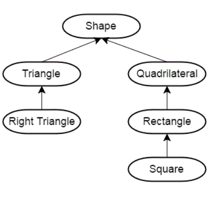
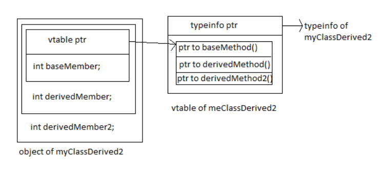

#  ch12-类进阶


1. 运算符重载
2. 类的继承

 
#  一.运算符重载


引例:  
```c
#include<iostream>
#include<vector>
#include<string>
struct Str
{
  int val;
};

Str Add(Str x, Str y){
  Str z;
  z.val = x.val + y.val;
  return z;
}
int main(){
  int x;
  int y;
  x + y;//不同对象之间的运算
  -----
  Str w;
  Str z;
  Str res = Add(w,z);//加法的实现更加复杂
  std::cout<< res.val <<std::endl;
}
```

##  1.1.使用 operator 关键字引入重载函数


- 重载不能发明新的运算，不能改变运算的优先级与结合性，通常不改变运算含义

  ```c
  #include<iostream>
  #include<vector>
  #include<string>
  struct Str
  {
    int val;
  };
  //重载
  auto operator +(Str x, Str y){
    Str z;
    z.val = x.val + y.val;
    return z;
  }
  //没有@的运算
  auto operator @(Str x, Str y)


  auto operator +(Str2 x, Str2 y){
    //...
  }

  int main(){
    Str x;
    Str y;
    x + y;//合法
  }
  ```

- 函数参数个数与运算操作数个数相同，至少一个为类类型(==不能全部都是内建类型==)

  ```c
  #include<iostream>
  #include<vector>
  #include<string>
  struct Str
  {
    int val;
  };
  //均为内建类型,非法
  auto operator +(int x, double y){

  }

  int main(){
    Str x;
    Str y;
    x + y;//合法
  }
  ```
- 除 operator() 外其它运算符不能有缺省参数(==这里的operator()是重载小括号"()"的意思==)

  ```c
  #include<iostream>
  #include<vector>
  #include<string>
  struct Str
  {
    int val = 3;

    //operator() 可以带缺省参数 
    //典型的运算符重载
    auto operator () (int y = 3){
      return val + y;
    }

  };
  //不能有缺省参数
  auto operator +(Str x, Str y = Str{}/*缺省参数*/){
    Str z;
    z.val = x.val + y.val;
    return z;
  }

  int main(){
    Str x;
    Str y;
    x + y;//合法
    ----
    std::cout<< x(5) <<std::endl;//8
    std::cout<< x() <<std::endl;//6
  }
  ```

- 可以选择实现为成员函数与非成员函数
    - ==通常来说，实现为成员函数会以 *this 作为第一个操作数==（注意 == 与 <=> 的重载）


  ```c
  #include<iostream>
  #include<vector>
  #include<string>
  struct Str
  {
    int val = 3;

    //operator() 可以带缺省参数 
    //典型的运算符重载
    auto operator () (int y = 3){
      return val + y;
    }

    auto operator +(Str x){
      Str z;
      z.val = val + x.val;
      return z;
    }

  };

  int main(){
    Str x;
    Str y;
    Str z = x + y;//x-->this, y为输入的参数
    ----
    std::cout<< x(5) <<std::endl;//8
    std::cout<< x() <<std::endl;//6
  }
  ```


##  1.2.[根据重载特性，可以将运算符进一步划分](https://zh.cppreference.com/w/cpp/language/operators)


- 可重载且==必须==实现为成员函数的运算符（ =,[],(),-> 与转型运算符）(可重载的基本都可以重载为成员函数,但这几个必须重载为成员函数)


* 可重载且==可以==实现为非成员函数的运算符


- 可重载但不建议重载的运算符（ &&, ||, 逗号运算符）
  - C++17 中规定了相应的求值顺序但没有方式实现短路逻辑
* 不可重载的运算符（如 ? ：运算符）


---------------------
##  1.3.运算符重载——重载详述 1


- 对称运算符通常定义为非成员函数以支持首个操作数的类型转换


  ```c
  #include<iostream>
  #include<vector>
  #include<string>

  struct Str
  {
    Str(int x)
      : val(x)
      {}
    //这里定义为成员函数,与上一小节的建议相反,
    //看看会导致什么样的结果
    auto operator +(Str input){
      return Str(val + input.val);
    }

  //这个函数是我朋友
    friend auto operator +(Str input1, Str input2);
  private:
    int val;

  };

  int main(){
    Str x = 3;
    Str y = 4;
    Str z = x + y;//合法
    Str z = x + 4;//合法,int型的4被隐式转换为Str类型
    ------------
    由于加法是对称运算符,如果支持 x+4,也应该支持4+x才对,但:
    Str z = 4 + x;//报错
    - 因为,成员函数operator+ 的第一参数为this*, 
      此处,当看到int型的4时不会调用operator+函数
    - 所以不建议将对称运算符定义为成员函数
  }


  --更改为非成员函数--
    auto operator +(Str input1, Str input2){
    //此时val需要为public外部才能调用
    //可以使用友元来更改权限
    return Str(input1.val + input2.val);
  }
  更改后就支持 `4+x` 操作了,此时就会将int型的4隐式构建为Str类型(因为有Str(int x)构造函数)

  ```
  ==规范版本:==
  ```c
  #include<iostream>
  #include<vector>
  #include<string>

  struct Str
  {
    Str(int x)
      : val(x)
      {}
    // 全局域的函数
    // 类内定义友元函数的典型应用
    friend auto operator +(Str input1, Str input2){
      //使用友元来更改权限
      return Str(input1.val + input2.val);
    }
  private:
    int val;
  };

  int main(){
    Str x = 3;
    Str z = 4 + x;//合法
  }
  ```

- 移位运算符一定要定义为非成员函数，因为其首个操作数类型为流类型

  ```c
  #include<iostream>
  #include<vector>
  #include<string>

  struct Str
  {
    Str(int x)
      : val(x)
      {}
    // 全局域的函数
    // 类内定义友元函数的典型应用
    friend auto operator +(Str input1, Str input2){
      //使用友元来更改权限
      std::cout<<"Operator + is called!"<<std::endl;
      return Str(input1.val + input2.val);
    }

    //std::cout<<std::enl;就是重载了移位运算符
    //ostream输出流
    friend auto& operator << (std::ostream& ostr, Str input)
    {
      ostr << input.val;
      return ostr;//为什么要返回ostr
      - 为了支持:std::cout<< x << z;这种连续操作
      - 如果不返回,就只能输出一次!
    }

  private:
    int val;
  };

  int main(){
    Str x = 3;
    Str z = 4 + x;//合法
  }
  ```


- 赋值运算符也可以接收一般参数

  ```c
  #include<iostream>
  #include<vector>
  #include<string>

  struct Str
  {
    Str(int x)
      : val(x)
      {}

    // 全局域的函数
    // 类内定义友元函数的典型应用
    friend auto operator +(Str input1, Str input2){
      //使用友元来更改权限
      std::cout<<"Operator + is called!"<<std::endl;
      return Str(input1.val + input2.val);
    }

    //std::cout<<std::enl;就是重载了移位运算符
    //ostream输出流
    friend auto& operator << (std::ostream& ostr, Str input)
    {
      ostr << input.val;
      return ostr;//为什么要返回ostr
      - 为了支持:std::cout<< x << z;这种连续操作
      - 如果不返回,就只能输出一次!
    }

    // 第一参数为*this
    // 拷贝赋值运算符
    Str& operator=(const Str& input){
      val = input.val;
      return *this;
    }
    // = 是二元操作符
    Str& operator=(const std::string& input){
      val = static_cast<int>input.size();
      return *this;
    }

  private:
    int val;
  };

  int main(){
    Str x ;
    x = std::string("12345");
    std::cout<< x <<std::endl;
  }
  ```


- operator [ ] 通常返回引用--举例:使用重载[ ]模拟数组的访问操作!
  ```c
  #include<iostream>
  #include<vector>
  #include<string>

  struct Str
  {
    Str(int x)
      : val(x)
      {}

    // 全局域的函数
    // 类内定义友元函数的典型应用
    friend auto operator +(Str input1, Str input2){
      //使用友元来更改权限
      std::cout<<"Operator + is called!"<<std::endl;
      return Str(input1.val + input2.val);
    }

    //std::cout<<std::enl;就是重载了移位运算符
    //ostream输出流
    friend auto& operator << (std::ostream& ostr, Str input)
    {
      ostr << input.val;
      return ostr;//为什么要返回ostr
      - 为了支持:std::cout<< x << z;这种连续操作
      - 如果不返回,就只能输出一次!
    }

    // 第一参数为*this
    // 拷贝赋值运算符
    Str& operator=(const Str& input){
      val = input.val;
      return *this;
    }
    // = 是二元操作符
    Str& operator=(const std::string& input){
      val = static_cast<int>input.size();
      return *this;
    }

    - 返回引用才能支持写操作,否则只支持读操作!
    int& operator[](int id)
    {
      return val;
    }

    //重载一个const属性的操作
    int operator[](int id)
    {
      return val;
    }

  private:
    int val;
  };

  int main(){
    Str x ;
    x = std::string("12345");
    std::cout<< x[0]<<'\n';
    x[0] = 100;//
    std::cout<< x[0]<<'\n';
    -----------
    - 但是对于读写操作,还有一个地方需要注意:const
    const Str cx = 3;
    std::cout<< x[0]<<'\n';//无法读
    cx[0] = 100;//无法写
    - 因为返回值是int& ,因此此时既无法读也无法写 
    - 要想只支持读而不支持写的const属性,返回值应该为int而非int&
  }
  ```

- 自增、自减运算符的前缀、后缀重载方法

  ```c
  #include<iostream>
  #include<vector>
  #include<string>

  struct Str
  {
    Str(int x)
      : val(x)
      {}

    // 全局域的函数
    // 类内定义友元函数的典型应用
    friend auto operator +(Str input1, Str input2){
      //使用友元来更改权限
      std::cout<<"Operator + is called!"<<std::endl;
      return Str(input1.val + input2.val);
    }

    //std::cout<<std::enl;就是重载了移位运算符
    //ostream输出流
    friend auto& operator << (std::ostream& ostr, Str input)
    {
      ostr << input.val;
      return ostr;//为什么要返回ostr
      - 为了支持:std::cout<< x << z;这种连续操作
      - 如果不返回,就只能输出一次!
    }

    // 第一参数为*this
    // 拷贝赋值运算符
    Str& operator=(const Str& input){
      val = input.val;
      return *this;
    }
    // = 是二元操作符
    Str& operator=(const std::string& input){
      val = static_cast<int>input.size();
      return *this;
    }

    - 返回引用才能支持写操作,否则只支持读操作!
    int& operator[](int id)
    {
      return val;
    }

    //重载一个const属性的操作
    int operator[](int id)
    {
      return val;
    }

    //我们需要一种办法去判断是前缀自增还是后缀自增
    Str& operator++ ()//没有参数:前缀自增(自减同理)
    {
      ++val;
      return *this;
      - 为什么要返回*this
      - 为了能实现类似++(++x)这样的操作
    }
    //有参数:后缀自增(自减同理),input变量没有实际意义
    Str operator++ (int)
    {
      - 这也是平时代码中尽可能使用前缀自增的原因
      Str tmp(*this);//拷贝构造,可能很耗时
      ++val;
      return tmp;//返回的是副本,然后再++
    }

  private:
    int val;
  };

  int main(){
    Str s(3);
    s++;
  }
  ```

- 使用解引用运算符（ * ）与成员访问运算符（ -> ）模拟指针行为
  - 注意“ .” 运算符不能重载
  - “→” 会递归调用 操作 “→”

  ```c
  #include<iostream>
  #include<vector>
  #include<string>

  struct Str
  {
    int val;
    void fun() {}
  };

  int main(){
    int* x;
    *x;//解引用
    -----
    Str* ptr = ...;
    ptr->val;
    ptr->fun();
  }
  ```
  **解引用符"*"重载:**
  ```c
  #include<iostream>
  #include<vector>
  #include<string>

  struct Str
  {
    Str(int* p)
      :ptr(p)
    {
    }
    //返回int& 支持写操作
    int& operator * ()
    {
      return *ptr;
    }

    //只读不写
    int operator * () const
    {
      return *ptr;
    }

  private:
    int* ptr;
  };

  int main(){
    int x = 100;
    Str ptr(&x);
    std::cout<<*ptr<<std::endl;
    *ptr = 200;
  }
  ```
  **成员访问运算符"->"重载:**
  ```c
  #include<iostream>
  #include<vector>
  #include<string>

  struct Str
  {
    Str(int* p)
      :ptr(p)
    {
    }

    //method1:返回指针Str*
    Str* operator->()//零个形参
    {
      return this;
    }

    int val = 5;
  private:
    int* ptr;
  };

  int main(){
    Str* ptr = ...;
    ptr->x;//ptr是对象,x不是严格的对象(obj.x这个整体才是对象)
    ------
    int x = 100;
    Str ptr(&x);
    ptr->val;//合法
    std::cout<< ptr->val<<std::endl;
    //等价于
    std::cout<<(ptr.operator->()->val)<<std::endl;
  }
  ```


  ```c
  #include<iostream>
  #include<vector>
  #include<string>

  struct Str2
  {
     Str2* operator->()//零个形参
    {
      return this;
    }

    int blabla = 123;
  };

  struct Str
  {
    Str(int* p)
      :ptr(p)
    {
    }

    //method2:返回指针Str
    Str2 operator->()//零个形参
    {
      return Str2{};
    }

    int val = 5;
  private:
    int* ptr;
  };

  int main(){
    int x = 100;
    Str ptr(&x);
    std::cout<< ptr->blabla<<std::endl;//123
    //等价于
    std::cout.operator<<(ptr.operator->().operator->()->blabla).operator<<(std::endl);//123
    //递归下去,直到找到返回是指针的重载函数
    
  }
  ```

- 使用函数调用运算符构造可调用对象


  ```c
  #include<iostream>
  #include<vector>
  #include<string>

  struct Str
  {
    Str(int p)
      :ptr(p)
    {
    }
    //operator()函数调用运算符:ORB-SLAM2的特征点提取就是用的这个
    int operator() ()
    {
      return val;
    }

    int operator() (int x, int y, int z)
    {
      return val+x+y+z;
    }
  private:
    int val;
  };

  int main(){
    Str obj(100);
    std::cout<< obj() <<std::endl;
    std::cout<< obj(1,2,3) <<std::endl;
  }
  ```
  ==讲师连叹三声,可调用对象的好处太多了! C++11以前等价于现在的lambda表达式在用==
  ```c
  #include<iostream>
  #include<vector>
  #include<string>

  struct Str
  {
    Str(int p)
      :ptr(p)
    {
    }

    bool operator() (int input)
    {
      return val < input;
    }

  private:
    int val;
  };

  bool fun(int input)
  {
    //普通的fun()在只有一个参数的情况下,100这个值就只能固定的写死
    return 100< input;
  }

  int main(){
    Str obj(100);
    std::cout<< obj(101) <<std::endl;//1
    std::cout<< obj(99) <<std::endl;//0
  }
  ```

  <font color=red>ORB-SLAM2中的函数调用操作符重载:</font>
  ```c
  - 声明
      void operator()( cv::InputArray image, cv::InputArray mask,
                        std::vector<cv::KeyPoint>& keypoints,
                        cv::OutputArray descriptors);

  - 调用
    (*mpORBextractorLeft)(im,cv::Mat(),mvKeys,mDescriptors);
  ```
## 1.4.运算符重载——重载详述 2

- 类型转换运算符
  - 函数声明为 operator type() const
  - 与单参数构造函数一样，都引入了一种类型转换方式
    ```c
    #include<iostream>
    #include<vector>
    #include<string>

    struct Str
    {
      //单参数构造函数,有类型的隐式转换
      Str(int p)
        :ptr(p)
      {
      }
      - 没有返回类型,返回类型已经包含在函数名中
      - const要加上,因为类型转换不需要改变其值
      operator int() const
      {
        //实现类型的转换 Str -> int 
        return val;
      }
    private:
      int val;
    };

    int main(){
      const Str obj(100);
      static_cast<Str>(100);//合法:有构造函数在Str(int p)
      Static_cast<int>obj;//合法:有类型转换函数在operator int() const
      int v = obj;//调用的类型转换符operator int() const
      std::cout<< v <<std::endl;//100
    }
    ```
  - 注意避免引入歧义性与意料之外的行为
    ```c
    #include<iostream>
    #include<vector>
    #include<string>

    struct Str
    {
      //单参数构造函数,有类型的隐式转换
      Str(int p)
        :ptr(p)
      {
      }
      - 没有返回类型,返回类型已经包含在函数名中
      - const要加上,因为类型转换不需要改变其值
      operator int() const
      {
        //实现类型的转换 Str -> int 
        return val;
      }
      friend auto& operator+(Str a, Str b)
      {
        return Str(a.val + b.val);
      }
    private:
      int val;
    };

    int main(){
      Str obj(100);
      有歧义:
      - 1.通过构造函数将int 3转为Str类型,再调用operator+函数
      - 2.通过operator int() const函数将obj类型转换为int,然后再与int 3相加
      obj + 3;
      
      有意料之外的行为:
      - cin是输入流,此刻的行为是将3输出到cin
      - C++编译器内部防止了一种隐式的类型转换,假设C++不防止这种隐式的类型转换:cin可以转换为bool类型--if(std::cin)
      - 假设C++不防止这种隐式的类型转换,则此时就可以将cin看做bool类型进行类型的提升,提升为int类型,然后再左移3位,这样理解这行代码就是合法的
      - 而此时是非法的,则就避免了这种类型的转换
      - 如何避免这种隐式的类型转换呢?
      std::cin << 3;//非法
    }
    ```
    - ==通过 explicit 引入显式类型转换,避免这种隐式的类型转换==
    ```c
    #include<iostream>
    #include<vector>
    #include<string>

    struct Str
    {
      //explicit 引入显式类型转换
      explicit Str(int p)
        :ptr(p)
      {
      }
      - 没有返回类型,返回类型已经包含在函数名中
      - const要加上,因为类型转换不需要改变其值
      operator int() const
      {
        //实现类型的转换 Str -> int 
        return val;
      }
      friend auto& operator+(Str a, Str b)
      {
        return Str(a.val + b.val);
      }
    private:
      int val;
    };

    int main(){
      Str obj(100);
      无歧义,只能:
      - 2.通过operator int() const函数将obj类型转换为int,然后再与int 3相加
      obj + 3;

    }
    ```
    ```c
    #include<iostream>
    #include<vector>
    #include<string>

    struct Str
    {
      Str(int p)
        :ptr(p)
      {
      }
      - 没有返回类型,返回类型已经包含在函数名中
      - const要加上,因为类型转换不需要改变其值
      - explicit 引入显式类型转换
      explicit operator int() const
      {
        //实现类型的转换 Str -> int 
        return val;
      }
      friend auto& operator+(Str a, Str b)
      {
        return Str(a.val + b.val);
      }
    private:
      int val;
    };

    int main(){
      Str obj(100);
      无歧义,只能:
      - 1.通过构造函数将int 3转为Str类型,再调用operator+函数
      obj + 3;

    }
    ```
    ```c
    #include<iostream>
    #include<vector>
    #include<string>

    struct Str
    {
      explicit Str(int p)
        :ptr(p)
      {
      }
      - 没有返回类型,返回类型已经包含在函数名中
      - const要加上,因为类型转换不需要改变其值
      - explicit 引入显式类型转换
      explicit operator int() const
      {
        //实现类型的转换 Str -> int 
        return val;
      }
      friend auto& operator+(Str a, Str b)
      {
        return Str(a.val + b.val);
      }
    private:
      int val;
    };

    int main(){
      Str obj(100);
      //非法,没有匹配的加法
      obj + 3;
      //合法:显式转换
      obj + static_cast<Str>(3);
      //合法:显式转换
      static_cast<int>obj + 3;
    }
    ```
  - explicit bool 的特殊性：用于条件表达式时会进行隐式类型转换
    ```c
    #include<iostream>
    #include<vector>
    #include<string>

    struct Str
    {
      explicit Str(int p)
        :ptr(p)
      {
      }

      operator bool() const
      {
        return (val == 0)
      }

    private:
      int val;
    };

    int main(){
      Str obj(100);
      //隐式转换: operator bool() const
      std::cout<< obj <<std::endl;//0
    }
    ```
    ```c
    #include<iostream>
    #include<vector>
    #include<string>

    struct Str
    {
      explicit Str(int p)
        :ptr(p)
      {
      }

      explicit operator bool() const
      {
        return (val == 0)
      }

    private:
      int val;
    };

    int main(){
      Str obj(100);
      //std::cout<< obj <<std::endl;
      - 声明的是explicit operator bool() const 为什么还能隐式的转换?
      - C++ 开的后门,-->如果是转为bool类型且是应用于条件的判断时,哪怕是explicit也可以隐式转换
      - cin的实现就是这样,普通场景cin无法转换为bool,但是判断语句时可以--if(std::cin >> 3)
      auto var = obj ? 1:0;
      std::cout << var <<std::endl;
      if(obj)
      {
        std::cout<< 1 <<std::endl;
      }
      else
      {
        std::cout<< 0 <<std::endl;
      }
    }
    ```

- C++ 20 中对 == 与 <=> 的重载
  - 通过 == 定义 !=
  - 通过 <=> 定义多种比较逻辑
  - 隐式交换操作数
  - 注意 <=> 可返回的类型： strong_ordering, week_ordering, partial_ordering

  > 1. C++20以前要重载关系运算符,至少要重载6个: <, >, <=, >=, ==, !=
  > 2. C++20开始只需要重载:==, <=>这两个就可以实现以上6个的自动推导!

    ```c
    #include<iostream>
    #include<vector>
    #include<string>

    struct Str
    {
      explicit Str(int p)
        :ptr(p)
      {
      }

      friend bool operator ==(Str obj, Str obj2)
      {
        return obj.val == obj2.val;
      }

    private:
      int val;
    };

    int main(){
      Str obj(100);
      Str obj2(100);
      std::cout<< (obj == obj2)<<std::endl;//1
      std::cout<< (obj != obj2)<<std::endl;//0: 根据==重载推导出的!=
    }
    ```
    ```c
    #include<iostream>
    #include<vector>
    #include<string>

    struct Str
    {
      explicit Str(int p)
        :ptr(p)
      {
      }

      auto operator ==(Str obj, int x)//可以不定义为友元
      {
        return obj.val == x;
      }

    private:
      int val;
    };

    int main(){
      Str obj(100);
      Str obj2(100);
      std::cout<< (obj == 100)<<std::endl;//1
      std::cout<< (100 == obj)<<std::endl;//C++20合法,C++17不合法
      //c++17:100可以转为Str类型,但是obj不能转为int类型,所以没有对应的函数
      //C++20:首先找operator==(int,Str);然后找operator==(Str,int)==>C++20能够识别==可以交换
    }
    ```
    ```c
    #include<iostream>
    #include<vector>
    #include<string>
    #include<compare>

    struct Str
    {
      explicit Str(int p)
        :ptr(p)
      {
      }

      auto operator <=>(int x)
      {
        return val <=> x;
      }

    private:
      int val;
    };

    int main(){
      Str obj(100);
      std::cout<< (100  >= obj2)<<std::endl;//合法
    }
    ```


#  二.类的继承




  ```c
  #include<iostream>
  #include<vector>
  #include<string>
  struct Base
  {
  };
  struct Derive : public Base
  {
  };

  int main()
  {
  }
  ```

##  2.1.通过类的继承（派生）来引入 ==是一个== 的关系

==**永远记住: 派生类描述的 "是一个" 基类**==


- 通常采用 public 继承（ struct[public] V.S. class[private] ）
- 注意：继承部分不是类的声明
- 使用基类的指针或引用可以指向派生类对象
- 静态类型 V.S. 动态类型

  ```c
  #include<iostream>
  #include<vector>
  #include<string>
  struct Base
  {
    void fun(){}
  };
  struct Base2 : base
  {
  };
  struct Derive : public Base2//class缺省的话是private继承
  {
    void fun2(){}
  };
  struct Derive2 : public Base2//class缺省的话是private继承
  {
    void fun2(){}
  };

  int main()
  {
    Derive d;
    Drive d2;

    - 使用基类的指针或引用可以指向派生类对象
    - Base& 为静态类型,编译器识别的类型
    - 实际上为动态类型 d (Derive&):运行期识别的类型
    Base& ref = d;//Base&为静态类型,编译期识别的类型
    Base* ptr = &d;
    ptr = &d2;//合法,动态类型类型发生改变
    ref.fun();//静态类型,编译器识别,编译不会报错
    ref.fun2();//fun2为Derive成员函数.动态类型,编译器无法正确识别,编译报错
  }
  ```
- ==protected 限定符：派生类可访问,外部不能访问==
  ```c
  #include<iostream>
  #include<vector>
  #include<string>
  struct Base
  {
    private:
      void fun(){}
  };
  
  struct Derive : public Base//class缺省的话是private继承
  {
    void fun2()
    {
      fun();//也无法访问
    }
  };
  int main()
  {
    Base b;
    b.fun();//无法访问
  }
  ```
  ```c
  #include<iostream>
  #include<vector>
  #include<string>
  struct Base
  {
    public:
      void fun(){}
  };
  
  struct Derive : public Base//class缺省的话是private继承
  {
    void fun2()
    {
      fun();
    }
  };
  int main()
  {
    Base b;
    b.fun();

    Derive d;
    d.fun();//Derive 是一个 Base 因此可以访问
  }
  ```

  ```c
  - protected 限定符：派生类可访问,外部不能访问
  #include<iostream>
  #include<vector>
  #include<string>
  struct Base
  {
    protected:
      void fun(){}
  };
  
  struct Derive : public Base//class缺省的话是private继承
  {
    void fun2()
    {
      fun();//合法,派生类可访问
    }
  };
  int main()
  {
    Base b;
    b.fun();//非法,外部不能访问

    Derive d;
    d.fun();//非法,外部不能访问
  }
  ```
  ```c
  - protected 限定符：派生类可访问,外部不能访问
  #include<iostream>
  #include<vector>
  #include<string>
  struct Base
  {
    protected:
      void fun(){}
      int x;
  };
  
  struct Derive : public Base//class缺省的话是private继承
  {
    public:
      void fun2()
      {
        x;//可以访问
        fun();//合法,派生类可访问
      }
  };
  int main()
  {
    Base b;
    b.fun();//非法,外部不能访问

    Derive d;
    d.fun2();//合法,fun2为public
  }
  ```
##  2.2.类的派生会形成嵌套域

嵌套域:
```c
{
  派生类
  {
    基类
  }
}
```
- 派生类所在域位于基类内部
- 派生类中的名称定义会覆盖基类

  ```c
  #include<iostream>
  #include<vector>
  #include<string>
  struct Base
  {
    int val = 2;
  };
  
  struct Derive : public Base
  {
    public:
      void fun2()
      {
        std::cout<< val <<std::endl;
      }
      int val = 3;
  };
  int main()
  {
    Derive d;
    d.fun2();//3
  }
  ```


- 使用域操作符显式访问基类成员
  ```c
  #include<iostream>
  #include<vector>
  #include<string>
  struct Base
  {
    int val = 2;
  };
  
  struct Derive : public Base
  {
    public:
      void fun2()
      {
        std::cout<< val <<std::endl;
        std::cout<< Base::val <<std::endl;//打印2
      }
      int val = 3;
  };
  int main()
  {
    Derive d;
    d.fun2();//3
  }
  ```


- 在派生类中调用基类的构造函数

  ```c
  #include<iostream>
  #include<vector>
  #include<string>
  struct Base
  {
    Base()
    {
      std::cout<<"Base Constructor is called!"<<std::endl;
    }
  };
  
  struct Derive : public Base
  {
    Derive()
    {
       std::cout<<"Derive Constructor is called!"<<std::endl;
    }
    public:
      void fun2()
      {
        std::cout<< val <<std::endl;
      }
      int val = 3;
  };
  int main()
  {
    Derive d;
    打印顺序:
    - 1.Base Constructor is called!
    - 2.Derive Constructor is called!
  }
  ```
  这种情况会报错,系统不知道怎样去调用base的构造函数
  ```c
  #include<iostream>
  #include<vector>
  #include<string>
  struct Base
  {
    Base(int)//构造函数加一个参数
    {
      std::cout<<"Base Constructor is called!"<<std::endl;
    }
  };
  
  struct Derive : public Base
  {
    Derive(int a)
    {
       std::cout<<"Derive Constructor is called!"<<std::endl;
    }
    public:
      void fun2()
      {
        std::cout<< val <<std::endl;
      }
      int val = 3;
  };
  int main()
  {
    Derive d;
  }
  ```
  此时需要Derive显式的去调用构造函数
  ```c
  #include<iostream>
  #include<vector>
  #include<string>
  struct Base
  {
    Base(int)
    {
      std::cout<<"Base Constructor is called!"<<std::endl;
    }
  };
  
  struct Derive : public Base
  {
     - 利用初始化列表显式调用基类的构造函数!!
    Derive(int a)
      :Base(a)
    {
       std::cout<<"Derive Constructor is called!"<<std::endl;
    }
    public:
      void fun2()
      {
        std::cout<< val <<std::endl;
      }
      int val = 3;
  };
  int main()
  {
    Derive d(3);//此时就合法了!!
    打印顺序:
    - 1.Base Constructor is called!
    - 2.Derive Constructor is called!
  }
  ```


##  2.3.类的继承——虚函数

虚函数表:





1. 左边最里面的方框为一个基类;
2. 第二个方框为一个派生类;


### 2.3.1. 通过虚函数与引用（指针）实现动态绑定
- 使用关键字 virtual 引入
- 非静态、非构造函数可声明为虚函数
- 虚函数会引入[vtable结构](https://www.avabodh.com/cxxin/multivirtual.html)
  - ==**dynamic_cast: 基类类型转派生类类型-->运行期发生**==
      - 1.派生类转换为基类(派生类描述的 "是一个" 基类的关系,因此这种转换没问题):动态类型-->静态类型
      - 2.但是反过类,可以将基类转为派生类吗?不一定,静态类型-->动态类型,这个静态类型可能还对应着其他的动态类.如何保证一个相对安全的静态类型-->动态类型的转换呢?dynamic_cast
      - 3.之所以可以这样转换是因为存在虚函数表vtable, vtable是虚函数引入的,
      因此,如果没有虚函数,也无法进行这样的转换(没有虚函数,基类就不支持多态的转换)==,只要基类有虚函数就可以实现基类到派生类的类型转换==
      - 4.实际上是通过vtable, 如图,是通过遍历查找到的派生类 `MyClassDerived2* ptr2 = dynamic_cast<MyClassDerived2*>(ptr)`这句话的意思就是在虚函数变中找到MyClassDerived2的类型,这样理解的话,就能看到一条完整的链路,如果链路不完整,自然也就没办法进行转换!
  ```c
  #include<iostream>
  #include<vector>
  #include<string>
  struct Base
  {
    virtual void baseMethod(){}
    int baseMember;

  };
  
  struct MyClassDerived : public Base
  {
     virtual void derivedMethod(){}
     int derivedmember;

  };
  struct MyClassDerived2 : MyClassDerived
  {
     virtual void derivedMethod2(){}
     int derivedmember2;

  };

  int main()
  {
    MyClassDerived2 d;
    - 1.派生类转换为基类(派生类描述的 "是一个" 基类的关系,因此这种转换没问题): 
      动态类型-->静态类型
    Base& b = d;
    Base* ptr = &d;

    - 2.但是反过类,可以将基类转为派生类吗?不一定,静态类型-->动态类型,
      这个静态类型可能还对应着其他的动态类. 
      如何保证一个相对安全的静态类型-->动态类型的转换呢?dynamic_cast

    - 3.之所以可以这样转换是因为存在虚函数表vtable, vtable是虚函数引入的,
      因此,如果没有虚函数,也无法进行这样的转换(没有虚函数,基类就不支持多态的转换)
    MyClassDerived2& d2 = dynamic_cast<MyClassDerived2>(b)
    MyClassDerived2* ptr2 = dynamic_cast<MyClassDerived2*>(ptr)

    - 4.只要链路完整,都能查找成功-
    MyClassDerived& d3 = dynamic_cast<MyClassDerived>(b)
    MyClassDerived* ptr3 = dynamic_cast<MyClassDerived*>(ptr)
  }
  ```

### 2.3.2.虚函数在基类中的定义
- 引入缺省逻辑
  ```c
  #include<iostream>
  #include<vector>
  #include<string>
  struct Base
  {
    //默认是public
    //此处的虚函数是缺省的逻辑
    virtual void fun()
    {
      std::cout<< "Base::fun() is called!\n";
    }
  };
  
  struct Derived : public Base
  {
  };

  int main()
  {
    Derived d;
    d.fun();//Base::fun() is called!
  }
  ```
  ==这里是面试笔试经常会遇到的情况:==
  ```c
  #include<iostream>
  #include<vector>
  #include<string>
  struct Base
  {
    //默认是public
    virtual void fun()
    {
      std::cout<< "Base::fun() is called!\n";
    }
  };
  
  struct Derived : public Base
  {
    void fun()//重写
    {
      std::cout<<"Derive::fun() is called!\n";
    }

  };
  
  - 动态多态(运行期多态): 通过动态类型(运行期绑定)实现的运行期多态

  void proc(Base& b)
  {
    b.fun();
  } 

  int main()
  {
    Derived d;
    d.fun();//Derive::fun() is called!

    - 由于vtable的存在,b虽然是Base&类型, 但指向的是d Derived类型, 会在运行期进行绑定
    Base& b = d;
    b.fun();//Derive::fun() is called!

    proc(d);//合法,等价于 Base& b = d;Derive::fun() is called!
    ------------
    Base b;
    proc(b);//合法;Base::fun() is called!
  }
  ```
  如果删除virtual:
  ```c
  #include<iostream>
  #include<vector>
  #include<string>
  struct Base
  {
    //默认是public
    void fun()
    {
      std::cout<< "Base::fun() is called!\n";
    }
  };
  
  struct Derived : public Base
  {
    void fun()
    {
      std::cout<<"Derive::fun() is called!\n";
    }

  };

  int main()
  {
    Derived d;
    d.fun();//Derive::fun() is called!
    - 此时没有vtable,就无法由基类找到派生类,在编译期就被绑定在一起
    Base& b = d;
    b.fun();//Base::fun() is called!
  }
  ```

- 可以通过 = 0 声明纯虚函数，相应地构造抽象基类

  ```c
  #include<iostream>
  #include<vector>
  #include<string>

  struct Base//包含纯虚函数的类: 抽象基类
  {
    virtual void fun() = 0;// 声明纯虚函数,在vtable里面先开个槽,作为一个接口在派生类中进行实现
  };
  
  struct Derived : public Base
  {
    void fun()
    {
      std::cout<<"Derived::fun() is called!\n";
    }
  };
  void proc(Base& b)
  {
    b.fun();
  }

  int main()
  {
    Derived d;
    d.fun();

    Base b;//报错,不能使用抽象基类定义对象
    Base& b = d;//允许使用抽象基类指向派生类(指针或)
  }
  ```

==派生类对纯虚函数的重写==

  ```c
  #include<iostream>
  #include<vector>
  #include<string>

  //struct Base2{};
  
  struct Base//包含纯虚函数的类: 抽象基类
  {
    virtual void fun() = 0;// 声明纯虚函数,在vtable里面先开个槽,作为一个接口在派生类中进行实现
  };

  struct Derived2 : Base//合法,但你本质上Derived2还是一个抽象基类
  {

  };
  
  struct Derived : public Base
  {
    void fun()
    {
      std::cout<<"Derived::fun() is called!\n";
    }
  };
  void proc(Base& b)
  {
    b.fun();
  }

  int main()
  {
    Derived d;
    d.fun();

    Derived2 d2;//报错,无法构造对象,Derived2派生自Base,Base为抽象基类,Derived2没有对纯虚函数进行重写
  }
  ```
重写后:

  ```c
  #include<iostream>
  #include<vector>
  #include<string>

  //struct Base2{};
  
  struct Base//包含纯虚函数的类: 抽象基类
  {
    virtual void fun() = 0;// 声明纯虚函数,在vtable里面先开个槽,作为一个接口在派生类中进行实现
  };

  struct Derived2 : Base//合法,对纯虚函数进行了实现,此时不再是抽象基类了
  {
    void fun()
    {
      std::cout<<"Derived2::fun() is called!\n";
    }
  };
  
  struct Derived : Derived2
  {
  };
  void proc(Base& b)
  {
    b.fun();
  }

  int main()
  {
    Derived d;
    d.fun();//Derived2::fun() is called!

    Derived2 d2;//合法
  }
  ```
  给纯虚函数一个定义:
  ```c
  #include<iostream>
  #include<vector>
  #include<string>

  //struct Base2{};
  
  struct Base//虽然定义了纯虚函数,但是并不改变Base是一个抽象基类
  {
    virtual void fun() = 0;// 声明纯虚函数,在vtable里面先开个槽,作为一个接口在派生类中进行实现
  };

  - 要定义纯虚函数,只能在类的外部
  void Base::fun()
  {
    std::cout<<"Base::fun() is called!\n";
  }

  struct Derived : Base//合法,对纯虚函数进行了实现,此时不再是抽象基类了
  {
    void fun()
    {
      Base::fun();//显式调用
      std::cout<<"Derived::fun() is called!\n";
    }
  };
  
  void proc(Base& b)
  {
    b.fun();
  }

  int main()
  {
    //Base::fun() is called!
    //Derived::fun() is called!
    Derived d;//Derived::fun() is called!
    d.fun();
    Base b;//依然报错
  }
  ```


### 2.3.3.虚函数在派生类中的重写（ override ）
- 函数签名(==都是void fun(),包括函数名与形参不变==)保持不变（返回类型可以是原始返回指针 / 引用类型的派生指针 / 引用类型）

  ```c
  #include<iostream>
  #include<vector>
  #include<string>

  struct Base2{};
  struct Derived2 : Base2 {};
  
  struct Base
  {
    virtual Base2& fun()
    {
      std::cout<< "virtual Base2& fun() is called!\n";
      static Base2 b;
      return b;
    }
  };
  
  struct Derived : public Base
  {
    Derived2& fun()//是重写
    {
      std::cout<<"Derived2& fun() is called!\n";
      static Derived2 inst;
      return inst;
    }

  };
  void proc(Base& b)
  {
    b.fun();
  }

  int main()
  {
    Derived d;
    d.fun();//Derived2& fun() is called!

    Base b;
    b.fun();//virtual Base2& fun() is called!
  }
  ```

  ==如果虚函数形参不同,则不是重写是重载:==
  ```c
  #include<iostream>
  #include<vector>
  #include<string>

  struct Base2{};
  struct Derived2 : Base2 {};
  
  struct Base
  {
    virtual void fun()
    {
      std::cout<< "Base::fun() is called!\n";
    }
  };
  
  struct Derived : public Base
  {
    /*
    int fun()//报错,不match,函数签名不一样了
    {
      std::cout<<"Derived::int fun() is called!\n";
      return 3;
    }
    */
    void fun(int)//合法,但不是重写,是重载,参数列表发生了改变
    {
      std::cout<<"Derived::fun(int) is called!\n";
    }

  };
  void proc(Base& b)
  {
    b.fun();
  }

  int main()
  {
    Derived d;
    d.fun();//Base::fun() is called!

    Base b;
    b.fun();//Base::fun() is called!
  }
  ```

- 虚函数特性保持不变:在基函数中是虚函数-->在派生类中任然是虚函数

  ```c
  #include<iostream>
  #include<vector>
  #include<string>

  
  struct Base
  {
    virtual void fun()
    {
      std::cout<<"Base::fun() is called!\n";
    }
  };

  struct Derive : Base
  {
    void fun()//虚函数特性保持不变:在基函数中是虚函数-->在派生类中任然是虚函数
    {
      std::cout<<"Derive::fun() is called!\n";
    }
  };

  void proc(Base& b)
  {
    b.fun();
  }

  int main()
  {
    Derived d;
    d.fun();//Derived2::fun() is called!

  }
  ```
- override 关键字

  ```c
  #include<iostream>
  #include<vector>
  #include<string>

  
  struct Base
  {
    virtual void fun()
    {
      std::cout<<"Base::fun() is called!\n";
    }
  };

  struct Derive : Base
  {
    //如果形参不同了,则构成了重载的关系,但如果实际上不是我们的本意,我们希望的是重写,此时就可以加关键字override,如果重写不合法,就会报错提示
    void fun(int) override //此时我们希望是重写,但这里是重载,报错提示
    {
      std::cout<<"Derive::fun() is called!\n";
    }
  };

  void proc(Base& b)
  {
    b.fun();
  }

  int main()
  {
    Derived d;
    d.fun();//Derived2::fun() is called!
  }
  ```


### 2.3.4.由虚函数所引入的动态绑定属于运行期行为，与编译期行为有所区别


- 虚函数的缺省实参只会考虑静态类型

  ```c
  #include<iostream>
  #include<vector>
  #include<string>
  
  struct Base
  {
    virtual void fun(int x = 3)
    {
      std::cout<<"Base:"<<x<<std::endl;
    }
  };

  struct Derive : Base
  {
    void fun(int x = 4) override
    {
      std::cout<<"Derive:"<<x<<std::endl;
    }
  };

  void proc(Base& b)
  {
    b.fun();
  }

  int main()
  {
    Derive d;
    - 打印: Derive: 3 --> 虚函数的缺省实参只会考虑静态类型(proc函数的形参为Base,静态类型为Base, x为3)
    proc(d);//这段代码可以放入cppinsights中看一下
  }
  ```
  cppinsights翻译:

  ```c
  #include<iostream>
  #include<vector>
  #include<string>
  
  struct Base
  {
    inline virtual void fun(int x)
    {
      std::operator<<(std::cout, "Base:").operator<<(x).operator<<(std::endl);
    }
    // inline constexpr Base() noexcept = default;
  };

  struct Derive : public Base
  {
    inline virtual void fun(int x)
    {
      std::operator<<(std::cout, "Derive:").operator<<(x).operator<<(std::endl);
    }
    // inline constexpr Derive() noexcept = default;
  };

  void proc(Base & b)
  {
    b.fun(3);//编译期完成,编译期只有静态类型
  }
  
  int main()
  {
    Derive d = Derive();
    proc(static_cast<Base&>(d));
  }
  
  ```

- 虚函数的调用成本高于非虚函数: 很直观,需要各种跳转
  - final 关键字: 告诉编译器,此后派生的类不会再对该虚函数进行重写,也就是说当前这个虚函数已经是虚函数表的最后一个,在一定程度上提升代码性能(类的派生很大程度上就是重写虚函数实现功能,如果定义为了final,基本上也意味着不会再对该类进行派生了,因此final也可以修饰类)

  ```c
  #include<iostream>
  #include<vector>
  #include<string>
  
  struct Base
  {
    virtual void fun(int x = 3)
    {
      std::cout<<"Base:"<<x<<std::endl;
    }
  };

  struct Derive : Base
  {
    void fun(int x = 4) override final
    {
      std::cout<<"Derive:"<<x<<std::endl;
    }
  };

  struct Derive final : Base//final也可以修饰类
  {
    void fun(int x = 4) override
    {
      std::cout<<"Derive:"<<x<<std::endl;
    }
  };
  struct Derive2 : Derive//再派生就报错!
  {

  }
  void proc(Base& b)
  {
    b.fun();
  }

  int main()
  {
    Derive d;
    - 打印: Derive: 3 --> 虚函数的缺省实参只会考虑静态类型(proc函数的形参为Base,静态类型为Base, x为3)
    proc(d);//这段代码可以放入cppinsights中看一下
  }
  ```

- ==为什么要使用指针（或引用）引入动态绑定==


  ```c
  #include<iostream>
  #include<vector>
  #include<string>
  
  struct Base
  {
    virtual void fun(int x = 3)
    {
      std::cout<<"Base:"<<x<<std::endl;
    }
  };

  struct Derive final : Base//final也可以修饰类
  {
    void fun(int x = 4) override
    {
      std::cout<<"Derive:"<<x<<std::endl;
    }
  };

  void proc(Base b)//没有指针或引用就是使用d来构造Base(将Derive隐式转换为了Base)
  {
    b.fun();
  }

  int main()
  {
    Derive d;
    - 打印: Base: 3
    proc(d);
  }
  ```

- 在构造函数中调用虚函数要小心

  ```c
  #include<iostream>
  #include<vector>
  #include<string>
  
  struct Base
  {
    Base()//构造函数
    {
      fun();
    }
    virtual void fun()
    {
      std::cout<<"Base:"<<std::endl;
    }
  };

  struct Derive final : Base//final也可以修饰类
  {
    Derive()//构造函数
      :Base()
      {
      }
    void fun() override
    {
      std::cout<<"Derive:"<<std::endl;
    }
  };

  int main()
  {
    Derive d;//打印--Base:
  }
  ```

- 派生类的析构函数会隐式调用基类的析构函数


  ```c
  #include<iostream>
  #include<vector>
  #include<string>
  #include<memory>
  struct Base
  {
     ~Base()
    {
      std::cout<<"Base"<<std::endl;
    }
  };

  struct Derive final : Base//final也可以修饰类
  {
    ~Derive()
    {
      std::cout<<"Derive"<<std::endl;
    }
  };

  int main()
  {
    Derive* d = new Derive();
    - 打印顺序:
      Derive
      Base
    delete d;

    ------
    Derive* d = new Derive();
    Base* b = d;
    - 打印(行为是未定义的,大概率是只调用Base的析构函数):
      Base
    delete b;

    ------
    - 打印顺序(行为是未定义的,不可控):
      Derive
      Base
    std::shared_ptr<Base> ptr(new Derive());

    ------
    - 打印顺序(行为是未定义的,不可控):
      Base
    std::unique_ptr<Base> ptr(new Derive());
  }
  ```

- 通常来说要将基类的析构函数声明为 virtual 的


  ```c
  #include<iostream>
  #include<vector>
  #include<string>
  #include<memory>
  struct Base
  {
    virtual ~Base()
    {
      std::cout<<"Base"<<std::endl;
    }
  };

  struct Derive final : Base//final也可以修饰类
  {
     ~Derive()//会继承虚函数,这个析构函数也是虚函数
    {
      std::cout<<"Derive"<<std::endl;
    }
  };

  int main()
  {
    Derive* d = new Derive();
    - 打印顺序:
      Derive
      Base
    delete d;

    ------
    Derive* d = new Derive();
    Base* b = d;
    - 打印顺序(行为是确定的,可以通过vtable进行查找,后构造的先析构):
      Derive
      Base
    delete b;

    ------
    - 打印顺序(行为是确定的,可以通过vtable进行查找,后构造的先析构):
      Derive
      Base
    std::shared_ptr<Base> ptr(new Derive());

    ------
    - 打印顺序(行为是确定的,可以通过vtable进行查找,后构造的先析构):
      Derive
      Base
    std::unique_ptr<Base> ptr(new Derive());
  }
  ```
析构函数大括号里面没有什么需要写的东西时:


  ```c
  #include<iostream>
  #include<vector>
  #include<string>
  #include<memory>
  struct Base
  {
     virtual ~Base() = default;//重点在virtual 
  };

  struct Derive final : Base//final也可以修饰类
  {
     ~Derive()//会继承虚函数,这个析构函数也是虚函数
    {
      std::cout<<"Derive"<<std::endl;
    }
  };

  int main()
  {
    std::shared_ptr<Base> ptr(new Derive());
  }
  ```

==基类的析构函数一定要申明为虚函数吗?答:只有通过基类的指针删除派生类时才需要这样处理.==

  ```c
  #include<iostream>
  #include<vector>
  #include<string>
  #include<memory>
  struct Base
  {
    virtual ~Base()
    {
      std::cout<<"Base"<<std::endl;
    }
  };

  struct Derive final : Base//final也可以修饰类
  {
     ~Derive()//会继承虚函数,这个析构函数也是虚函数
    {
      std::cout<<"Derive"<<std::endl;
    }
  };

  int main()
  {
    - 如果是通过基类的指针删除派生类对象,则基类的析构函数需要是virtual
    Derive d = new Derive();
    Base* b = d;
    delete b;

    - 如果是通过派生类删除派生类对象,则基类的析构函数不需要是virtual
    Derive* d = new Derive();
    delete d;//系统知道,派生类是派生自哪个基类
  }
  ```

- 在派生类中修改虚函数的访问权限:访问权限是编译期行为


  ```c
  #include<iostream>
  #include<vector>
  #include<string>
  #include<memory>
  struct Base
  {
    protected:
    virtual void fun()
    {
      std::cout<<"Base"<<std::endl;
    }
  };

  struct Derive final : Base//final也可以修饰类
  {
    public:
    void fun() override
    {
      std::cout<<"Derive"<<std::endl;
    }
  };

  int main()
  {
    Derive d;
    d.fun();//Derive,这里就有访问权限,相当于改变了虚函数的访问权限
    ----
    Base& b = d;//编译期看的是静态类型,静态类型Base的fun没有外部访问权限
    b.fun();//报错,没有访问权限
  }
  ```


## 2.4.类的继承——继承与特殊成员函数


- 派生类合成的:

  - 缺省构造函数会隐式调用基类的缺省构造函数
  - 拷贝构造函数将隐式调用基类的拷贝构造函数
  - 赋值函数将隐式调用基类的赋值函数
    ```c
    #include<iostream>
    #include<vector>
    #include<string>
    #include<memory>
    struct Base
    {
      Base()
      {
        std::cout<<"Base default constructor is called!"<<std::endl;
      }

      Base(const Base& val)
      {
        std::cout<<"Base copy constructor is called!"<<std::endl;
      }
      Base& operator=(const Base&)//赋值函数
      {
        std::cout<<"Base assignment is called!"<<std::endl;
        return *this;
      }
    };

    struct Derive : Base
    {
      /*添加这几行,同样的效果,都是编译器合成
      Derive() = default;
      Derive(const Derive& val) = default;
      Derive& operator=(const Derive&) = default;
      */
    };

    int main()
    {
      - 缺省构造函数会隐式调用基类的缺省构造函数
        打印:Base default constructor is called!
      Derive d;//默认构造

      -----
      - 拷贝构造函数将隐式调用基类的拷贝构造函数
        打印:Base default constructor is called!
            Base copy constructor is called!
      Derive d;//默认构造
      Derive x(d);//拷贝初始化

      -----
      - 赋值函数将隐式调用基类的赋值函数
        打印:Base default constructor is called!
            Base copy constructor is called!
            Base assignment is called!
      Derive d;//默认构造
      Derive x(d);//拷贝初始化
      x = d;//赋值
    }
    ```


- 派生类的析构函数会调用基类的析构函数

  ```c
  #include<iostream>
  #include<vector>
  #include<string>
  #include<memory>
  struct Base
  {
    Base()
    {
      std::cout<<"Base default constructor is called!"<<std::endl;
    }

    Base(const Base& val)
    {
      std::cout<<"Base copy constructor is called!"<<std::endl;
    }
    Base& operator=(const Base&)//赋值函数
    {
      std::cout<<"Base assignment is called!"<<std::endl;
      return *this;
    }
    ~Base()
    {
      std::cout<<"Base destructor is called!"<<std::endl;
    }
  };

  struct Derive : Base
  {
    ~Derive()
    {
      std::cout<<"Derive destructor is called!"<<std::endl;
    }
  };

  int main()
  {
    - 派生类的析构函数会调用基类的析构函数
      打印:Base default constructor is called!
          Derive destructor is called!
          Base destructor is called!
    Derive d;//默认构造
  }
  ```
- 派生类的其它构造函数将隐式调用基类的缺省构造函数

  ```c
  #include<iostream>
  #include<vector>
  #include<string>
  #include<memory>
  struct Base
  {
    Base()
    {
      std::cout<<"Base default constructor is called!"<<std::endl;
    }
    Base(int)//只是对当前类有意义
    {
      std::cout<<"Base constructor 2 is called!"<<std::endl;
    }
    Base(const Base& val)
    {
      std::cout<<"Base copy constructor is called!"<<std::endl;
    }
    Base& operator=(const Base&)//赋值函数
    {
      std::cout<<"Base assignment is called!"<<std::endl;
      return *this;
    }
    ~Base()
    {
      std::cout<<"Base destructor is called!"<<std::endl;
    }
  };

  struct Derive : Base
  {
    Derive(int)
    {
    }
  };

  int main()
  {
    - 派生类的其它构造函数将隐式调用基类的缺省构造函数
      打印:Base default constructor is called!
          Base destructor is called!
      注意不是Base constructor 2 is called!
    Derive d(3);
  }
  ```

  ```c
  #include<iostream>
  #include<vector>
  #include<string>
  #include<memory>
  struct Base
  {
    Base()
    {
      std::cout<<"Base default constructor is called!"<<std::endl;
    }
    Base(int)//只是对当前类有意义
    {
      std::cout<<"Base constructor 2 is called!"<<std::endl;
    }
    Base(const Base& val)
    {
      std::cout<<"Base copy constructor is called!"<<std::endl;
    }
    Base& operator=(const Base&)//赋值函数
    {
      std::cout<<"Base assignment is called!"<<std::endl;
      return *this;
    }
  };

  struct Derive : Base
  {
    Derive() = default;
    Derive(const Derive&)//此时不是default
    {
    }
  };

  int main()
  {
    - 派生类的其它构造函数将隐式调用基类的缺省构造函数
      打印:Base default constructor is called!
          Base default constructor is called!
      注意不是Base constructor 2 is called!
    Derive d;//Base default constructor is called!
    Derive x(d);//Base default constructor is called!
  }
  ```

- 所有的特殊成员函数在显式定义时都可能需要显式调用基类相关成员

  ```c
  #include<iostream>
  #include<vector>
  #include<string>
  #include<memory>
  struct Base
  {
    Base()
    {
      std::cout<<"Base default constructor is called!"<<std::endl;
    }
    Base(int)//只是对当前类有意义
    {
      std::cout<<"Base constructor 2 is called!"<<std::endl;
    }
    Base(const Base& val)
    {
      std::cout<<"Base copy constructor is called!"<<std::endl;
    }
    Base& operator=(const Base&)//赋值函数
    {
      std::cout<<"Base assignment is called!"<<std::endl;
      return *this;
    }
  };

  struct Derive : Base
  {
    Derive()
      :Base(0)
      {
      }
    Derive(const Derive& input)
      : Base(input)
    {
    }
  };

  int main()
  {
    - 所有的特殊成员函数在显式定义时都可能需要显式调用基类相关成员
      打印:Base constructor 2 is called!
          Base copy constructor is called!
    Derive d;//Base constructor 2 is called!
    Derive x(d);//Base copy constructor is called!
  }
  ```

- 构造与销毁顺序
  - 基类的构造函数会先调用，之后才涉及到派生类中数据成员的构造
  - 派生类中的数据成员会被先销毁，之后才涉及到基类的析构函数调用


##  2.5.类的继承——补充知识

###  2.5.1.public 与 private 继承（[参考资料](https://www.programiz.com/cpp-programming/public-protected-private-inheritance)）
- public 继承：描述 "是一个" 的关系


  ```c
  #include<iostream>
  #include<vector>
  #include<string>
  #include<memory>
  struct Base
  {
    Base()
    {
      std::cout<<"Base default constructor is called!"<<std::endl;
    }
    Base(int)//只是对当前类有意义
    {
      std::cout<<"Base constructor 2 is called!"<<std::endl;
    }
    Base(const Base& val)
    {
      std::cout<<"Base copy constructor is called!"<<std::endl;
    }
    Base& operator=(const Base&)//赋值函数
    {
      std::cout<<"Base assignment is called!"<<std::endl;
      return *this;
    }
  };

  struct Derive : public Base
  {
    Derive()
      :Base(0)
      {
      }
    Derive(const Derive& input)
      : Base(input)
    {
    }
  };

  int main()
  {
    - 所有的特殊成员函数在显式定义时都可能需要显式调用基类相关成员
      打印:Base constructor 2 is called!
          Base copy constructor is called!
    Derive d;//Base constructor 2 is called!
    Derive x(d);//Base copy constructor is called!
  }
  ```

- private 继承：描述 "根据基类实现出" 的关系

对于private继承,基类也随即变为private,对于这种情况,更加通用的情况是直接将基类声明为子类的私有成员变量,而不是通过继承来实现.


- protected 继承：几乎不会使用


###  2.5.2.using 与继承
- 使用 using 改变基类成员的访问权限
  - 派生类可以访问该成员(基类中是private的属性,无法改变)
  - 无法改变构造函数的访问权限

  ```c
  #include<iostream>

  struct Base
  {
  public:
    int x;
    void fun(int){}
  private:
    int y;
  protected:
    int z;
    void fun(){}//重载
    Base(int){}//构造函数
  };

  struct Derive : public Base
  {
  public:
    using Base::z;//使用using改变基类的访问权限(改为当前权限域的权限类型:将z改为public)
    using Base::Base;//报错:无法改变构造函数的访问权限
  private:
    using Base::x;//使用using改变基类的访问权限(改为当前权限域的权限类型:将x改为private)
    using Base::fun;//对所有基类中的fun()函数全部变为private
  private:
    using Base::y;//报错,因为y在基类属于private,y对于子类不可见,也就没办法对它进行操作

  };
  int main()
  {
    Derive d;
    d.z;//可访问
    d.x;//不可访问
  }
  ```

- 使用 using 继承基类的构造函数逻辑
  ```c
  #include<iostream>

  struct Base
  {
  public:
    Base(int){}//构造函数
  };

  struct Derive : public Base
  {
  public:
    using Base::Base;//使用 using 继承基类的构造函数逻辑,而无需重写
  };
  int main()
  {
    Derive d(100);
  }
  ```

- using 与部分重写

  这是正常的逻辑
  ```c
  #include<iostream>

  struct Base
  {
  protected:
    virtual void fun(){
      std::cout<<"1\n";
    }    
    virtual void fun(int){
      std::cout<<"2\n";
    }
  };

  struct Derive : public Base
  {
  public:
    using Base::fun;
  };
  int main()
  {
    Derive d;
    d.fun();//1
    d.fun(3);//2
  }
  ```
  如果我们想重写fun(int)函数,该如何处理呢:
  ```c
  #include<iostream>

  struct Base
  {
  protected:
    virtual void fun(){
      std::cout<<"1\n";
    }    
    virtual void fun(int){
      std::cout<<"2\n";
    }
  };

  struct Derive : public Base
  {
  public:
    using Base::fun;
    //重写fun(int)
    void fun(int) override{
      std::cout<<"3\n";
    }
  };
  int main()
  {
    Derive d;
    d.fun();//1
    d.fun(4);//3
  }
  ```
  延伸:
  ```c
  #include<iostream>

  struct Base
  {
  protected:
    Base(){}//缺省构造函数
  };

  struct Derive : public Base
  {
  public:
    using Base::base;
    //Derive() = default;
  };
  int main()
  {
    Derive d;//不是改变了Base()的权限,而是系统构造了缺省的构造函数,去调用了基类的构造函数
  }
  ```


- 继承与友元：友元关系无法继承，但基类的友元可以访问派生类中基类的相关成员


- 通过基类指针实现在容器中保存不同类型对象
  ```c
  #include<iostream>

  struct Base
  {
  };

  struct Derive : public Base
  {
  };
  int main()
  {
    Derive d;
    Base* ptr = &d;//使用基类指针,指向派生类地址
  }
  ```
  - 数组,或容器,保存的是类型一致的数据,但是我们能不能使用这些容器保存数据类型不一样的东西呢,实际上是可以做到的:
  ```c
  #include<iostream>

  struct Base
  {
    //还是有一定的限制,只能统一返回double,如果是string就没办法了
    virtual double GetValue() = 0;
    virtual ~Base() = default;
  };

  struct Derive : public Base
  {
    Derive(int x)
      : val(x){}
      double GetValue() override{
        return value;
      }
    int val;
  };
  struct Derive2 : public Base
  {
    Derive2(double x)
      : val(x){}
    double GetValue() override{
      return value;
    }
    double val;
  };
  int main()
  {
    //std::vector<Base*>
    std::vector<std::shared_ptr<Base>> vec;
    vec.emplace_back(new Derive(1));
    vec.emplace_back(new Derive2(3.2));

    std::cout<< vec[0]->GetValue()<<std::endl;    
    std::cout<< vec[1]->GetValue()<<std::endl;
  }
  ```


- 多重继承与虚继承


  ```c
  #include<iostream>
  struct Base
  {
    virtual ~Base() = default;
    int x;
  };

  struct Base1 :Base
  {
    virtual ~Base1() = default;
  };

  struct Base2 :Base
  {
    virtual ~Base2() = default;
  };

  //多重继承在实际应用中,用得还是相对较少
  struct Derive : public Base1, public Base2
  {

  };

  int main()
  {
    Derive d;
    d,x;//报错:当前类不包含,基类也不包含,系统无法知道是通过Base1去继续找x,还是通过Base2去继续往上找x.
  }
  ```
  解决:虚继承
  ```c
  #include<iostream>
  struct Base
  {
    virtual ~Base() = default;
    int x;
  };

  struct Base1 : virtual Base
  {
    virtual ~Base1() = default;
  };

  struct Base2 : virtual Base
  {
    virtual ~Base2() = default;
  };

  //多重继承在实际应用中,用得还是相对较少
  struct Derive : public Base1, public Base2
  {

  };

  int main()
  {
    Derive d;
    d,x;//合法,通过虚函数表来理解
  }
  ```

- [空基类优化与](https://zh.cppreference.com/w/cpp/language/ebo) 属性 \[[no_unique_address]]


  ```c
  #include<iostream>
  struct Base
  {
    void fun(){}//此时加了一个函数,基类的大小同样是1 : 
  };

  struct Derive Base1
  {
    int x;
  };

  int main()
  {
    std::cout<<sizeof(Base)<<std::endl;//空基类:1
    std::cout<<sizeof(Derive)<<std::endl;//4

  }
  ```
