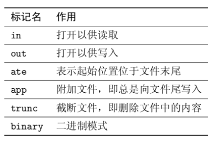
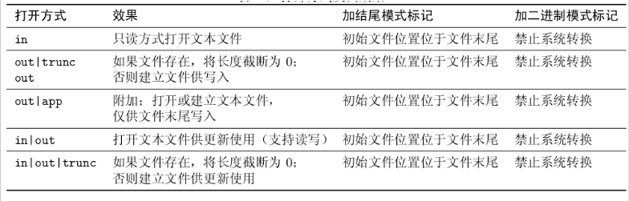

### ch07.深入IO
1. IOStream 概述
2. 输入与输出
3. 文件与内存操作
4. 流的状态、定位与同步

推荐书籍:Standard C++ IOStream and Locales

### 一.IOStream 概述
 - IOStream 采用流式 I/O 而非记录 I/O ,但可以在此基础上引入结构信息
 - 所处理的两个主要问题
    - 表示形式的变化:使用格式化 / 解析在数据的内部表示与字符序列间转换
    - 与外部设备的通信:针对不同的外部设备(终端、文件、内存)引入不同的处理逻辑
- 所涉及到的操作
  - 格式化 / 解析
  - 缓存
  - 编码转换
  - 传输
- 采用模板来封装字符特性,采用继承来封装设备特性
  - 常用的类型实际上是类模板实例化的结果

### 二.输入与输出

- 输入与输出分为格式化与非格式化两类
 - 非格式化 I/O :不涉及数据表示形式的变化,使用方法查阅cppreference
    - 常用输入函数: get / read / getline / gcount
    - 常用输出函数: put / write
    ```c
    int main(){
      int x;
      std::cin >> x ;
      std::cout<< x << std::endl;
      ----
      int x;
      std::cin.read(reinterpret_cast<char*>(&x), sizeof(x));//非格式化的输入
      std::cout<< x << std::endl;//诡异的输出
      ----
      //有时非格式化的输入也是有用的
      float y = 3.1415;
      std::cout<< y << std::endl;//3.1415
    }
    ```
    ```c
    int main(){
      char a = '0';
      int x = static_cast<char>(a);
      std::cout<< a << std::endl;
      std::cout<< x <<std::endl;
    }
    ```
- 格式化 I/O :使用移位操作符来进行的输入 (>>) 与输出 (<<)
  - C++ 通过操作符重载以支持内建数据类型的格式化 I/O
  - 可以通过重载操作符以支持自定义类型的格式化 I/O
- 格式控制
  - 可接收位掩码类型( showpos )、字符类型( fill )与取值相对随意( width )的格式化参数
  - 注意 width 方法的特殊性:触发后被重置
    ```c
    int main(){
      char a = '0';
      int x = static_cast<char>(a);
      std::cout.setf(std::ios_base::showpos)//显示正数前面的正号
      std::cout.width(10);//设置输出宽度,结果:         0
      std::cout.fill('.'');//设置输出宽度结果:.........0
      std::cout<< a << std::endl;
      std::cout<< x <<std::endl;//打印x时候就没有格式输出了:width 方法的特殊性:触发后被重置
    }
    ```
- 操纵符
  - 简化格式化参数的设置
  - 触发实际的插入与提取操作
    ```c
    int main(){
      char a = '0';
      int x = static_cast<char>(a);
      //简化格式化参数
      std::cout<< std::showpos<< a << '\n << x << std::endl;
      std::cout<< std::showpos<< << setw(10)<< std::setfill('.')
               << a << '\n << x << std::endl;
    ```
 - 提取会放松对格式的限制
    ```c
    int main(){
      int x;
      std::cin>> x;//+10, +010,
      std::cout<< x <<'\n';//输出均为10
    }
    ```
 - 提取 C 风格字符串时要小心内存越界
    ```c
    int main(){
      char x[5];
      std::cin>> x;//abcdefg
      std::cout<< x <<'\n';//崩溃
      -----
      char x[5];
      std::cin>> std::setw(5) >> x;//abcdefg
      std::cout<< x <<std::endl;// 程序崩溃abcd
    }
    ```
### 三.文件与内存操作

#### 3.1.文件操作
  - [basic_ifstream](https://zh.cppreference.com/w/cpp/io/basic_ifstream) / basic_ofstream / basic_fstream
  - 文件流可以处于打开 / 关闭两种状态,处于打开状态时无法再次打开,只有打开时才能 I/O
    ```c
    #include<iostream>
    #include<string>
    #include<fstream>

    int main(){
      std::ofstream outFile("my_file");
      outFile << "Hello,world!";
      std::cout<<outFile.is_open()<<std::endl;
      outFile.close();

      std::ifstream inFile("my_file");
      std::string x;
      inFile >> x;
      std::cout<< x <<std::endl;

      -----
      std::ifstream inFile;
      inFile.open("my_file");//也可以打开文件
      inFile.close();
      
      -----
      //在域里面有效
      {//可以不用open close函数,在域里面有效
        std::ofstream outFile("my_file");
        outFile << "Hello";
      }//至此隐式关闭

    }
    ```
#### 3.2.文件流的打开模式(图引自 C++ IOStream 一书)
  - 每种文件流都有缺省的打开方式
  - 注意 ate 与 app 的异同
    ```c
    #include<iostream>
    #include<string>
    #include<fstream>

    int main(){
      //ate表示起始位置位于文件末尾
      std::ifstream inFile("my_file", std::ios_base::in | std::ios_base::ate);

      -----
      std::ofstream outFile("my_file"); 
      outFile << "world!";//刷新文档中的内容,默认trunc模式

      -----
      //app,从文件末尾开始写 
      std::ofstream outFile("my_file", std::ios_base::out | std::ios_base::app);
    }
    ```
  - binary 能禁止系统特定的转换
  - 避免意义不明确的流使用方式(如 ifstream + out )



#### 3.3.合法的打开方式组合(引自 C++ IOStream 一书)



line1:ifstrea;
line2,3:ofstream;
line4,5:fstream;

#### 3.4.其他
 - 内存流: basic_istringstream / basic_ostringstream / basic_stringstream
    ```c
    #include<iostream>
    #include<string>
    #include<sstream>
    #include<iomaning>

    int main(){
      //输出流
      std::ostringstream obj1;
      obj1<< std::ios_base::setw(10) << std::ios_base::setfill('.') << 10;
      std::string res = obj.str();//"12345"
      std::cout<< res << std::endl;

      //输入流
      std::istringstream obj2(res);
      int x;
      obj2 >>x;
      std::cout<< x << std::endl;
    }
    ```
 - 也会受打开模式: in / out / ate / app 的影响
 - 使用 str() 方法获取底层所对应的字符串
    - 小心避免使用 str().c_str() 的形式获取 C 风格字符串
    ```c
    #include<iostream>
    #include<string>
    #include<sstream>
    #include<iomaning>

    int main(){
      //输出流
      std::ostringstream buf2("test");
      buf2 << '1';
      auto res = buf2.str();
      auto c_res = res.c_str();
    }
    ```
- 基于字符串流的字符串拼接优化操作
    ```c
    #include<iostream>
    #include<string>
    #include<sstream>
    #include<iomaning>

    int main(){
      //输出流
      std::string x;
      x += "Hello";
      x += ", world!";
      x += "Hello";
      x += ", world!";// 性能较差

      //修改
      std::ostringstream ostr;
      ostr << "Hello";
      ostr << ", world!";
      ostr << "Hello";
      ostr << ", world!";// 性能更优
      std::string y = ostr.str();

    }
    ```


### 四.流的状态、定位与同步

#### 4.1.流的状态

- [iostate(流的状态有四种)](https://zh.cppreference.com/w/cpp/io/ios_base/iostate)
  - failbit / badbit / eofbit / goodbit
    - goodbit	无错误
    - badbit	不可恢复的流错误
    - failbit	输入/输出操作失败（格式化或提取错误）
    - eofbit	关联的输入序列已抵达文件尾
  ```c
  #include<fstream>

  int main(){
    std::ofstream outFile;//正常
    outFile << 10;//错误,因为输出流outFile没有关联到任何文件上
    //此时的错误就是badbit

    int x;
    std::cin>>x;//键盘输入"Hello"
    //此时的错误就是failbit
    std::ofstream outFile;//正常
    outFile.close();//已经是关闭状态,再次对他进行关闭,报错failbit

    int x;
    std::xin>>x;//ctrl + d
  }
  ```
- 检测流的状态
  - good( ) / fail() / bad() / eof() 方法
  - 转换为 bool 值( 参考 cppreference ):参考中的表格十分重要,可以推断输出是什么
  ```c
  #include<fstream>

  int main(){
    int x;
    std::xin>>x;
    std::cout<<std::cin.good()<<' '
             <<std::cin.fail()<<' '
             <<std::cin.bad()<<' '
             <<std::cin.eof()<<' '
             <<static_cast<bool>(std::cin)<<'\n';
             //输入数字10:1 0 0 0 1
             //输入字符串Hello:0 1 0 1 0
  }
  ```
- 注意
  - 转换为 bool 值时不会考虑 eof
  - fail 与 eof 可能会被同时设置,但二者含意不同
- 通常来说,只要流处于某种错误状态时,插入 / 提取操作就不会生效

- 设置流状态
  - clear :设置流的状态为具体的值(缺省为 goodbit )
  - setstate :将某个状态附加到现有的流状态上
- 捕获流异常:exceptions方法F

#### 4.2.流的定位
- 获取流位置
  - [tellg() / tellp()](https://zh.cppreference.com/w/cpp/io/basic_ostream/tellp) 可以用于获取输入 / 输出流位置 (pos_type 类型 )
      tellg-->get,tellp-->put
      ```c
      #include <iostream>
      #include <sstream>
      int main()
      {
          std::ostringstream s;
          std::cout << s.tellp() << '\n';
          s << 'h';
          std::cout << s.tellp() << '\n';
          s << "ello, world ";
          std::cout << s.tellp() << '\n';
          s << 3.14 << '\n';
          std::cout << s.tellp() << '\n' << s.str();
      }
      /*
      0
      1
      13
      18
      hello, world 3.14
      */
      ```
  - 两个方法可能会失败,此时返回 pos_type(-1)
- 设置流位置
  - [seekg() / seekp()](https://zh.cppreference.com/w/cpp/io/basic_istream/seekg) 用于设置输入 / 输出流的位置(不是插入,而是从位置开始进行覆盖)
  - 这两个方法分别有两个重载版本:
     - 设置绝对位置:传入 pos_type 进行设置
     - 设置相对位置:通过偏移量(字符个数 ios_base::beg ) + 流位置符号的方式设置
        - ios_base::beg
        - ios_base::cur
        - ios_base::end
     ```c
    #include <iostream>
    #include <string>
    #include <sstream>
    
    int main()
    {
        std::string str = "Hello, world";
        std::istringstream in(str);
        std::string word1, word2;
    
        in >> word1;
        in.seekg(0); // 回溯
        in >> word2;
    
        std::cout << "word1 = " << word1 << '\n'
                  << "word2 = " << word2 << '\n';
    }
    输出：
    word1 = Hello,
    word2 = Hello,
     ``` 

#### 4.3.流的同步
- 基于 flush() / sync() / unitbuf 的同步
  - [flush()](https://zh.cppreference.com/w/cpp/io/manip/flush) 用于输出流同步,刷新缓冲区
  - [sync()](https://zh.cppreference.com/w/cpp/io/basic_istream/sync) 用于输入流同步,其实现逻辑是编译器所定义的
  - 输出流可以通过设置 unitbuf 来保证每次输出后自动同步
  ```c
  #include<iostream>
  #include<string>
  #include<fstream>

  int main(){
    std::cout<<"what's your name?\n";
    std::string name;
    std::cin >> name;
    //实现刷新缓冲区

    //flush() 输出流同步:典型应用:需要吧内容显示到终端上,
    //或则保存到文件里,则可以调用flush进行输出同步
    std::cout<<"what's your name?\n";
    std::cout<<"what's your name?\n"<<std::flush;
    //同上,不太建议,不适用缓冲区,直接打印到终端
    std::cout<<std::unitbuf<<"what's your name?\n";
    std::cout.flush();//作用同上

    //sync() 输入流同步:典型应用:打开一个文件的同时,可能有其他程序在对
    //改程序进行写入,此时可以使用sync()进行输入流同步,更新读取的内容(多线程)
  }
  ```
- [基于绑定 (tie) 的同步](https://zh.cppreference.com/w/cpp/io/basic_ios/tie)
  - 流可以绑定到一个输出流上,这样在每次输入 / 输出前可以刷新输出流的缓冲区
  - 比如: cin 绑定到了 cout 上
  
  A-->C
  A-->D
  A绑定到C上,A可以是输入流可以是输出流,但C必须为输出流,如果A再绑定到D上,则不再绑定到C上;
  既是,一个流只能绑定到一个输出流上.但可以多对一.
  B-->C
  不同的流可以同时绑定到同一个输出流上.
  ```c
  #include<iostream>
  #include<string>
  #include<fstream>

  int main(){
    std::cout<<"what's your name?\n";
    std::string name;
    std::cin >> name;//使用cin进行输入时就刷新了cout的缓冲区
    //实现刷新缓冲区

  }
  -------------
  #include <iostream>
  #include <fstream>
  #include <string>
  //模拟了cin与cout的缓冲
  int main()
  {
      std::ofstream os("test.txt");
      std::ifstream is("test.txt");//指定了同一个文件
      std::string value("0");
  
      os << "Hello";
      is >> value;
      //"0",缓冲区没有进行绑定,缓冲区还没有写入到文件里
      std::cout << "Result before tie(): \"" << value << "\"\n";
      is.clear();

      is.tie(&os);//进行绑定,将缓冲区写入文件中
      is >> value;
  
      std::cout << "Result after tie(): \"" << value << "\"\n";
  }
  输出：

  Result before tie(): "0"
  Result after tie(): "Hello"
  ```
- 与 C 语言标准 IO 库的同步
  - 缺省情况下, C++ 的输入输出操作会与 C 的输入输出函数同步
  - 可以通过 sync_with_stdio 关闭该同步
